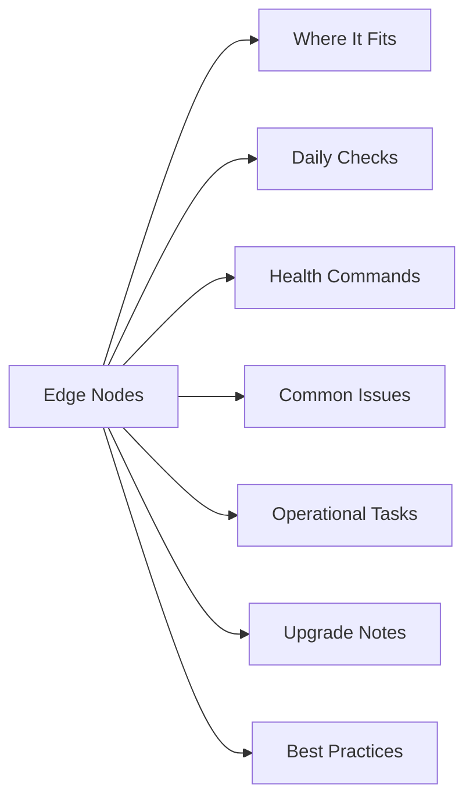

# NSX Edge Nodes

## Overview

Edge cluster health, transport nodes, uplinks, services, and troubleshooting.

## Where It Fits

Use this page for VMware platform support, daily checks, troubleshooting, upgrade prep, and operational review.

## Daily Checks

| Check | Command | Notes |
|---|---|---|
| Review active alarms. |  |  |
| Check recent failed tasks. |  |  |
| Confirm service health. |  |  |
| Confirm capacity and performance are normal. |  |  |
| Check recent changes. |  |  |

## Health Commands

~~~bash
# Add environment-specific commands here
~~~

## Common Issues

- Failed or stuck tasks.
- Certificate, DNS, or authentication issues.
- Capacity pressure.
- Service health warnings.
- Version mismatch after maintenance.
- Monitoring gaps.

## Operational Tasks

| Task | Command |
|---|---|
| Review alarms and events. |  |
| Confirm ownership and support notes. |  |
| Validate dependencies. |  |
| Document changes. |  |
| Confirm monitoring coverage. |  |

## Upgrade Notes

- Confirm compatibility.
- Review known issues.
- Confirm rollback plan.
- Validate health before and after the change.

## Best Practices

| Recommendation | Detail |
|---|---|
| Keep naming consistent. | Keep naming consistent. |
| Keep versions aligned. | Keep versions aligned. |
| Avoid unsupported version combinations. | Avoid unsupported version combinations. |
| Document exceptions. | Document exceptions. |
| Validate after every change. | Validate after every change. |
