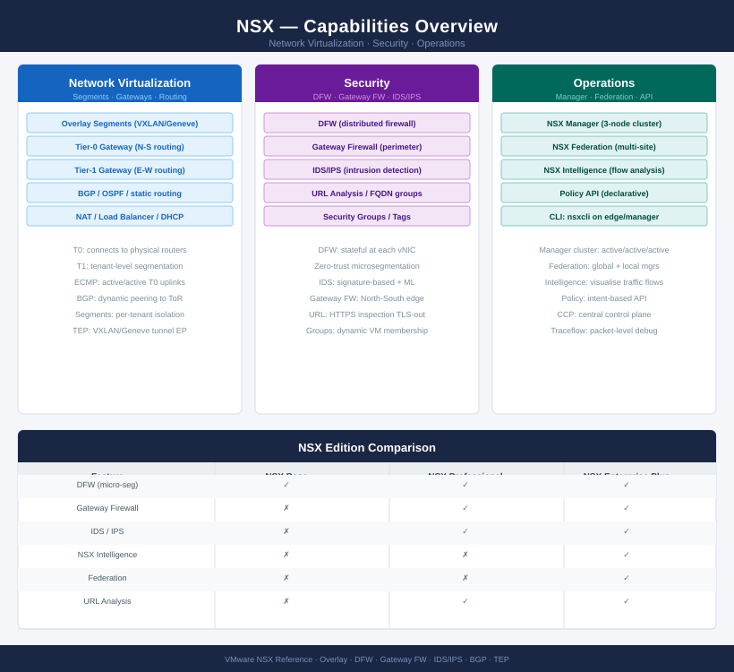
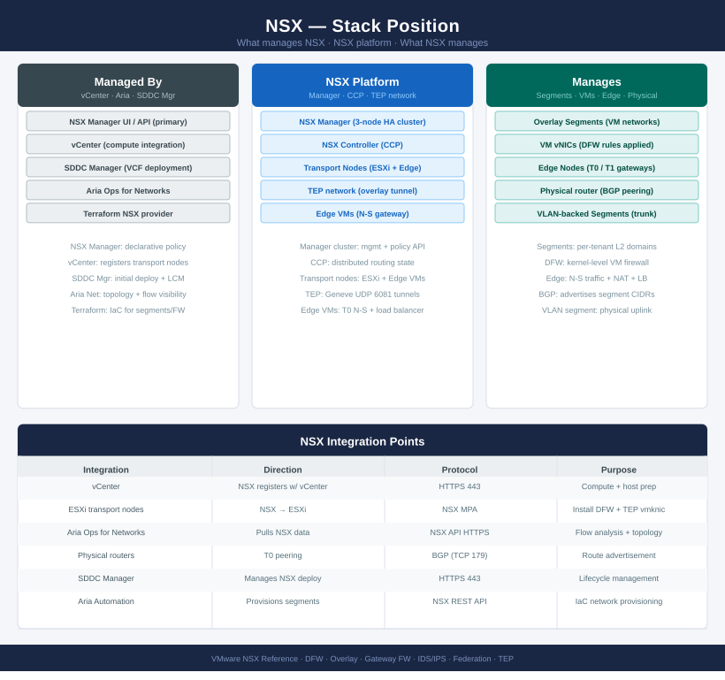

# NSX

<div class="kb-summary">
Technical and operational reference for VMware NSX. Covers segments, gateways, distributed firewall, routing, edge nodes, and overlay networking for software-defined network and security across vSphere environments.

*Applies to: NSX-T 3.x · NSX 4.x*
</div>





```text
┌──────────────────────────────────── NSX-T — Installation Sequence ────────────────────────────────────┐
│                                                                                                       │
│  Step 1 · Pre-Deploy Checks                                                                           │
│  ─────────────────────────────────────────────────────────────────────────────────────────            │
│  DNS/NTP confirmed on all hosts and vCenter  ·  vCenter trust established                             │
│  Management network: dedicated IPs for 3 NSX Manager nodes + 1 VIP reserved                           │
│  MTU 9000 on all physical switches for TEP (GENEVE encapsulation) traffic                             │
│  Host firmware and NIC drivers on NSX HCL  ·  vCenter version compatible                              │
│  Edge VM sizing: medium (4 vCPU/8 GB) minimum  ·  bare-metal for high throughput                      │
│                                                                                                       │
│                                        │  deploy NSX Manager cluster                                  │
│                                        ▼                                                              │
│  Step 2 · NSX Manager Deployment                                                                      │
│  ─────────────────────────────────────────────────────────────────────────────────────────            │
│  Deploy NSX Manager OVA on first ESXi host  ·  Set size: medium or large                              │
│  Set management IP, gateway, DNS, NTP  ·  Set admin + audit passwords                                 │
│  Login to NSX Manager UI  ·  Accept EULA  ·  Enter licence key                                        │
│  Deploy second and third NSX Manager nodes  ·  Join to form 3-node cluster                            │
│  Configure VIP (virtual IP) for NSX Manager cluster  ·  Confirm all nodes UP                          │
│                                                                                                       │
│                                        │  register vCenter and configure transport                    │
│                                        ▼                                                              │
│  Step 3 · Transport Zones & Profiles                                                                  │
│  ─────────────────────────────────────────────────────────────────────────────────────────            │
│  Add vCenter as compute manager  ·  Accept thumbprint  ·  Sync completes                              │
│  Create overlay transport zone  ·  Create VLAN transport zone                                         │
│  Create uplink profile: active/standby or LACP  ·  MTU 9000  ·  VLAN for TEP                          │
│  Create TEP IP pool: range of IPs on TEP subnet allocated per host/edge                               │
│  Host switch profile: maps physical NICs to logical uplinks                                           │
│                                                                                                       │
│                                        │  prepare hosts as transport nodes                            │
│                                        ▼                                                              │
│  Step 4 · Host Transport Node Preparation                                                             │
│  ─────────────────────────────────────────────────────────────────────────────────────────            │
│  System → Fabric → Hosts: select all cluster hosts  ·  Configure NSX                                  │
│  Select transport zone, uplink profile, TEP pool  ·  Apply to cluster                                 │
│  Monitor host prep status: each host transitions to Success state                                     │
│  Verify TEP IPs assigned  ·  TEP-to-TEP connectivity (ping from host)                                 │
│  NSX kernel modules loaded on all hosts  ·  No host in degraded state                                 │
│                                                                                                       │
│                                        │  deploy and configure Edge nodes                             │
│                                        ▼                                                              │
│  Step 5 · Edge Cluster Deployment                                                                     │
│  ─────────────────────────────────────────────────────────────────────────────────────────            │
│  Deploy Edge VM OVA on ESXi hosts (or bare-metal)  ·  Size: medium+                                   │
│  Edge transport node config: overlay TZ, VLAN TZ, uplink profile, TEP pool                            │
│  Create Edge cluster  ·  Add both Edge nodes  ·  BFD between edges enabled                            │
│  Tier-0 gateway: create, assign to Edge cluster  ·  Uplink port to physical router                    │
│  BGP or static routing: configure on Tier-0  ·  Confirm route advertisement                           │
│                                                                                                       │
│                                        │  configure logical networking                                │
│                                        ▼                                                              │
│  Step 6 · Logical Networking & Firewall                                                               │
│  ─────────────────────────────────────────────────────────────────────────────────────────            │
│  Tier-1 gateway: linked to Tier-0  ·  Route advertisement for connected segments                      │
│  Segments: create logical segments  ·  Assign to Tier-1 or as standalone                              │
│  Distributed Firewall: review default allow rules  ·  Create baseline deny policy                     │
│  Micro-segmentation: tag VMs with NSX groups  ·  Apply workload-based policies                        │
│  Enable Gateway Firewall on Tier-0/Tier-1 for perimeter controls                                      │
│                                                                                                       │
└───────────────────────────────────────────────────────────────────────────────────────────────────────┘
```


<div class="kb-grid kb-grid-3">

<a class="kb-card" href="architecture/">
  <strong>Architecture</strong>
  <span>How it works, integrations, and design standards.</span>
</a>

<a class="kb-card" href="deploy/">
  <strong>Deploy</strong>
  <span>Phase-by-phase deployment from NSX Manager cluster through host transport nodes, Edge cluster, and T0/T1 gateways.</span>
</a>

<a class="kb-card" href="operations/">
  <strong>Operations</strong>
  <span>CLI reference, health checks, procedures, lifecycle, backup, and scripts.</span>
</a>

<a class="kb-card" href="security/">
  <strong>Security</strong>
  <span>Authentication, access control, encryption, and hardening.</span>
</a>

<a class="kb-card" href="troubleshooting/">
  <strong>Troubleshooting</strong>
  <span>Common issues, diagnostics, and escalation.</span>
</a>

</div>
