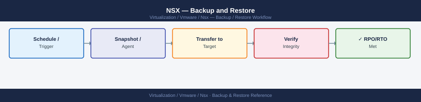

---
tags:
  - nsx
  - nsx-4
  - operations
  - vmware
---
# NSX — Backup and Restore

*Applies to: VMware NSX-T 3.x / 4.x*


```bash
# Configure backup via API
curl -sk -u 'admin:password' \
  -X PUT \
  -H "Content-Type: application/json" \
  -d '{
    "backup_config": {
      "backup_enabled": true,
      "remote_file_server": {
        "server": "backup.example.local",
        "port": 22,
        "protocol": {
          "protocol_name": "SFTP",
          "authentication": {
            "authentication_mode": "PASSWORD",
            "username": "nsx-backup",
            "password": "s3cur3P@ss"
          }
        },
        "dir_path": "/backups/nsx/"
      },
      "pass_phrase": "MyVaultStoredPassphrase",
      "backup_schedule": {
        "resource_type": "IntervalBackupSchedule",
        "seconds_between_backups": 86400
      },
      "backup_to_retain": 14
    }
  }' \
  "https://<nsx-manager>/api/v1/cluster/backups/config"
```


```text title="Expected output"
{
  "backup_config": {
    "backup_enabled": true,
    "remote_file_server": {
      "server": "backup.example.local",
      "port": 22,
      "protocol": {
        "protocol_name": "SFTP",
        "authentication": {
          "authentication_mode": "PASSWORD",
          "username": "nsx-backup"
        }
      },
      "dir_path": "/backups/nsx/"
    },
    "pass_phrase": "***",
    "backup_schedule": {
      "resource_type": "IntervalBackupSchedule",
      "seconds_between_backups": 86400
    },
    "backup_to_retain": 14,
    "last_backup_time": 1699564800000,
    "backup_status": "SUCCESS"
  }
}
```

!!! warning "Common errors"
    **`curl: (60) SSL certificate problem: self signed certificate`** — Add `-k` flag to skip certificate verification (already present in example, but ensure it's not removed in production use with proper CA certificates).
    **`{"error_code":401,"error_message":"Invalid credentials"}`** — Verify the NSX Manager admin credentials are correct and the user has backup configuration privileges.
    **`{"error_code":400,"error_message":"Connection to backup server failed"}`** — Confirm the backup server hostname/IP is reachable from NSX Manager and SFTP port 22 is open in firewall rules.
```bash
nsxcli
get cluster status
get managers
get services
```

```text title="Expected output"
NSX CLI (version 3.2.1.5)
Connected to: nsx-manager-01.corp.local (192.168.1.50)

Cluster Status:
  Cluster ID: 8f4a2c1e-9b3d-47e2-a1f5-6d8c9e2b4a7f
  Status: STABLE
  Node Count: 3
  Leader: nsx-manager-01
  Last Updated: 2024-01-15 14:32:18 UTC

Managers:
  nsx-manager-01 (192.168.1.50) - ACTIVE - v3.2.1.5
  nsx-manager-02 (192.168.1.51) - ACTIVE - v3.2.1.5
  nsx-manager-03 (192.168.1.52) - ACTIVE - v3.2.1.5

Services:
  api-service: RUNNING (uptime: 45d 12h)
  policy-service: RUNNING (uptime: 45d 12h)
  cluster-service: RUNNING (uptime: 45d 12h)
  messaging-service: RUNNING (uptime: 45d 12h)
  search-service: RUNNING (uptime: 45d 12h)
```

!!! warning "Common errors"
    **`error: unable to connect to nsx-manager`** — Verify NSX Manager hostname/IP is reachable and nsxcli is configured with correct credentials in ~/.nsxclirc.
    **`error: cluster status unavailable - quorum lost`** — Restart the NSX Manager cluster services or check network connectivity between manager nodes; if persistent, restore from backup.
    **`error: authentication failed`** — Ensure your NSX Manager admin credentials are correct and the user account has not been locked after failed login attempts.
```bash
# Cluster health
get cluster status

# Transport node connectivity (may take 5–10 min to reconnect)
get transport-node-status

# Verify segments are present
nsxcli
get logical-switches

# Verify gateways
get logical-routers

# Check DFW policies restored
curl -sk -u 'admin:password' \
  "https://<nsx-manager>/policy/api/v1/infra/domains/default/security-policies" | python3 -m json.tool

# Check Edge nodes reconnected
curl -sk -u 'admin:password' \
  "https://<nsx-manager>/api/v1/edge-clusters"
```

```text title="Expected output"
cluster status: STABLE
  nodes: 3/3 UP
  manager-nodes: 3/3 UP
  controller-nodes: 3/3 UP

transport-node-status:
  tn-compute-01: CONNECTED
  tn-compute-02: CONNECTED
  tn-compute-03: CONNECTED
  tn-edge-01: CONNECTING (reconnect in progress)
  tn-edge-02: CONNECTED

logical-switches:
  ls-prod-web: UUID 550e8400-e29b-41d4-a716-446655440000
  ls-prod-db: UUID 6ba7b810-9dad-11d1-80b4-00c04fd430c8
  ls-mgmt: UUID 6ba7b811-9dad-11d1-80b4-00c04fd430c8

logical-routers:
  lr-prod: UUID 550e8400-e29b-41d4-a716-446655440001
  lr-mgmt: UUID 550e8400-e29b-41d4-a716-446655440002

{
  "results": [
    {
      "id": "default-layer3-section",
      "display_name": "Default Layer 3 Rules",
      "rules": [
        {
          "id": "rule-001",
          "action": "ALLOW",
          "source_groups": ["/infra/domains/default/groups/web-tier"]
        }
      ]
    }
  ],
  "result_count": 1
}

{
  "results": [
    {
      "id": "edge-cluster-1",
      "display_name": "prod-edge-cluster",
      "member_node_type": "EDGE_NODE",
      "members": [
        {
          "transport_node_id": "tn-edge-01",
          "status": "UP"
        },
        {
          "transport_node_id": "tn-edge-02",
          "status": "UP"
        }
      ]
    }
  ]
}
```

!!! warning "Common errors"
    **`curl: (60) SSL certificate problem: self signed certificate`** — Add `-k` flag to skip SSL verification (already present in example; if error persists, verify NSX Manager hostname matches certificate CN).
    **`401 Unauthorized`** — Verify admin credentials are correct and user has API access permissions; check NSX Manager audit logs for failed authentication attempts.
    **`transport-node-status: tn-edge-01 DISCONNECTED`** — Check Edge node VM power state, network connectivity to NSX Manager, and certificate expiration on the Edge node via `get certificate-info`.
```bash
# Export full policy config as JSON (use before changes for comparison)
curl -sk -u 'admin:password' \
  "https://<nsx-manager>/policy/api/v1/infra?filter=Type-SecurityPolicy" \
  > nsx-dfw-export-$(date +%Y%m%d).json

# Export all infra objects
curl -sk -u 'admin:password' \
  "https://<nsx-manager>/policy/api/v1/infra" \
  > nsx-full-infra-$(date +%Y%m%d).json
```

```text title="Expected output"
% Total    % Received % Xferd  Average Speed   Time    Time     Time  Current
                                 Dload  Upload   Total   Spent    Left  Speed
100 2847k  100 2847k    0     0   1.2M      0  0:00:02 0:00:02 --:--:--  0:00:02
  % Total    % Received % Xferd  Average Speed   Time    Time     Time  Current
                                 Dload  Upload   Total   Spent    0     0   892k      0  0:00:05 0:00:05 --:--:--  0:00:05
```

!!! warning "Common errors"
    **`curl: (60) SSL certificate problem: self signed certificate`** — Add the `-k` flag (already present) or use `--cacert /path/to/ca.pem` with a valid certificate bundle.
    **`curl: (7) Failed to connect to <nsx-manager> port 443: Connection refused`** — Verify the NSX Manager hostname/IP is correct and the API service is running with `curl -sk https://<nsx-manager>/api/v1/node/status`.
    **`{"error_code":401,"error_message":"Unauthorized"}`** — Confirm the admin credentials are correct and the user has API access permissions in NSX Manager.
```bash
# Query the last successful backup timestamp
curl -sk -u 'admin:password' \
  "https://<nsx-manager>/api/v1/cluster/backups/history" | \
  python3 -c "
import sys, json
data = json.load(sys.stdin)
backups = data.get('results', [])
if backups:
    latest = sorted(backups, key=lambda x: x.get('end_time', 0), reverse=True)[0]
    import datetime
    ts = datetime.datetime.fromtimestamp(latest['end_time']/1000)
    print(f'Last backup: {ts}  Status: {latest.get(\"status\",\"?\")}'  )
else:
    print('No backups found')
"
```


```text title="Expected output"
Last backup: 2024-01-15 03:45:22.341000  Status: SUCCEEDED
```

!!! warning "Common errors"
    **`curl: (60) SSL certificate problem: self signed certificate`** — Add the `-k` flag to skip certificate verification (already present in the example, but ensure it's not removed).
    **`json.decoder.JSONDecodeError: Expecting value: line 1 column 1 (char 0)`** — Verify the NSX Manager hostname is correct and reachable, and confirm credentials are valid by testing with `curl -sk -u 'admin:password' "https://<nsx-manager>/api/v1/cluster/backups/history"` directly.
    **`KeyError: 'end_time'`** — Check that backups exist and have completed; if the API returns an empty results array or malformed backup objects, verify NSX backup jobs have run successfully via the NSX UI.
## Before you begin

- **Access:** vCenter read-only minimum; Administrator role for remediation steps
- **Timing:** safe to run during business hours unless a step is marked ⚠ (causes interruption)
- **Dependencies:** no active upgrades or migrations on the same infrastructure
- **Logging:** capture command output — paste into the change record on completion

---

---

## See also

- [NSX — Standard Procedures](../procedures/)
- [NSX — Common Issues](../../troubleshooting/common-issues/)
- [NSX — Health Checks](../health-checks/)

## Verify

- **Alarms:** vSphere Client → Home → Alarms — no new critical alarms after the operation
- **Events:** monitor the vCenter Events view for the affected object for 5 minutes
- **Health check:** run the morning health-check sequence for the affected product tier
