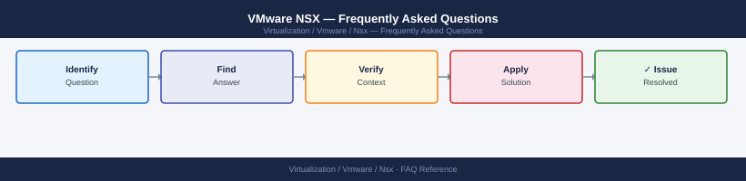

---
tags:
  - nsx
  - faq
  - operations
---
# VMware NSX — Frequently Asked Questions

Common questions about VMware NSX operations, configuration, and troubleshooting. For step-by-step procedures, see the <a href="index.md">Operations</a> section.

## General

**Q: What NSX version is recommended for new deployments?**
A: NSX 4.1.x or 4.2.x is the current recommendation. Check: NSX Manager → System → Overview → Version. Always align NSX version with vCenter and ESXi compatibility matrix.

**Q: How do I check the current VMware NSX version?**
A: `NSX Manager → System → Overview → Version`

## Configuration

**Q: What is the default MTU requirement for NSX GENEVE overlay and when must it change?**
A: GENEVE encapsulation adds 50-54 bytes overhead. Physical network MTU must be at least 1600 bytes (recommended 9000 for jumbo frames). Configure uplink profiles accordingly. Failure to set MTU causes silent packet drops for large frames.

**Q: How do I enable NSX Distributed Firewall for east-west microsegmentation?**
A: DFW is enabled by default once NSX is installed. Create security groups (Inventory → Groups) using VM tags, OS type, or AD groups. Create DFW policies (Security → Distributed Firewall → Add Policy). Apply default-deny with explicit allow rules.

## Operations

**Q: How do I upgrade NSX without disrupting workload networking?**
A: Upgrade NSX Manager appliances first (N+1 rolling within the cluster). Then upgrade Edge clusters. Then upgrade host transport nodes one at a time (hosts remain in the fabric during upgrade — only the upgrade itself causes a brief disruption per host).

**Q: What is the correct procedure to add a new T1 gateway and segment?**
A: NSX Manager → Networking → Tier-1 Gateways → Add. Link to existing T0. Create Segment: Networking → Segments → Add → connect to the T1. Set the subnet gateway address. Assign to VMs via vCenter port group.

## Troubleshooting

**Q: NSX shows 'Edge node tunnel is down'. What does it mean?**
A: The GENEVE tunnel between the Edge node and transport nodes is failing. Check TEP IP reachability, MTU, and the uplink profile. Verify physical switch ports carrying the TEP VLAN are up. Review `get tunnel-port` from the Edge node CLI.

**Q: North-south throughput through NSX Edge is below expected — where do I start?**
A: Check Edge node CPU utilisation (DPDKs are single-threaded per core). Verify ECMP is configured across multiple Edge uplinks. Review DPDK queue statistics via Edge node CLI: `get dataplane l2fwd`. Add Edge nodes if throughput is near the per-node limit.

## Backup and Recovery

**Q: How often should I back up NSX configuration?**
A: Daily automated backup: NSX Manager → System → Backup → Schedule. Store on a remote SFTP server. Backup includes all logical networking, security policies, and certificates. Test restore to a lab environment quarterly.

**Q: Can I restore a single DFW policy without a full NSX restore?**
A: Not natively. DFW policies are part of the NSX configuration database. Export policies to CSV/XML for documentation, but restoration requires the full NSX backup. Use NSX API (`GET /policy/api/v1/infra`) to export policy state for manual reconstruction.

## See Also

- [VMware NSX Operations](index.md)
- [VMware NSX Troubleshooting](../../../troubleshooting/index.md)
