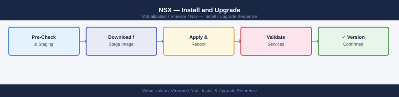

---
tags:
  - nsx
  - nsx-4
  - operations
  - vmware
---
# NSX — Install and Upgrade



```bash
# SSH to node 2
nsxcli

# Join to the cluster (provide node 1's IP and certificate thumbprint)
join management-plane <node1-ip> username admin thumbprint <node1-thumbprint>

# Get node 1's thumbprint from node 1 CLI:
get certificate api thumbprint
```

```yaml
Name: pool-tep-compute
Subnet: 192.168.200.0/24
Gateway: 192.168.200.1
IP Ranges: 192.168.200.10–192.168.200.254
```
```bash
# Verify from Manager CLI after preparation
nsxcli
get transport-nodes
get transport-node-status
# All hosts should show "UP"
```
```text
1. NSX Manager (all 3 nodes) — control plane first
2. Edge Nodes — north-south gateway impact; BGP reconverges
3. ESXi Transport Nodes (host-by-host) — data plane impact; rolling
```
```text
Upgrade node 1 → node 1 reboots (cluster VIP on node 2 or 3)
Upgrade node 2 → node 2 reboots
Upgrade node 3 → node 3 reboots
```
```bash
curl -sk -u 'admin:password' \
  "https://<nsx-manager>/api/v1/upgrade/status-summary"
```
```bash
# On Edge node CLI
get version
get bgp neighbor summary
# All peers should be Established
```
```bash
# Verify backup is restorable before the upgrade window
# Check backup files are present on SFTP server
# Confirm the passphrase is stored and accessible
```
```bash
# NSX Manager cluster health
nsxcli
get cluster status
get managers
get services

# Transport node health
curl -sk -u 'admin:password' \
  "https://<nsx-manager>/api/v1/transport-nodes/status"
# Check: up_count equals total_count

# Edge cluster health and BGP
# SSH to each Edge node
get version                    # Confirm new version
get bgp neighbor summary        # All peers Established
get edge-cluster status         # Active/Standby state confirmed

# Open alarms
curl -sk -u 'admin:password' \
  "https://<nsx-manager>/api/v1/alarms?status=OPEN&severity=CRITICAL"
# Should return result_count: 0

# DFW rule push
# Verify a test VM can still communicate as expected after upgrade
```

```d2
direction: right

hub: "NSX-T\nOperations" {shape: hexagon}
verify: "Verify" {shape: rectangle}

hub -> verify
```

## Before you begin

- **Access:** vCenter read-only minimum; Administrator role for remediation steps
- **Timing:** safe to run during business hours unless a step is marked ⚠ (causes interruption)
- **Dependencies:** no active upgrades or migrations on the same infrastructure
- **Logging:** capture command output — paste into the change record on completion

---

!!! warning "Host enters maintenance mode"
    ESXi remediation puts hosts into maintenance mode, triggering DRS evacuation. Confirm DRS is Fully Automated and HA admission control is satisfied before starting.

---

## See also

- [NSX — Health Checks](health-checks/)
- [NSX — Common Issues](../troubleshooting/common-issues/)
- [NSX — Standard Procedures](procedures/)

## Verify

- **Alarms:** vSphere Client → Home → Alarms — no new critical alarms after the operation
- **Events:** monitor the vCenter Events view for the affected object for 5 minutes
- **Health check:** run the morning health-check sequence for the affected product tier
