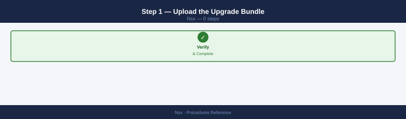
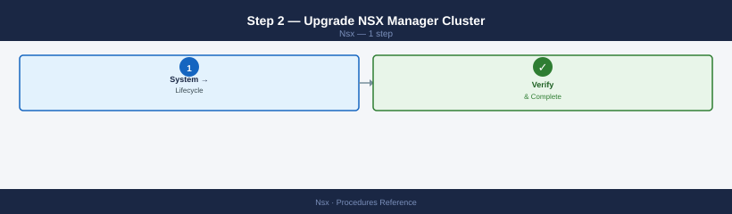
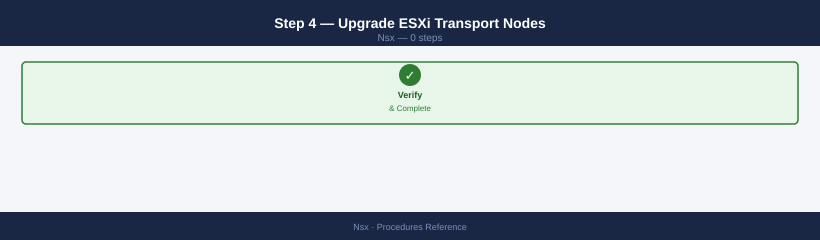
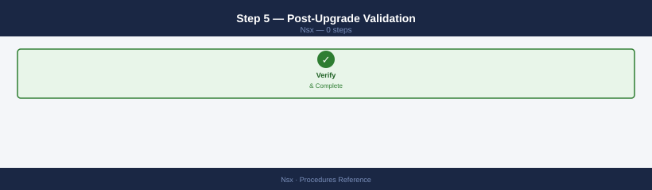
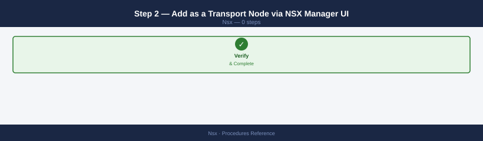
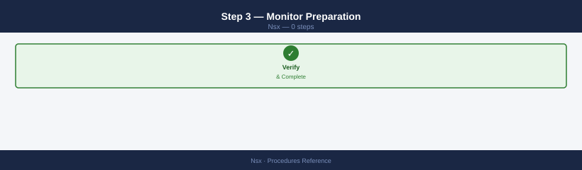
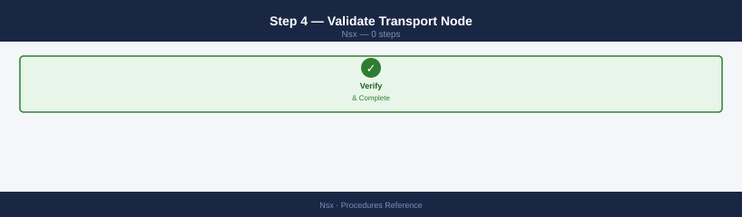

---
tags:
  - nsx
  - nsx-4
  - operations
  - vmware
---
# NSX — Standard Procedures

<div class="kb-summary">
Step-by-step NSX procedures — segments, T0/T1 gateways, DFW security policies, NAT, load balancers, IPsec VPN, certificate rotation, backup/restore, and upgrade validation. Includes API commands.

*Applies to: NSX-T 3.x / NSX 4.x*
</div>


---

## Before you begin

- **Access:** vCenter read-only minimum; Administrator role for remediation steps
- **Timing:** safe to run during business hours unless a step is marked ⚠ (causes interruption)
- **Dependencies:** no active upgrades or migrations on the same infrastructure
- **Logging:** capture command output — paste into the change record on completion

---

## Create a Segment

Creates a new overlay segment in NSX and connects it to a T1 gateway. Run this when provisioning a new application tier or workload network.

1. Determine the transport zone path for your environment (overlay for inter-host, VLAN for physical uplinks).
2. Choose a gateway address for the subnet the segment will serve.
3. Set the connectivity path to the T1 gateway that will route traffic for this segment.
4. POST/PATCH the segment via the Policy API, then verify state.

```bash
curl -sk -u 'admin:password' \
  -X PATCH \
  -H "Content-Type: application/json" \
  -d '{
    "display_name": "seg-prod-app",
    "transport_zone_path": "/infra/sites/default/enforcement-points/default/transport-zones/tz-overlay-compute",
    "connectivity_path": "/infra/tier-1s/t1-prod-frontend",
    "subnets": [{
      "gateway_address": "10.0.2.1/24"
    }],
    "admin_state": "UP"
  }' \
  "https://<nsx-manager>/policy/api/v1/infra/segments/seg-prod-app"
```

After creation, attach the segment to a VM vNIC via vCenter (Edit Settings > Network Adapter). To delete the segment later:

```bash
curl -sk -u 'admin:password' \
  -X DELETE \
  "https://<nsx-manager>/policy/api/v1/infra/segments/seg-prod-app"
```

---

## Verify Segment Health

Confirms a segment is operationally UP and that VMs have connected logical ports. Run after creating a segment or when VMs report no network connectivity.

1. SSH to an NSX Manager or Edge node and open the NSX CLI.
2. Check admin state and operational status — both must be UP.
3. Confirm the VNI has been assigned.
4. Check that logical ports exist for connected VMs.

```bash
nsxcli
get logical-switches | grep seg-prod-app
get logical-switch <id> status
# Expected: Admin State: UP  Operational Status: UP
```

```bash
get logical-switch <id> | grep VNI
```

```bash
curl -sk -u 'admin:password' \
  "https://<nsx-manager>/api/v1/logical-ports?logical_switch_id=<segment-id>&attachment_type=VIF"
```

---

## Configure a T1 Gateway

Creates or updates a T1 gateway and configures route advertisement so that connected subnets are visible to the T0 gateway. Run when adding a new routing tier for an application zone.

1. Create the T1 gateway object via the UI (Policy > Networking > Tier-1 Gateways > Add) or the API.
2. Link it to the T0 gateway in the Linked Tier-0 Gateway field.
3. Assign it to an edge cluster.
4. Enable route advertisement for connected subnets.
5. Optionally apply a DNS and DHCP profile.

```bash
# Verify existing route advertisement config
curl -sk -u 'admin:password' \
  "https://<nsx-manager>/policy/api/v1/infra/tier-1s/<t1-id>/route-advertisement"

# Enable TIER1_CONNECTED if not already set
curl -sk -u 'admin:password' \
  -X PATCH \
  -H "Content-Type: application/json" \
  -d '{
    "enabled": true,
    "advertise_connected": true
  }' \
  "https://<nsx-manager>/policy/api/v1/infra/tier-1s/<t1-id>/route-advertisement"
```

---

## Configure a T0 Gateway (BGP Peering)

Adds or updates a BGP neighbor on the T0 gateway so NSX can exchange routes with the physical fabric (ToR switches). Run when onboarding a new edge node uplink or adding a second ToR for redundancy.

1. Identify the T0 gateway ID and locale-service ID (usually `default`).
2. Gather the ToR IP address, remote AS number, and MD5 key.
3. Configure BFD to accelerate failure detection (recommended: 500 ms interval, multiplier 3).
4. Apply the neighbor config via the Policy API.
5. Verify BGP state from the Edge node CLI.

```bash
# Via Policy API
curl -sk -u 'admin:password' \
  -X PATCH \
  -H "Content-Type: application/json" \
  -d '{
    "display_name": "ToR-02",
    "neighbor_address": "10.0.0.5",
    "remote_as_num": "65000",
    "bfd_config": {
      "enabled": true,
      "interval": 500,
      "multiple": 3
    },
    "password": "bgp-md5-key"
  }' \
  "https://<nsx-manager>/policy/api/v1/infra/tier-0s/<t0-id>/locale-services/default/bgp/neighbors/tor-02"
```

```bash
vrf <tier0-vrf>
get bgp neighbor summary | grep 10.0.0.5
# State should be Established
```

---

## Trigger Edge Node Failover

Manually fails over the active Edge node to its standby so that maintenance can be performed on the currently active node without extended downtime. Run during Edge node patching or when the active Edge shows hardware faults.

1. Identify which Edge node is currently standby (`get edge-cluster status`).
2. SSH to the **standby** Edge node (not the active one).
3. Issue the failover command — the standby promotes itself to active.
4. BGP reconverges via BFD, typically within 10–30 seconds.
5. Verify the new active/standby state and that BGP neighbors are re-established.

```bash
# SSH to the currently STANDBY Edge node (check with: get edge-cluster status)
set edge-cluster failover
# The standby becomes active; the previously active Edge becomes standby
# BGP reconverges — typically within 10–30 seconds with BFD

# Verify new state
get edge-cluster status
get bgp neighbor summary
```

---

## Create a DFW Security Policy

Creates a new Distributed Firewall security policy container. Policies group related rules by application or purpose and control the order in which rules are evaluated. Run when onboarding a new application that requires its own firewall scope.

1. Navigate to Security > Distributed Firewall > Add Policy, or use the API below.
2. Set the policy name, scope (All for environment-wide, or limit to specific groups), and sequence number.
3. Leave the policy empty initially — add rules as a separate step.
4. Publish to push to the dataplane.

```bash
curl -sk -u 'admin:password' \
  -X PATCH \
  -H "Content-Type: application/json" \
  -d '{
    "display_name": "policy-web-tier",
    "category": "Application",
    "stateful": true,
    "sequence_number": 10
  }' \
  "https://<nsx-manager>/policy/api/v1/infra/domains/default/security-policies/policy-web-tier"
```

---

## Add a Rule to a Security Policy

Adds a firewall rule to an existing security policy. Run when opening a new application port or restricting traffic between groups.

1. Identify the security policy ID and prepare the source/destination group paths.
2. Define the service (port/protocol) — use a predefined service path or inline service entry.
3. Set the action: `ALLOW`, `DROP`, or `REJECT`.
4. Assign a sequence number lower than the default-deny rule.
5. Publish changes.

```bash
curl -sk -u 'admin:password' \
  -X PATCH \
  -H "Content-Type: application/json" \
  -d '{
    "display_name": "allow-web-to-app-443",
    "sequence_number": 10,
    "source_groups": ["/infra/domains/default/groups/sg-web-tier"],
    "destination_groups": ["/infra/domains/default/groups/sg-app-tier"],
    "services": ["/infra/services/HTTPS"],
    "action": "ALLOW",
    "logged": true
  }' \
  "https://<nsx-manager>/policy/api/v1/infra/domains/default/security-policies/policy-web-tier/rules/allow-web-to-app-443"
```

After adding rules, publish the policy:

```bash
curl -sk -u 'admin:password' \
  -X POST \
  "https://<nsx-manager>/policy/api/v1/infra/domains/default/security-policies/policy-web-tier?action=revise"
```

---

## Delete a DFW Rule via API

Removes a specific firewall rule from a security policy. Run when a rule is no longer required or was added in error. Always verify connectivity before and after deletion.

1. Confirm the policy ID and rule ID (visible in the NSX UI under Security > Distributed Firewall, or via a GET call).
2. Record the rule definition as a rollback reference before deleting.
3. Issue the DELETE call.
4. Verify traffic behaviour with a traceflow test.

```bash
curl -sk -u 'admin:password' \
  -X DELETE \
  "https://<nsx-manager>/policy/api/v1/infra/domains/default/security-policies/<policy-id>/rules/<rule-id>"
```

To confirm the rule has been removed:

```bash
curl -sk -u 'admin:password' \
  "https://<nsx-manager>/policy/api/v1/infra/domains/default/security-policies/<policy-id>/rules" | \
  python3 -c "import sys,json; [print(r['id'], r['display_name']) for r in json.load(sys.stdin)['results']]"
```

---

## Create a Security Group (Tag-Based)

Creates a dynamic security group whose membership is determined by NSX tags applied to VMs. Run when onboarding a new application tier that will be protected by DFW policies.

1. Decide on the tag scope and value that will identify members (for example `tier:web`).
2. Apply the tag to the relevant VMs (see Apply NSX Tags below).
3. Create the group with a tag-based membership condition.

```bash
# Via API — create a group by tag
curl -sk -u 'admin:password' \
  -X PATCH \
  -H "Content-Type: application/json" \
  -d '{
    "display_name": "sg-web-tier",
    "expression": [{
      "resource_type": "Condition",
      "member_type": "VirtualMachine",
      "key": "Tag",
      "operator": "EQUALS",
      "value": "web-tier"
    }]
  }' \
  "https://<nsx-manager>/policy/api/v1/infra/domains/default/groups/sg-web-tier"
```

Verify membership after tagging VMs:

```bash
curl -sk -u 'admin:password' \
  "https://<nsx-manager>/policy/api/v1/infra/domains/default/groups/sg-web-tier/members/virtual-machines"
```

---

## Apply NSX Tags to a VM (PowerCLI and API)

Applies NSX tags to a virtual machine so that it joins tag-based dynamic security groups. Run when provisioning a new VM that must be protected by an existing DFW policy, or when migrating a VM between application tiers.

Tags can be applied via PowerCLI (leverages vCenter tag objects) or directly via the NSX Fabric API using the VM's MoRef ID.

**PowerCLI method:**

```powershell
# PowerCLI — assign NSX tag to a VM
$vm = Get-VM "app-server-01"
New-TagAssignment -Tag (Get-Tag -Name "app-tier") -Entity $vm
```

**NSX Fabric API method** (requires the VM MoRef ID, e.g. `vm-123`):

```bash
curl -sk -u 'admin:password' \
  -X POST \
  -H "Content-Type: application/json" \
  -d '{
    "external_id": "<vm-moref-id>",
    "tags": [{"scope": "tier", "tag": "app"}]
  }' \
  "https://<nsx-manager>/api/v1/fabric/virtual-machines?action=update_tags"
```

After tagging, verify the VM appears in the target group:

```bash
curl -sk -u 'admin:password' \
  "https://<nsx-manager>/policy/api/v1/infra/domains/default/groups/sg-app-tier/members/virtual-machines"
```

---

## Test DFW Rules with Traceflow

Uses NSX Traceflow to inject a synthetic packet between two VMs and trace the path through the overlay, confirming whether DFW rules allow or drop it. Run after any DFW rule change to validate the expected outcome before closing the change record.

1. Navigate to Plan & Troubleshoot > Traceflow in the NSX UI.
2. Set the source VM and vNIC, destination VM IP or MAC, and the protocol/port.
3. Click Trace — NSX injects one synthetic packet and shows per-hop results.
4. Look for DELIVERED at the destination and confirm no unexpected DROP observations at any hop.

Alternatively, test real connectivity from a VM after a rule change:

```bash
curl -v https://<dest-vm-ip>/
# Or: telnet <dest-vm-ip> 443
```

For automated traceflow via API:

```bash
curl -sk -u 'admin:password' \
  -X POST \
  -H "Content-Type: application/json" \
  -d '{
    "packet": {
      "eth_type": 2048,
      "ip_protocol": 6,
      "src_ip": "10.0.2.10",
      "dst_ip": "10.0.3.20",
      "dst_port": 443,
      "src_port": 54321,
      "ttl": 64
    },
    "port_id": "<source-logical-port-id>"
  }' \
  "https://<nsx-manager>/api/v1/traceflows"
```

---

## Configure SNAT / DNAT

Configures Source NAT (SNAT) or Destination NAT (DNAT) rules on a T1 or T0 gateway. SNAT is used to masquerade private VM addresses behind a public IP for outbound traffic. DNAT is used to redirect inbound connections to a private VM. Run when exposing a new service externally or connecting a legacy application that requires a fixed source IP.

**SNAT — translate outbound traffic from a subnet to a public IP:**

```bash
curl -sk -u 'admin:password' \
  -X PATCH \
  -H "Content-Type: application/json" \
  -d '{
    "display_name": "snat-app-tier-outbound",
    "action": "SNAT",
    "source_network": "10.0.2.0/24",
    "translated_network": "203.0.113.10",
    "sequence_number": 10,
    "enabled": true
  }' \
  "https://<nsx-manager>/policy/api/v1/infra/tier-1s/<t1-id>/nat/USER/nat-rules/snat-app-tier-outbound"
```

**DNAT — redirect inbound traffic from a public IP to a private VM:**

```bash
curl -sk -u 'admin:password' \
  -X PATCH \
  -H "Content-Type: application/json" \
  -d '{
    "display_name": "dnat-public-web-01",
    "action": "DNAT",
    "destination_network": "203.0.113.11",
    "translated_network": "10.0.2.50",
    "sequence_number": 20,
    "enabled": true
  }' \
  "https://<nsx-manager>/policy/api/v1/infra/tier-1s/<t1-id>/nat/USER/nat-rules/dnat-public-web-01"
```

Verify NAT rules are active:

```bash
curl -sk -u 'admin:password' \
  "https://<nsx-manager>/policy/api/v1/infra/tier-1s/<t1-id>/nat/USER/nat-rules"
```

---

## Renew NSX Manager Certificate (API)

Replaces the TLS certificate presented by NSX Manager. Run when the existing certificate is within 30 days of expiry, or when replacing a self-signed certificate with a CA-signed one after initial deployment.

1. Generate a CSR on NSX Manager or bring a pre-generated certificate and key pair.
2. Import the certificate via the Trust API.
3. Apply the imported certificate to the NSX Manager node.
4. Verify the new certificate is served.

```bash
# Step 1 — Generate a CSR on NSX Manager
curl -sk -u 'admin:password' \
  -X POST \
  -H "Content-Type: application/json" \
  -d '{
    "key_size": "RSA_2048",
    "subject": {
      "attributes": [
        {"key": "CN", "value": "nsx-manager.example.com"},
        {"key": "O",  "value": "Example Corp"},
        {"key": "C",  "value": "AU"}
      ]
    },
    "extensions": {
      "subject_alt_names": {
        "dns_names": ["nsx-manager.example.com"],
        "ip_addresses": ["192.168.1.10"]
      }
    }
  }' \
  "https://<nsx-manager>/api/v1/trust-management/csrs"
```

```bash
# Step 2 — Import the signed certificate (PEM format)
CERT_PEM=$(cat /path/to/signed.crt)
KEY_PEM=$(cat /path/to/private.key)

curl -sk -u 'admin:password' \
  -X POST \
  -H "Content-Type: application/json" \
  -d "{
    \"pem_encoded\": \"${CERT_PEM}\",
    \"private_key\": \"${KEY_PEM}\",
    \"display_name\": \"nsx-mgr-cert-2026\"
  }" \
  "https://<nsx-manager>/api/v1/trust-management/certificates?action=import"
```

```bash
# Step 3 — Apply the certificate to the NSX Manager node
# Obtain the certificate ID from the import response, then:
curl -sk -u 'admin:password' \
  -X POST \
  "https://<nsx-manager>/api/v1/node/services/http?action=apply_certificate&certificate_id=<cert-id>"
```

```bash
# Step 4 — Verify the new certificate is live
echo | openssl s_client -connect <nsx-manager>:443 2>/dev/null | openssl x509 -noout -dates -subject
```

---

## Configure NSX Backup

Configures automated backups of NSX Manager configuration to an SFTP server. Run during initial NSX deployment and whenever the backup target changes. NSX backs up policy, manager, and cluster configuration.

1. Prepare an SFTP server with a dedicated backup user and directory.
2. Configure the backup target on NSX Manager.
3. Set the backup schedule (recommended: daily at a low-traffic window).
4. Trigger an on-demand backup to confirm the connection.

```bash
# Configure SFTP backup target
curl -sk -u 'admin:password' \
  -X PUT \
  -H "Content-Type: application/json" \
  -d '{
    "server": {
      "host": "backup.example.com",
      "port": 22,
      "protocol": "sftp",
      "directory_path": "/nsx-backups"
    },
    "authentication": {
      "username": "nsx-backup",
      "password": "sftp-password",
      "authentication_scheme": "PASSWORD"
    },
    "inventory_summary_interval": 300
  }' \
  "https://<nsx-manager>/api/v1/cluster/backups/config"
```

```bash
# Set backup schedule — daily at 02:00
curl -sk -u 'admin:password' \
  -X PUT \
  -H "Content-Type: application/json" \
  -d '{
    "backup_schedule": {
      "resource_type": "IntervalBackupSchedule",
      "interval": 86400
    }
  }' \
  "https://<nsx-manager>/api/v1/cluster/backups/config"
```

```bash
# Trigger an on-demand backup immediately
curl -sk -u 'admin:password' \
  -X POST \
  "https://<nsx-manager>/api/v1/cluster/backups?action=backup_to_remote_file_server"
```

```bash
# List available backups to confirm success
curl -sk -u 'admin:password' \
  "https://<nsx-manager>/api/v1/cluster/restore/backuptimestamps"
```

---

!!! danger "Wipes current NSX configuration — use only after catastrophic failure"
    NSX restore **overwrites the entire current NSX configuration** with the backup state. All changes made after the backup timestamp are permanently lost. This procedure is for disaster recovery only — not for config rollback. Coordinate with the network team before initiating. Ensure the backup timestamp is valid and all dependent services (VMs, NSX-T segments, DFW rules) are accounted for in the chosen backup.

## Restore NSX from Backup

Restores NSX Manager configuration from a previously taken backup. Run only after a catastrophic NSX Manager failure where the cluster cannot be recovered in place. Restoration wipes the current NSX configuration and replaces it with the backup state.

1. Deploy a fresh NSX Manager OVA at the same IP address as the original.
2. Configure the SFTP backup target (same credentials as when the backup was taken).
3. List available backup timestamps and select the most recent valid backup.
4. Initiate the restore — NSX will download the backup and replay configuration.
5. Monitor restore progress and verify cluster health after completion.

```bash
# Step 1 — Re-configure the backup target on the fresh NSX Manager
# (same API call as Configure NSX Backup above)

# Step 2 — List available restore points
curl -sk -u 'admin:password' \
  "https://<nsx-manager>/api/v1/cluster/restore/backuptimestamps"
```

```bash
# Step 3 — Start the restore (use the timestamp from the listing)
curl -sk -u 'admin:password' \
  -X POST \
  -H "Content-Type: application/json" \
  -d '{
    "timestamp": <backup-timestamp>
  }' \
  "https://<nsx-manager>/api/v1/cluster/restore?action=start"
```

```bash
# Step 4 — Poll restore status
curl -sk -u 'admin:password' \
  "https://<nsx-manager>/api/v1/cluster/restore/status"
# Watch for "status": "SUCCESS" — this can take 15–30 minutes
```

```bash
# Step 5 — Verify cluster health after restore
curl -sk -u 'admin:password' \
  "https://<nsx-manager>/api/v1/cluster/status"
```

---

## Collect NSX Support Bundle

Collects diagnostic logs and system state from all NSX Manager and Edge nodes into a single archive for VMware Support or internal root-cause analysis. Run when opening a support ticket or investigating a complex failure.

1. Initiate the support bundle collection via API or UI (Support > Support Bundle).
2. Specify which nodes to include — always include all managers and the affected Edge nodes.
3. Wait for collection to complete (typically 2–10 minutes depending on cluster size).
4. Download the bundle from NSX Manager.

```bash
# Initiate support bundle collection
curl -sk -u 'admin:password' \
  -X POST \
  -H "Content-Type: application/json" \
  -d '{
    "components": ["MANAGER", "CONTROLLER", "EDGE"],
    "log_age": "WEEK",
    "notes": "Support bundle for ticket SR-12345"
  }' \
  "https://<nsx-manager>/api/v1/administration/support-bundles?action=collect"
```

```bash
# Poll collection status
curl -sk -u 'admin:password' \
  "https://<nsx-manager>/api/v1/administration/support-bundles/status"
```

```bash
# Download completed bundle (file_id returned in status response)
curl -sk -u 'admin:password' \
  -O \
  "https://<nsx-manager>/api/v1/administration/support-bundles/download?file_id=<file-id>"
```

---

## Change Control Record — Pre and Post Verification

Documents the pre-change and post-change verification steps required for any NSX change. A completed change record must be attached to every CR before the change window is closed.

**Before the change:**

1. Raise a CR in the ITSM tool and record the planned change, rollback procedure, and test plan.
2. Capture the current BGP neighbour state.
3. Run a traceflow for each traffic flow that the change may affect.
4. Capture existing DFW rule counts as a baseline.

```bash
# Pre-change — capture BGP state
vrf <tier0-vrf>
get bgp neighbor summary

# Pre-change — capture transport node state
curl -sk -u 'admin:password' \
  "https://<nsx-manager>/api/v1/transport-nodes/status" | \
  python3 -c "import sys,json; [print(n['node_id'], n['host_node_deployment_status']) for n in json.load(sys.stdin)['results']]"

# Pre-change — capture DFW rule count per policy
curl -sk -u 'admin:password' \
  "https://<nsx-manager>/policy/api/v1/infra/domains/default/security-policies" | \
  python3 -c "import sys,json; [print(p['id'], p.get('rule_count','?')) for p in json.load(sys.stdin)['results']]"
```

**After the change:**

1. Re-run the same traceflow tests and confirm DELIVERED status.
2. Verify BGP is still Established with all neighbours.
3. Confirm no new CRITICAL alarms have appeared.
4. Record pass/fail evidence in the CR and close.

```bash
# Post-change — verify BGP neighbours still Established
vrf <tier0-vrf>
get bgp neighbor summary

# Post-change — check for new alarms
curl -sk -u 'admin:password' \
  "https://<nsx-manager>/api/v1/alarms?status=OPEN&severity=CRITICAL"

# Post-change — confirm transport node health
curl -sk -u 'admin:password' \
  "https://<nsx-manager>/api/v1/transport-nodes/status"
```

Connectivity test from a workload VM:

```bash
curl -v https://<dest-vm-ip>/
# Or: telnet <dest-vm-ip> 443
```

## Configure a Load Balancer

NSX-T load balancer supports L4 (TCP/UDP) and L7 (HTTP/HTTPS) with virtual servers, server pools, and health monitors.

```bash
# 1. Create a server pool
curl -sk -u 'admin:password' -X POST \
  "https://<nsx-manager>/api/v1/loadbalancer/pools" \
  -H "Content-Type: application/json" \
  -d '{
    "display_name": "web-pool",
    "algorithm": "ROUND_ROBIN",
    "members": [
      {"ip_address": "<member-1-ip>", "port": "443", "weight": 1},
      {"ip_address": "<member-2-ip>", "port": "443", "weight": 1}
    ],
    "active_monitor_ids": []
  }'

# 2. Create a virtual server
curl -sk -u 'admin:password' -X POST \
  "https://<nsx-manager>/api/v1/loadbalancer/virtual-servers" \
  -H "Content-Type: application/json" \
  -d '{
    "display_name": "web-vs",
    "ip_address": "<vip-ip>",
    "port": "443",
    "pool_id": "<pool-id>",
    "application_profile_id": "<https-profile-id>",
    "enabled": true
  }'

# 3. Attach LB service to a T1 gateway
curl -sk -u 'admin:password' -X POST \
  "https://<nsx-manager>/api/v1/loadbalancer/services" \
  -H "Content-Type: application/json" \
  -d '{
    "display_name": "web-lb-service",
    "attachment": {"target_id": "<t1-gateway-id>", "target_type": "LogicalRouter"},
    "size": "SMALL",
    "virtual_server_ids": ["<virtual-server-id>"]
  }'

# 4. Verify LB service status
curl -sk -u 'admin:password' \
  "https://<nsx-manager>/api/v1/loadbalancer/services/<lb-service-id>/status"
# operational_status should be UP
```

Health monitor for HTTPS:

```bash
curl -sk -u 'admin:password' -X POST \
  "https://<nsx-manager>/api/v1/loadbalancer/monitors" \
  -H "Content-Type: application/json" \
  -d '{
    "display_name": "https-monitor",
    "resource_type": "LbHttpsMonitor",
    "interval": 5,
    "timeout": 15,
    "fall_count": 3,
    "rise_count": 2,
    "request_url": "/health",
    "request_method": "GET",
    "response_status_codes": [200]
  }'
```

## Configure IPsec VPN

Policy-based IPsec VPN between NSX T0 and a remote peer (on-prem firewall or cloud gateway).

```bash
# 1. Create IKE profile (IKEv2 recommended)
curl -sk -u 'admin:password' -X POST \
  "https://<nsx-manager>/api/v1/vpn/ipsec/ike-profiles" \
  -H "Content-Type: application/json" \
  -d '{
    "display_name": "ike-profile-aes256",
    "ike_version": "IKE_V2",
    "encryption_algorithms": ["AES_256"],
    "digest_algorithms": ["SHA2_256"],
    "dh_groups": ["GROUP14"],
    "sa_life_time": 86400
  }'

# 2. Create tunnel profile
curl -sk -u 'admin:password' -X POST \
  "https://<nsx-manager>/api/v1/vpn/ipsec/tunnel-profiles" \
  -H "Content-Type: application/json" \
  -d '{
    "display_name": "tunnel-profile-aes256",
    "encryption_algorithms": ["AES_256"],
    "digest_algorithms": ["SHA2_256"],
    "dh_groups": ["GROUP14"],
    "sa_life_time": 3600,
    "enable_perfect_forward_secrecy": true
  }'

# 3. Create local endpoint (T0 uplink IP)
curl -sk -u 'admin:password' -X POST \
  "https://<nsx-manager>/api/v1/vpn/ipsec/local-endpoints" \
  -H "Content-Type: application/json" \
  -d '{
    "display_name": "local-endpoint",
    "local_id": "<t0-uplink-ip>",
    "local_address": "<t0-uplink-ip>",
    "logical_router_id": "<t0-router-id>"
  }'

# 4. Create peer endpoint
curl -sk -u 'admin:password' -X POST \
  "https://<nsx-manager>/api/v1/vpn/ipsec/peer-endpoints" \
  -H "Content-Type: application/json" \
  -d '{
    "display_name": "remote-peer",
    "peer_id": "<remote-peer-ip>",
    "peer_address": "<remote-peer-ip>",
    "authentication_mode": "PSK",
    "psk": "<pre-shared-key>",
    "ike_profile_id": "<ike-profile-id>",
    "tunnel_profile_id": "<tunnel-profile-id>"
  }'

# 5. Create IPsec session
curl -sk -u 'admin:password' -X POST \
  "https://<nsx-manager>/api/v1/vpn/ipsec/sessions" \
  -H "Content-Type: application/json" \
  -d '{
    "display_name": "vpn-to-onprem",
    "resource_type": "PolicyBasedIPSecVpnSession",
    "local_endpoint_id": "<local-endpoint-id>",
    "peer_endpoint_id": "<peer-endpoint-id>",
    "peer_subnets": ["<remote-cidr>"],
    "local_subnets": ["<local-cidr>"],
    "enabled": true
  }'

# 6. Verify tunnel status
curl -sk -u 'admin:password' \
  "https://<nsx-manager>/api/v1/vpn/ipsec/sessions/<session-id>/status"
# ike_status.ike_session_state should be UP; tunnel_status.fail_count should be 0
```

## Add a Transport Zone

Transport zones define the scope of logical switching and routing across NSX transport nodes.

```bash
# Create an overlay transport zone (for GENEVE-encapsulated segments)
curl -sk -u 'admin:password' -X POST \
  "https://<nsx-manager>/api/v1/transport-zones" \
  -H "Content-Type: application/json" \
  -d '{
    "display_name": "tz-overlay-prod",
    "description": "Production overlay transport zone",
    "transport_type": "OVERLAY",
    "host_switch_name": "nsxHostSwitch",
    "is_default": false
  }'

# Create a VLAN transport zone (for uplinks to physical network)
curl -sk -u 'admin:password' -X POST \
  "https://<nsx-manager>/api/v1/transport-zones" \
  -H "Content-Type: application/json" \
  -d '{
    "display_name": "tz-vlan-uplink",
    "transport_type": "VLAN",
    "host_switch_name": "nsxHostSwitch"
  }'

# List all transport zones
curl -sk -u 'admin:password' \
  "https://<nsx-manager>/api/v1/transport-zones" | jq '.results[] | {name: .display_name, type: .transport_type, id: .id}'

# Verify transport nodes are in the zone
curl -sk -u 'admin:password' \
  "https://<nsx-manager>/api/v1/transport-zones/<tz-id>/transport-zone-profiles"
```

After adding a transport zone, add it to the host switch profile of the transport node profile, then re-apply to affected clusters.

## Put an Edge Node into Maintenance Mode

Required before Edge Node hardware maintenance, upgrade, or redeployment. Drains traffic to peer Edge Nodes first.

```bash
# 1. Identify Edge Node IDs
curl -sk -u 'admin:password' \
  "https://<nsx-manager>/api/v1/fabric/nodes?resource_type=EdgeNode" | \
  jq '.results[] | {name: .display_name, id: .id}'

# 2. Check Edge cluster membership and current active/standby state
curl -sk -u 'admin:password' \
  "https://<nsx-manager>/api/v1/edge-clusters" | \
  jq '.results[] | {cluster: .display_name, members: [.members[].transport_node_id]}'

# 3. Confirm peer Edge Node is healthy before draining
curl -sk -u 'admin:password' \
  "https://<nsx-manager>/api/v1/transport-nodes/<peer-edge-id>/status" | \
  jq '.node_status'
# Must be UP before proceeding

# 4. Enter maintenance mode
curl -sk -u 'admin:password' -X POST \
  "https://<nsx-manager>/api/v1/transport-nodes/<edge-node-id>?action=enter_maintenance_mode"

# 5. Monitor drain progress
curl -sk -u 'admin:password' \
  "https://<nsx-manager>/api/v1/transport-nodes/<edge-node-id>" | \
  jq '.maintenance_mode'
# Wait for: "ENTERING_MAINTENANCE_MODE" → "MAINTENANCE_MODE"

# 6. Verify all gateways have failed over to peer
curl -sk -u 'admin:password' \
  "https://<nsx-manager>/api/v1/logical-routers" | \
  jq '.results[] | select(.edge_cluster_member_indices != null) | {router: .display_name}'

# Exit maintenance mode after work is complete
curl -sk -u 'admin:password' -X POST \
  "https://<nsx-manager>/api/v1/transport-nodes/<edge-node-id>?action=exit_maintenance_mode"
```

## NSX Manager Cluster Health and Pre-Upgrade Validation

Run before any NSX upgrade or major change to confirm the cluster is in a clean state.

```bash
# 1. Cluster control plane status (all 3 managers must be STABLE)
curl -sk -u 'admin:password' \
  "https://<nsx-manager>/api/v1/cluster/status" | \
  jq '{control_plane: .control_cluster_status.status, mgmt_cluster: .mgmt_cluster_status.status}'

# 2. Individual node health
curl -sk -u 'admin:password' \
  "https://<nsx-manager>/api/v1/cluster/nodes" | \
  jq '.results[] | {name: .display_name, role: .role, status: .manager_role.mgmt_plane_listen_addr}'

# 3. All transport nodes connected and in-sync
curl -sk -u 'admin:password' \
  "https://<nsx-manager>/api/v1/transport-nodes/status" | \
  jq '[.results[] | select(.status != "UP")] | length'
# Must be 0 — no transport nodes degraded

# 4. No critical alarms open
curl -sk -u 'admin:password' \
  "https://<nsx-manager>/api/v1/alarms?status=OPEN&severity=CRITICAL" | \
  jq '.result_count'
# Must be 0

# 5. Backup exists and is recent
curl -sk -u 'admin:password' \
  "https://<nsx-manager>/api/v1/cluster/backups/history" | \
  jq '.backup_list[0] | {timestamp: .end_time, status: .success}'

# 6. Check upgrade coordinator pre-check (NSX 3.x+)
curl -sk -u 'admin:password' \
  "https://<nsx-manager>/api/v1/upgrade/pre-upgrade-checks" | \
  jq '.checks[] | select(.status != "SUCCESS") | {check: .type, status: .status, detail: .issues}'
# All checks must pass before proceeding with upgrade

# 7. Verify NSX-T version across all components
curl -sk -u 'admin:password' \
  "https://<nsx-manager>/api/v1/node" | jq '.node_version'
curl -sk -u 'admin:password' \
  "https://<nsx-manager>/api/v1/fabric/nodes?resource_type=EdgeNode" | \
  jq '.results[] | {name: .display_name, version: .node_version}'
```

---

## Upgrade NSX

Execute this procedure only after the pre-upgrade validation checklist (above) returns all checks green.

!!! warning "Upgrade order is mandatory: NSX Manager → Edge Nodes → Transport Nodes"
    Upgrading components out of order results in version incompatibilities that may take the data plane offline. NSX Manager must reach the new version first; Edge Nodes second (critical traffic path); ESXi Transport Nodes last (one host at a time, rolling). Never invert this order.

### Step 1 — Upload the Upgrade Bundle



1. Download the NSX upgrade bundle (`.mub` file) from the Broadcom portal
2. NSX Manager UI → **System → Lifecycle Management → Upgrade**
3. Click **Upload Bundle** — upload the `.mub` file; NSX Manager verifies the SHA checksum
4. Wait for the upload to complete — large bundles (>3 GB) may take 10–20 minutes

```bash
# Alternatively, trigger upload from a URL (NSX Manager downloads directly)
curl -sk -u 'admin:password' \
  -X POST \
  -H "Content-Type: application/json" \
  -d '{"url": "https://depot.example.local/nsx-upgrade.mub"}' \
  "https://<nsx-manager>/api/v1/upgrade/bundles?action=upload_from_url"
```

### Step 2 — Upgrade NSX Manager Cluster



1. **System → Lifecycle Management → Upgrade → Upgrade Coordinator**
2. Click **Upgrade** next to the Management Plane (NSX Manager nodes)
3. NSX upgrades each Manager node in a rolling fashion (one at a time) — the UI becomes briefly unavailable during each node's restart (1–3 minutes)
4. Monitor via the Upgrade Coordinator status panel; all Manager nodes must show the new version before proceeding

```bash
# Verify all Manager nodes are on the new version
curl -sk -u 'admin:password' \
  "https://<nsx-manager>/api/v1/cluster/nodes" | \
  jq '.results[] | {name: .fqdn, version: .version}'
```

### Step 3 — Upgrade Edge Nodes


1. Upgrade Coordinator → **Edge Nodes**
2. Select the Edge cluster(s) to upgrade — NSX upgrades one Edge node at a time within each cluster; during the upgrade of one node, the other handles traffic (requires N+1 sizing)
3. Click **Upgrade** — monitor per-node progress in the Upgrade Coordinator

```bash
# Verify Edge node versions post-upgrade
curl -sk -u 'admin:password' \
  "https://<nsx-manager>/api/v1/fabric/nodes?resource_type=EdgeNode" | \
  jq '.results[] | {name: .display_name, version: .node_version}'
```

### Step 4 — Upgrade ESXi Transport Nodes



1. Upgrade Coordinator → **Host Transport Nodes**
2. Select the upgrade group (by cluster); configure per-group parallelism (default: 1 host at a time)
3. Click **Upgrade** — NSX places each ESXi host in maintenance mode, upgrades the NSX VIBs, reboots the host, and exits maintenance mode before starting the next host

```bash
# Monitor host upgrade status
curl -sk -u 'admin:password' \
  "https://<nsx-manager>/api/v1/upgrade/nodes?upgrade_run_id=<run-id>" | \
  jq '.results[] | {node: .display_name, status: .status}'
```

### Step 5 — Post-Upgrade Validation



```bash
# Confirm all fabric nodes are on the target version
curl -sk -u 'admin:password' \
  "https://<nsx-manager>/api/v1/fabric/nodes" | \
  jq '.results[] | {name: .display_name, type: .resource_type, version: .node_version}'

# Re-run upgrade readiness check to confirm a clean post-upgrade state
curl -sk -u 'admin:password' \
  "https://<nsx-manager>/api/v1/upgrade/pre_upgrade_checks?action=run_all" \
  -X POST | jq '.checks[] | select(.status != "SUCCESS")'
```

- [ ] All NSX Manager nodes on target version
- [ ] All Edge nodes on target version
- [ ] All ESXi transport nodes on target version
- [ ] Zero failed upgrade readiness checks
- [ ] North-South and East-West traffic validated (test a VM reaching an external resource and a VM-to-VM flow through DFW)

---

## Commission a New Transport Node (ESXi Host)

Run when adding a new ESXi host to a cluster that uses NSX — the host must be prepared as an NSX Transport Node before VMs on it can use NSX-backed networking.

### Step 1 — Verify Host Prerequisites


```bash
# From the host, verify mgmt connectivity to NSX Manager
esxcli network ip connection list | grep 1234   # NSX Messaging Bus port
ping <nsx-manager-ip>

# Confirm no leftover NSX VIBs from a previous installation
esxcli software vib list | grep nsx
```

The host must be in the target vSphere cluster and visible in vCenter before proceeding.

### Step 2 — Add as a Transport Node via NSX Manager UI



1. NSX Manager → **System → Fabric → Hosts**
2. Locate the host (listed under the vCenter / cluster view) — it shows as **Not Configured**
3. Click the host → **Configure as Transport Node**
4. In the wizard:
   - Select the **N-VDS** (or VDS, if using VDS-backed NSX) — must match the transport zone type
   - Select the **Transport Zone(s)**: overlay zone for workload segments; VLAN zone for uplinks
   - Configure uplink mapping: map the physical NICs (vmnic2, vmnic3) to the N-VDS uplinks
5. Confirm — NSX Manager pushes the configuration to the host, installs NSX VIBs (requires host reboot or maintenance mode depending on Quick Boot support)

### Step 3 — Monitor Preparation



```bash
# Poll transport node preparation status
curl -sk -u 'admin:password' \
  "https://<nsx-manager>/api/v1/transport-nodes/<node-id>/state" | \
  jq '{state: .state, details: .details}'
# state: "success" = preparation complete
```

Or monitor in UI: **System → Fabric → Hosts** — host status changes from "In Progress" to "Success".

### Step 4 — Validate Transport Node



```bash
# Confirm the host is in the transport zone
curl -sk -u 'admin:password' \
  "https://<nsx-manager>/api/v1/transport-nodes/<node-id>" | \
  jq '.transport_zone_endpoints[] | .transport_zone_id'

# Verify TEP (Tunnel Endpoint) IP is assigned
esxcli network ip interface list | grep vmk10
# vmk10 is the default TEP vmkernel adapter created by NSX

# Confirm GENEVE tunnel is up from this host to at least one Edge node
esxcli network ip interface list
esxcli network ip connection list | grep 6081   # GENEVE port
```

- [ ] Host shows **Success** in NSX Manager → System → Fabric → Hosts
- [ ] TEP vmkernel (vmk10) IP assigned and pingable from another transport node
- [ ] VMs on this host can reach VMs on other transport nodes via overlay segments
- [ ] DFW rules from NSX are enforced on VMs on this host (test with traceflow)

---

## See also

- [NSX — Health Checks](health-checks/)
- [NSX — Common Issues](../troubleshooting/common-issues/)
- [NSX — CLI Reference](cli-reference/)

## Verify

- **Alarms:** vSphere Client → Home → Alarms — no new critical alarms after the operation
- **Events:** monitor NSX Manager → System → Fabric → Hosts for transport node status changes
- **Health check:** run the NSX morning health-check sequence after any topology change
