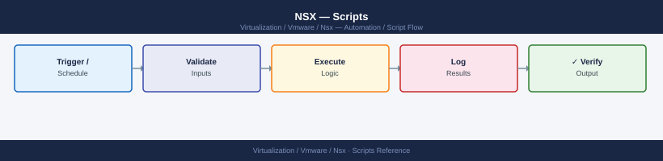

---
tags:
  - nsx
  - nsx-4
  - operations
  - vmware
---
# NSX — Scripts



```python
#!/usr/bin/env python3
"""
nsxt_health_check.py
Usage: python3 nsxt_health_check.py
Deps: pip install requests urllib3
"""

import os, sys, json
import requests
from urllib3.exceptions import InsecureRequestWarning

requests.packages.urllib3.disable_warnings(InsecureRequestWarning)

NSX_HOST = os.environ.get("NSX_HOST", "nsx-manager.local")
NSX_USER = os.environ.get("NSX_USER", "admin")
NSX_PASS = os.environ.get("NSX_PASS", "")

BASE_URL = f"https://{NSX_HOST}"
AUTH     = (NSX_USER, NSX_PASS)
HEADERS  = {"Content-Type": "application/json", "Accept": "application/json"}
overall  = 0

def get(path):
    r = requests.get(f"{BASE_URL}{path}", auth=AUTH, headers=HEADERS,
                     verify=False, timeout=15)
    r.raise_for_status()
    return r.json()

def check(label, status, detail=""):
    global overall
    icons = {"PASS": "\033[32mPASS\033[0m", "WARNING": "\033[33mWARN\033[0m", "CRITICAL": "\033[31mCRIT\033[0m"}
    print(f"  [{icons.get(status, status)}] {label:<45} {detail}")
    if status == "CRITICAL": overall = max(overall, 2)
    if status == "WARNING":  overall = max(overall, 1)

print(f"\n=== NSX-T System Health Check: {NSX_HOST} ===\n")

# --- Cluster status ---
try:
    cluster = get("/api/v1/cluster/status")
    mgmt_status = cluster.get("mgmt_cluster_status", {}).get("status", "UNKNOWN")
    ctrl_status  = cluster.get("control_cluster_status", {}).get("status", "UNKNOWN")
    check("Management cluster", "PASS" if mgmt_status == "STABLE" else "CRITICAL", mgmt_status)
    check("Control cluster",    "PASS" if ctrl_status  == "STABLE" else "CRITICAL", ctrl_status)
    for node in cluster.get("detailed_cluster_status", {}).get("groups_status", []):
        for member in node.get("members", []):
            ns = "PASS" if member.get("status") == "UP" else "CRITICAL"
            check(f"  Node: {member.get('display_name', member.get('component_id','?'))}", ns,
                  member.get("status", "UNKNOWN"))
except Exception as e:
    check("Cluster status", "CRITICAL", str(e)[:80])

# --- Transport node health ---
try:
    tn_status = get("/api/v1/transport-nodes/status")
    total = tn_status.get("total_count", 0)
    up    = tn_status.get("up_count",    0)
    down  = tn_status.get("down_count",  0)
    degrad = tn_status.get("degraded_count", 0)
    s = "PASS" if down == 0 and degrad == 0 else ("WARNING" if degrad > 0 else "CRITICAL")
    check("Transport nodes", s, f"total={total}  up={up}  down={down}  degraded={degrad}")
except Exception as e:
    check("Transport nodes", "WARNING", str(e)[:80])

# --- Edge clusters ---
try:
    edges = get("/api/v1/edge-clusters")
    for ec in edges.get("results", []):
        ec_id   = ec.get("id")
        ec_name = ec.get("display_name", ec_id)
        members = ec.get("members", [])
        check(f"Edge cluster: {ec_name}", "PASS", f"{len(members)} member(s)")
except Exception as e:
    check("Edge clusters", "WARNING", str(e)[:80])

# --- Open alarms ---
try:
    alarms = get("/api/v1/alarms?status=OPEN&severity=CRITICAL")
    crit_count = alarms.get("result_count", 0)
    if crit_count > 0:
        check("Open CRITICAL alarms", "CRITICAL", f"{crit_count} alarm(s) open")
        for alarm in alarms.get("results", [])[:5]:
            print(f"       {alarm.get('alarm_source',{}).get('display_name','?')}  —  {alarm.get('summary','')[:80]}")
    else:
        check("Open CRITICAL alarms", "PASS", "None")

    alarms_warn = get("/api/v1/alarms?status=OPEN&severity=MEDIUM")
    warn_count  = alarms_warn.get("result_count", 0)
    s = "WARNING" if warn_count > 0 else "PASS"
    check("Open MEDIUM alarms", s, f"{warn_count} alarm(s)")
except Exception as e:
    check("Alarms", "WARNING", str(e)[:80])

print(f"\nOverall: {'PASS' if overall == 0 else 'WARNING' if overall == 1 else 'CRITICAL'}")
sys.exit(overall)
```

```text
=== NSX-T Transport Node Status Monitor: 192.168.1.200 ===
Transport nodes found: 8

Node Name                                Type       State      Tunnels      TunnelDown Status
-----------------------------------------------------------------------------------------------
edge-node-01                             Edge       success    4            0          OK
esxi-01.company.local                    ESXi       success    3            0          OK
esxi-02.company.local                    ESXi       in_sync    3            1          TUNNEL_DOWN

ISSUES (1):
  esxi-02.company.local  [ESXi]  conn=in_sync  tunnels=3  down=1
```
```bash
#!/bin/bash
# nsxt_dfw_audit.sh
# Usage: NSX_HOST=nsx.local NSX_USER=admin NSX_PASS=secret ./nsxt_dfw_audit.sh

NSX_HOST="${NSX_HOST:-nsx-manager.local}"
NSX_USER="${NSX_USER:-admin}"
NSX_PASS="${NSX_PASS:-}"
BASE_URL="https://${NSX_HOST}"
CURL_OPTS="-sk --user '${NSX_USER}:${NSX_PASS}' -H 'Accept: application/json'"

warn_count=0
total_rules=0

echo "=== NSX-T DFW Rule Audit ==="
echo "Manager: ${NSX_HOST}"
echo "$(date -u '+%Y-%m-%dT%H:%M:%SZ')"
echo

# Get all security policies in the default domain
policies=$(curl $CURL_OPTS \
  "${BASE_URL}/policy/api/v1/infra/domains/default/security-policies?page_size=200" 2>/dev/null)

policy_count=$(echo "$policies" | python3 -c "import sys,json; d=json.load(sys.stdin); print(d.get('result_count',0))" 2>/dev/null)
echo "Policies found: ${policy_count}"
echo

# Iterate policies
policy_ids=$(echo "$policies" | python3 -c "
import sys, json
d = json.load(sys.stdin)
for p in d.get('results', []):
    print(p['id'] + '\t' + p.get('display_name', p['id']))
" 2>/dev/null)

while IFS=$'\t' read -r pol_id pol_name; do
    rules=$(curl $CURL_OPTS \
      "${BASE_URL}/policy/api/v1/infra/domains/default/security-policies/${pol_id}/rules?page_size=1000" 2>/dev/null)

    echo "Policy: ${pol_name} (${pol_id})"
    echo "  $(echo "$rules" | python3 -c "import sys,json; d=json.load(sys.stdin); print(str(d.get('result_count',0))+' rules')" 2>/dev/null)"

    # Parse rules and flag permissive allows
    echo "$rules" | python3 - <<'PYEOF'
import sys, json
data = json.load(sys.stdin)
for rule in data.get('results', []):
    name    = rule.get('display_name', rule.get('id', '?'))
    action  = rule.get('action', '?')
    sources = rule.get('source_groups', [])
    dests   = rule.get('destination_groups', [])
    applied = rule.get('scope', [])

    flag = ""
    if action == "ALLOW" and "ANY" in sources and "ANY" in dests:
        flag = "  *** OVERLY_PERMISSIVE: ALLOW ANY->ANY ***"
    elif action == "ALLOW" and "ANY" in sources:
        flag = "  ** WARN: ALLOW from ANY source"
    elif action == "ALLOW" and "ANY" in dests:
        flag = "  ** WARN: ALLOW to ANY destination"

    src_str  = ', '.join(sources[:3]) + ('...' if len(sources) > 3 else '')
    dst_str  = ', '.join(dests[:3])   + ('...' if len(dests) > 3 else '')
    apl_str  = ', '.join(applied[:2]) + ('...' if len(applied) > 2 else '')
    print(f"    [{action:<7}] {name:<40}  src={src_str}  dst={dst_str}  scope={apl_str}{flag}")
PYEOF
    echo
done <<< "$policy_ids"

echo "Audit complete."
```
```bash
chmod +x ~/nsxt_dfw_audit.sh
```
```bash
NSX_HOST="192.168.1.200" NSX_USER="admin" NSX_PASS="YourPassword" ~/nsxt_dfw_audit.sh
```
```text
=== NSX-T DFW Rule Audit ===
Manager: 192.168.1.200
2026-05-06T14:30:00Z

Policies found: 3

Policy: Default Layer3 Section (default-layer3-section)
  12 rules
    [ALLOW  ] Allow-Web-Traffic                        src=web-sg  dst=ANY...  *** ALLOW to ANY destination
    [DROP   ] Block-All                                src=ANY  dst=ANY

Audit complete.
```
```python
#!/usr/bin/env python3
"""
nsxt_gateway_health.py
Usage: python3 nsxt_gateway_health.py
Deps: pip install requests
"""

import os, sys
import requests
from urllib3.exceptions import InsecureRequestWarning

requests.packages.urllib3.disable_warnings(InsecureRequestWarning)

NSX_HOST = os.environ.get("NSX_HOST", "nsx-manager.local")
NSX_USER = os.environ.get("NSX_USER", "admin")
NSX_PASS = os.environ.get("NSX_PASS", "")
BASE_URL  = f"https://{NSX_HOST}"
AUTH      = (NSX_USER, NSX_PASS)
HEADERS   = {"Accept": "application/json"}
overall   = 0

def get(path, params=None):
    r = requests.get(f"{BASE_URL}{path}", auth=AUTH, headers=HEADERS,
                     params=params, verify=False, timeout=15)
    r.raise_for_status()
    return r.json()

def status_mark(ok):
    return "\033[32mPASS\033[0m" if ok else "\033[31mFAIL\033[0m"

# --- Segments ---
print(f"\n=== NSX-T Segment and Gateway Health: {NSX_HOST} ===\n")
print("--- Segments ---")
try:
    segs = get("/policy/api/v1/infra/segments", params={"page_size": 500})
    for seg in sorted(segs.get("results", []), key=lambda x: x.get("display_name", "")):
        name    = seg.get("display_name", seg["id"])
        state   = seg.get("admin_state", "unknown")
        subnet  = seg.get("subnets", [{}])[0].get("gateway_address", "N/A") if seg.get("subnets") else "N/A"
        conn_to = seg.get("connectivity_path", "none")
        ok = state.upper() == "UP"
        if not ok:
            global overall
            overall = max(overall, 1)
        print(f"  [{status_mark(ok)}] {name:<40}  state={state:<6}  subnet={subnet:<20}  gw={conn_to.split('/')[-1]}")
except Exception as e:
    print(f"  [WARN] Could not retrieve segments: {e}")

# --- Tier-0 Gateways ---
print("\n--- Tier-0 Gateways ---")
t0_ids = []
try:
    t0s = get("/policy/api/v1/infra/tier-0s")
    for t0 in t0s.get("results", []):
        t0_id   = t0["id"]
        t0_name = t0.get("display_name", t0_id)
        t0_ids.append(t0_id)
        ha_mode = t0.get("ha_mode", "N/A")
        state   = t0.get("failover_mode", "PREEMPTIVE")
        print(f"  [INFO ] {t0_name:<40}  ha_mode={ha_mode}  failover={state}")

        # BGP neighbors via management plane API
        try:
            lr_list = get("/api/v1/logical-routers", params={"router_type": "TIER0"})
            for lr in lr_list.get("results", []):
                if lr.get("display_name") == t0_name or lr.get("id") == t0_id:
                    lr_id = lr["id"]
                    bgp = get(f"/api/v1/logical-routers/{lr_id}/routing/bgp/neighbors/summary")
                    for nbr in bgp.get("results", []):
                        for n in nbr.get("bgp_neighbors_table_entry", []):
                            nbr_ip   = n.get("neighbor_address", "?")
                            nbr_state = n.get("connection_state", "?")
                            ok = nbr_state.upper() == "ESTABLISHED"
                            if not ok:
                                overall = max(overall, 2)
                            print(f"       BGP [{status_mark(ok)}] {nbr_ip:<20} state={nbr_state}")
        except Exception:
            pass
except Exception as e:
    print(f"  [WARN] Could not retrieve Tier-0 gateways: {e}")

# --- Tier-1 Gateways ---
print("\n--- Tier-1 Gateways ---")
try:
    t1s = get("/policy/api/v1/infra/tier-1s")
    for t1 in sorted(t1s.get("results", []), key=lambda x: x.get("display_name", "")):
        t1_name = t1.get("display_name", t1["id"])
        linked  = t1.get("tier0_path", "none").split("/")[-1]
        route_adv = t1.get("route_advertisement_types", [])
        print(f"  [INFO ] {t1_name:<40}  linked_t0={linked:<20}  adv={','.join(route_adv)}")
except Exception as e:
    print(f"  [WARN] Could not retrieve Tier-1 gateways: {e}")

print(f"\nOverall: {'PASS' if overall == 0 else 'WARNING' if overall == 1 else 'CRITICAL'}")
sys.exit(overall)
```
```bash
cd C:\Users\YourName\Desktop
python nsxt_gateway_health.py
```
```text
=== NSX-T Segment and Gateway Health: 192.168.1.200 ===

--- Segments ---
  [PASS] web-segment                                 state=UP    subnet=10.0.1.1/24        gw=Tier1-GW-01
  [PASS] app-segment                                 state=UP    subnet=10.0.2.1/24        gw=Tier1-GW-01

--- Tier-0 Gateways ---
  [INFO ] Tier0-GW-01                                ha_mode=ACTIVE_STANDBY  failover=PREEMPTIVE
       BGP [PASS] 10.0.0.1             state=ESTABLISHED
       BGP [PASS] 10.0.0.2             state=ESTABLISHED

--- Tier-1 Gateways ---
  [INFO ] Tier1-GW-01                                linked_t0=Tier0-GW-01        adv=TIER1_CONNECTED

Overall: PASS
```
```yaml
---
# nsxt_operational.yml
# Usage: ansible-playbook nsxt_operational.yml
# Vars: nsx_host, nsx_user, nsx_pass

- name: NSX-T Operational Health Check
  hosts: localhost
  gather_facts: false
  vars:
    nsx_host: nsx-manager.local
    nsx_user: "{{ lookup('env','NSX_USER') }}"
    nsx_pass: "{{ lookup('env','NSX_PASS') }}"
    nsx_base: "https://{{ nsx_host }}"

  tasks:

    - name: Check NSX-T cluster status
      ansible.builtin.uri:
        url:            "{{ nsx_base }}/api/v1/cluster/status"
        method:         GET
        user:           "{{ nsx_user }}"
        password:       "{{ nsx_pass }}"
        force_basic_auth: true
        validate_certs: false
        return_content: true
      register: cluster_status

    - name: Assert cluster management status is STABLE
      ansible.builtin.assert:
        that: >
          cluster_status.json.mgmt_cluster_status.status == 'STABLE'
        fail_msg: "NSX-T management cluster is NOT stable: {{ cluster_status.json.mgmt_cluster_status.status }}"
        success_msg: "NSX-T management cluster is STABLE"

    - name: Check transport node status
      ansible.builtin.uri:
        url:            "{{ nsx_base }}/api/v1/transport-nodes/status"
        method:         GET
        user:           "{{ nsx_user }}"
        password:       "{{ nsx_pass }}"
        force_basic_auth: true
        validate_certs: false
        return_content: true
      register: tn_status

    - name: Report transport node health
      ansible.builtin.debug:
        msg: >
          Transport nodes: total={{ tn_status.json.total_count }},
          up={{ tn_status.json.up_count }},
          down={{ tn_status.json.down_count }},
          degraded={{ tn_status.json.degraded_count }}

    - name: Assert no transport nodes are down
      ansible.builtin.assert:
        that: tn_status.json.down_count == 0
        fail_msg: "{{ tn_status.json.down_count }} transport node(s) are DOWN"
        success_msg: "All transport nodes are UP"

    - name: Check edge clusters
      ansible.builtin.uri:
        url:            "{{ nsx_base }}/api/v1/edge-clusters"
        method:         GET
        user:           "{{ nsx_user }}"
        password:       "{{ nsx_pass }}"
        force_basic_auth: true
        validate_certs: false
        return_content: true
      register: edge_clusters

    - name: Report edge clusters found
      ansible.builtin.debug:
        msg: "Edge clusters: {{ edge_clusters.json.result_count }}"

    - name: Check for open critical alarms
      ansible.builtin.uri:
        url:            "{{ nsx_base }}/api/v1/alarms?status=OPEN&severity=CRITICAL"
        method:         GET
        user:           "{{ nsx_user }}"
        password:       "{{ nsx_pass }}"
        force_basic_auth: true
        validate_certs: false
        return_content: true
      register: critical_alarms

    - name: Assert no open critical alarms
      ansible.builtin.assert:
        that: critical_alarms.json.result_count == 0
        fail_msg: >
          {{ critical_alarms.json.result_count }} CRITICAL alarm(s) open on {{ nsx_host }}.
          First alarm: {{ critical_alarms.json.results[0].summary | default('N/A') }}
        success_msg: "No open critical alarms"

    - name: Output health summary
      ansible.builtin.debug:
        msg:
          - "NSX-T health check complete for {{ nsx_host }}"
          - "Cluster: {{ cluster_status.json.mgmt_cluster_status.status }}"
          - "Transport nodes up: {{ tn_status.json.up_count }}/{{ tn_status.json.total_count }}"
          - "Critical alarms: {{ critical_alarms.json.result_count }}"
```
```bash
nano ~/nsxt_operational.yml
```
```bash
export NSX_USER="admin"
export NSX_PASS="YourPassword"
```
```bash
echo "localhost ansible_connection=local" > ~/inventory
```
```bash
ansible-playbook -i ~/inventory ~/nsxt_operational.yml
```
```powershell
# nsxt_rest_health.ps1
# Uses the NSX-T REST API — no extra modules required.
# Requires PowerShell 5.1+ (already on Windows 10/11).

param(
    [string]$NsxManager = "192.168.1.200",
    [string]$NsxUser    = "admin",
    [string]$NsxPass    = "YourNSXPasswordHere"
)

# Ignore SSL certificate errors (NSX Manager uses self-signed certs by default)
Add-Type @"
using System.Net;
using System.Security.Cryptography.X509Certificates;
public class TrustAll : ICertificatePolicy {
    public bool CheckValidationResult(ServicePoint sp, X509Certificate cert, WebRequest req, int prob) { return true; }
}
"@
[System.Net.ServicePointManager]::CertificatePolicy = New-Object TrustAll
[System.Net.ServicePointManager]::SecurityProtocol = [System.Net.SecurityProtocolType]::Tls12

$BaseUrl = "https://$NsxManager/api/v1"
$authBytes = [System.Text.Encoding]::ASCII.GetBytes("${NsxUser}:${NsxPass}")
$authB64   = [System.Convert]::ToBase64String($authBytes)
$Headers   = @{
    Authorization  = "Basic $authB64"
    Accept         = "application/json"
    "Content-Type" = "application/json"
}

function Invoke-NsxApi {
    param([string]$Path)
    try {
        return Invoke-RestMethod -Uri "$BaseUrl$Path" -Method GET -Headers $Headers
    } catch {
        Write-Host "  WARNING: Could not retrieve $Path — $($_.Exception.Message)" -ForegroundColor Yellow
        return $null
    }
}

Write-Host "`n=== NSX-T Manager Health Check: $NsxManager ===" -ForegroundColor Cyan
Write-Host "($(Get-Date -Format 'yyyy-MM-dd HH:mm:ss'))`n"

$overallExit = 0

# Step 1: GET /api/v1/cluster/status — overall cluster health
Write-Host "--- Cluster Status ---"
$cluster = Invoke-NsxApi "/cluster/status"
if ($cluster) {
    $mgmtStatus = $cluster.mgmt_cluster_status.status
    $ctrlStatus  = $cluster.control_cluster_status.status
    $mgmtColour  = if ($mgmtStatus -eq "STABLE") { "Green" } else { "Red" }
    $ctrlColour  = if ($ctrlStatus  -eq "STABLE") { "Green" } else { "Red" }
    Write-Host "  Management cluster : " -NoNewline; Write-Host $mgmtStatus -ForegroundColor $mgmtColour
    Write-Host "  Control cluster    : " -NoNewline; Write-Host $ctrlStatus  -ForegroundColor $ctrlColour

    if ($mgmtStatus -ne "STABLE" -or $ctrlStatus -ne "STABLE") { $overallExit = 2 }

    $nodeCount = 0
    foreach ($group in $cluster.detailed_cluster_status.groups_status) {
        foreach ($member in $group.members) {
            $nodeCount++
            $ns = $member.status
            $nc = if ($ns -eq "UP") { "Green" } else { "Red" }
            Write-Host "    Node: $($member.display_name)  Status: " -NoNewline
            Write-Host $ns -ForegroundColor $nc
            if ($ns -ne "UP") { $overallExit = 2 }
        }
    }
    Write-Host "  Total nodes: $nodeCount"
}

Write-Host ""

# Step 2: GET /api/v1/transport-nodes/status — transport node health
Write-Host "--- Transport Node Status ---"
$tnStatus = Invoke-NsxApi "/transport-nodes/status"
if ($tnStatus) {
    $total   = $tnStatus.total_count
    $up      = $tnStatus.up_count
    $down    = $tnStatus.down_count
    $degrad  = $tnStatus.degraded_count

    $colour = if ($down -eq 0 -and $degrad -eq 0) { "Green" } elseif ($degrad -gt 0) { "Yellow" } else { "Red" }
    Write-Host "  Total: $total  " -NoNewline
    Write-Host "Up: $up  Down: $down  Degraded: $degrad" -ForegroundColor $colour

    if ($down -gt 0) { $overallExit = [Math]::Max($overallExit, 2) }
    if ($degrad -gt 0) { $overallExit = [Math]::Max($overallExit, 1) }

    if ($down -gt 0) {
        Write-Host "  WARNING: $down transport node(s) are DOWN." -ForegroundColor Red
    }
}

Write-Host ""

# Step 3: GET /api/v1/alarms — active alarms
Write-Host "--- Active Alarms ---"
$alarms = Invoke-NsxApi "/alarms?status=OPEN&severity=CRITICAL"
if ($alarms) {
    $alarmCount = $alarms.result_count
    if ($alarmCount -gt 0) {
        Write-Host "  CRITICAL alarms: $alarmCount" -ForegroundColor Red
        foreach ($alarm in $alarms.results | Select-Object -First 5) {
            Write-Host "    - $($alarm.alarm_source.display_name): $($alarm.summary)" -ForegroundColor Red
        }
        $overallExit = [Math]::Max($overallExit, 2)
    } else {
        Write-Host "  No open CRITICAL alarms." -ForegroundColor Green
    }
}

$alarmsMedium = Invoke-NsxApi "/alarms?status=OPEN&severity=MEDIUM"
if ($alarmsMedium) {
    $medCount = $alarmsMedium.result_count
    $mc = if ($medCount -gt 0) { "Yellow" } else { "Green" }
    Write-Host "  MEDIUM alarms  : $medCount" -ForegroundColor $mc
    if ($medCount -gt 0) { $overallExit = [Math]::Max($overallExit, 1) }
}

Write-Host ""
$overallText = if ($overallExit -eq 0) { "PASS" } elseif ($overallExit -eq 1) { "WARNING" } else { "CRITICAL" }
$overallColour = if ($overallExit -eq 0) { "Green" } elseif ($overallExit -eq 1) { "Yellow" } else { "Red" }
Write-Host "Overall: " -NoNewline
Write-Host $overallText -ForegroundColor $overallColour
exit $overallExit
```
```powershell
Set-ExecutionPolicy -Scope Process -ExecutionPolicy Bypass
```
```bash
cd C:\Users\YourName\Desktop
.\nsxt_rest_health.ps1
```
```yaml
=== NSX-T Manager Health Check: 192.168.1.200 ===
(2026-05-06 14:30:22)

--- Cluster Status ---
  Management cluster : STABLE
  Control cluster    : STABLE
    Node: nsx-manager-01  Status: UP
    Node: nsx-manager-02  Status: UP
  Total nodes: 2

--- Transport Node Status ---
  Total: 8  Up: 8  Down: 0  Degraded: 0

--- Active Alarms ---
  No open CRITICAL alarms.
  MEDIUM alarms  : 0

Overall: PASS
```
```batch
@echo off
REM nsxt_plink_check.bat — NSX-T Manager health check via SSH (plink)
REM Connects to NSX Manager using plink (PuTTY command-line SSH tool).
REM
REM DOWNLOAD PLINK: https://www.putty.org
REM   - Download putty-64bit-X.XX-installer.msi and install it.
REM   - plink.exe will be at: C:\Program Files\PuTTY\plink.exe
REM
REM NOTE: NSX Manager uses its own CLI — these are NSX-specific commands,
REM   NOT standard Linux/bash commands.
REM
REM FIRST-TIME SETUP (run once to accept the SSH fingerprint):
REM   "C:\Program Files\PuTTY\plink.exe" -ssh admin@192.168.1.200
REM   Type 'y' when asked to trust the host fingerprint, then Ctrl+C.

set NSX_HOST=192.168.1.200
set SSH_USER=admin
set PLINK="C:\Program Files\PuTTY\plink.exe"

echo.
echo === NSX-T Manager Health Check: %NSX_HOST% ===
echo.

echo --- Cluster Status ---
%PLINK% -ssh -l %SSH_USER% -batch %NSX_HOST% "get cluster status"
if %ERRORLEVEL% neq 0 (
    echo ERROR: Could not connect to %NSX_HOST%.
    echo Check: 1) IP is correct  2) SSH is accessible  3) Run first-time fingerprint setup above
    exit /b 1
)

echo.
echo --- Transport Nodes ---
%PLINK% -ssh -l %SSH_USER% -batch %NSX_HOST% "get transport-nodes"

echo.
echo --- Active Alarms ---
%PLINK% -ssh -l %SSH_USER% -batch %NSX_HOST% "get alarms"

echo.
echo === NSX-T check complete ===
```
```text
"C:\Program Files\PuTTY\plink.exe" -ssh admin@192.168.1.200
```
```bash
cd C:\Users\YourName\Desktop
nsxt_plink_check.bat
```

```d2
direction: right

hub: "NSX-T\nOperations" {shape: hexagon}
verify: "Verify" {shape: rectangle}

hub -> verify
```

## Before you begin

- **Access:** vCenter read-only minimum; Administrator role for remediation steps
- **Timing:** safe to run during business hours unless a step is marked ⚠ (causes interruption)
- **Dependencies:** no active upgrades or migrations on the same infrastructure
- **Logging:** capture command output — paste into the change record on completion

---

---

## See also

- [NSX — CLI Reference](cli-reference/)
- [NSX — Standard Procedures](procedures/)

## Verify

- **Alarms:** vSphere Client → Home → Alarms — no new critical alarms after the operation
- **Events:** monitor the vCenter Events view for the affected object for 5 minutes
- **Health check:** run the morning health-check sequence for the affected product tier
