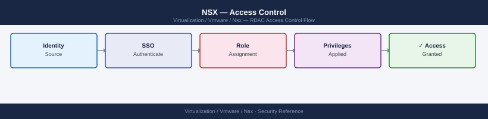

---
tags:
  - nsx
  - nsx-4
  - security
  - vmware
---
# NSX — Access Control


```bash
# List all role bindings (users and groups with assigned roles)
curl -sk -u 'admin:password' \
  "https://<nsx-manager>/api/v1/aaa/role-bindings" | \
  python3 -c "
import sys, json
d = json.load(sys.stdin)
for r in d.get('results', []):
    name  = r.get('name', r.get('id', '?'))
    rtype = r.get('type', '?')
    roles = ', '.join(x.get('role','?') for x in r.get('roles', []))
    src   = r.get('identity_source_type', 'LOCAL')
    print(f'  {name:<50} type={rtype:<15} roles={roles:<25} source={src}')
"
```


```text title="Expected output"
admin                                              type=USER           roles=enterprise_admin     source=LOCAL
  nsx-auditor                                        type=USER           roles=auditor               source=LOCAL
  security-team                                      type=GROUP          roles=security_admin       source=LDAP
  network-ops                                        type=GROUP          roles=network_admin        source=LDAP
  readonly-users                                     type=GROUP          roles=read_only_admin      source=LDAP
  svc-automation                                     type=USER           roles=enterprise_admin     source=LOCAL
```

!!! warning "Common errors"
    **`curl: (60) SSL certificate problem: self signed certificate`** — Add `-k` flag to curl command (already present in example; if error persists, verify NSX Manager certificate with `openssl s_client -connect <nsx-manager>:443`).
    **`json.decoder.JSONDecodeError: Expecting value: line 1 column 1`** — Verify NSX Manager is reachable and responding with valid JSON; check credentials and API endpoint with `curl -sk -u 'admin:password' https://<nsx-manager>/api/v1/aaa/role-bindings -v`.
    **`curl: (7) Failed to connect to <nsx-manager> port 443: Connection refused`** — Confirm NSX Manager hostname/IP is correct and the management interface is accessible from your client; verify with `ping <nsx-manager>` and `nc -zv <nsx-manager> 443`.
```bash
curl -sk -u 'admin:password' \
  -X PUT \
  -H "Content-Type: application/json" \
  -d '{
    "display_name": "project-tenant-a",
    "short_id": "tenant-a",
    "tier_0_gateway_paths": ["/infra/tier-0s/t0-prod"]
  }' \
  "https://<nsx-manager>/policy/api/v1/orgs/default/projects/project-tenant-a"
```

```text title="Expected output"
{
  "resource_type": "Project",
  "id": "project-tenant-a",
  "display_name": "project-tenant-a",
  "short_id": "tenant-a",
  "path": "/orgs/default/projects/project-tenant-a",
  "relative_path": "project-tenant-a",
  "parent_path": "/orgs/default",
  "marked_for_delete": false,
  "overridden": false,
  "tier_0_gateway_paths": [
    "/infra/tier-0s/t0-prod"
  ],
  "_create_time": 1698756432145,
  "_last_modified_time": 1698756432145,
  "_system_owned": false,
  "_protection": "NOT_PROTECTED",
  "_revision": 0
}
```

!!! warning "Common errors"
    **`curl: (60) SSL certificate problem: self signed certificate`** — Add `-k` flag to skip SSL verification (already present in example; if error persists, verify NSX Manager certificate chain).
    **`{"error_code":403,"error_message":"User admin does not have permission to create/modify projects"}`** — Ensure the admin user has Enterprise Admin or Project Admin role assigned in NSX Manager.
    **`{"error_code":404,"error_message":"Tier-0 gateway /infra/tier-0s/t0-prod not found"}`** — Verify the Tier-0 gateway path exists by running `curl -sk -u 'admin:password' https://<nsx-manager>/policy/api/v1/infra/tier-0s` and confirm the gateway name matches exactly.
```bash
curl -sk -u 'admin:password' \
  -X POST \
  -H "Content-Type: application/json" \
  -d '{
    "name": "CN=TenantA-Admins,OU=Groups,DC=corp,DC=local",
    "type": "remote_group",
    "identity_source_type": "LDAP",
    "roles": [{
      "role": "project_admin",
      "role_type": "ORG_ROLE",
      "org_id": "default",
      "project_ids": ["project-tenant-a"]
    }]
  }' \
  "https://<nsx-manager>/api/v1/aaa/role-bindings"
```

```text title="Expected output"
{
  "id": "role-binding-12847",
  "name": "CN=TenantA-Admins,OU=Groups,DC=corp,DC=local",
  "type": "remote_group",
  "identity_source_type": "LDAP",
  "roles": [
    {
      "role": "project_admin",
      "role_type": "ORG_ROLE",
      "org_id": "default",
      "project_ids": ["project-tenant-a"]
    }
  ],
  "resource_type": "RoleBinding",
  "_create_time": 1699564823456,
  "_last_modified_time": 1699564823456,
  "_revision": 0
}
```

!!! warning "Common errors"
    **`curl: (60) SSL certificate problem: self signed certificate`** — Add `-k` flag to skip certificate verification, or import the NSX Manager's CA certificate into your system trust store.
    **`{"httpStatus": 401, "error_code": 5003, "module_name": "Common", "error_message": "Authentication failed"}`** — Verify the admin credentials are correct and the user has API access permissions enabled in NSX Manager.
    **`{"httpStatus": 400, "error_code": 5000, "error_message": "Invalid project_id: project-tenant-a"}`** — Confirm the project ID exists in NSX Manager by running `curl -sk -u 'admin:password' https://<nsx-manager>/api/v1/projects` and use a valid project ID from the response.
```bash
# SSH to NSX Manager node
nsxcli

# Allow API access only from admin jump hosts and monitoring
set firewall rule 1 source-ip 10.0.1.0/24 dest-port 443 action allow
set firewall rule 2 source-ip 10.0.2.10/32 dest-port 443 action allow
set firewall rule 3 dest-port 443 action deny

# Allow SSH from jump hosts only
set firewall rule 10 source-ip 10.0.1.0/24 dest-port 22 action allow
set firewall rule 11 dest-port 22 action deny

get firewall rules
```

```text title="Expected output"
NSX CLI (build 20.0.3.1-18414822)
Connected to NSX Manager at 192.168.100.15

firewall rule 1 configured: source-ip 10.0.1.0/24 dest-port 443 action allow
firewall rule 2 configured: source-ip 10.0.2.10/32 dest-port 443 action allow
firewall rule 3 configured: dest-port 443 action deny
firewall rule 10 configured: source-ip 10.0.1.0/24 dest-port 22 action allow
firewall rule 11 configured: dest-port 22 action deny

Firewall Rules:
Rule ID | Source IP      | Dest Port | Action | Protocol
--------|----------------|-----------|--------|----------
1       | 10.0.1.0/24    | 443       | allow  | tcp
2       | 10.0.2.10/32   | 443       | allow  | tcp
3       | any            | 443       | deny   | tcp
10      | 10.0.1.0/24    | 22        | allow  | tcp
11      | any            | 22        | deny   | tcp
```

!!! warning "Common errors"
    **`Error: firewall rule 1 already exists`** — Delete the existing rule with `delete firewall rule 1` before reconfiguring it.
    **`Error: Invalid source-ip format: 10.0.1.0/24`** — Verify CIDR notation is correct and the NSX version supports subnet-based rules; use individual IPs if needed.
    **`Error: Access denied — insufficient privileges`** — Ensure your NSX user account has admin role; check with `get user <username>`.
```bash
# List existing principal identities
curl -sk -u 'admin:password' \
  "https://<nsx-manager>/api/v1/aaa/principal-identities"

# Verify certificate binding for an identity
curl -sk -u 'admin:password' \
  "https://<nsx-manager>/api/v1/aaa/principal-identities/<pi-id>"
```
```powershell
# PowerCLI — cross-check NSX role bindings against AD group membership
# (runs from a machine with AD RSAT tools and NSX API access)
$groups = @("NSX-Admins", "NSX-Network", "NSX-Security", "NSX-Ops")
foreach ($g in $groups) {
    $members = Get-ADGroupMember -Identity $g | Select-Object SamAccountName, distinguishedName
    Write-Host "=== $g ==="
    $members | ForEach-Object { Write-Host "  $($_.SamAccountName)" }
}
```

## Before you begin

- **Access:** vCenter Administrator role
- **Change management:** security changes require CAB approval in most environments
- **Rollback plan:** document current state before any security control change
- **Testing:** validate in a non-production environment first where possible

---

## See also

- [NSX — Authentication](../authentication/)
- [NSX — Hardening](../hardening/)
