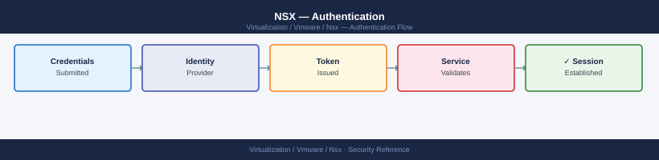

---
tags:
  - nsx
  - nsx-4
  - security
  - vmware
---
# NSX — Authentication


```bash
curl -sk -u 'admin:password' \
  -X PUT \
  -H "Content-Type: application/json" \
  -d '{
    "api_failed_auth_lockout_period": 900,
    "api_failed_auth_reset_period": 900,
    "api_max_requests": 100,
    "cli_failed_auth_lockout_period": 900,
    "cli_max_auth_failures": 5,
    "minimum_password_length": 20
  }' \
  "https://<nsx-manager>/api/v1/node/aaa/auth-policy"
```

```bash
curl -sk -u 'admin:password' \
  -X POST \
  -H "Content-Type: application/json" \
  -d '{"search_query": "nsxadmin", "cursor": "0"}' \
  "https://<nsx-manager>/api/v1/aaa/ldap/search"

# Expected: returns the matching user object from AD
```
```bash
# Assign Enterprise Admin role to an AD group
curl -sk -u 'admin:password' \
  -X POST \
  -H "Content-Type: application/json" \
  -d '{
    "roles": [{
      "role": "enterprise_admin"
    }],
    "name": "CN=NSX-Admins,OU=Groups,DC=corp,DC=local",
    "type": "remote_group",
    "identity_source_type": "LDAP",
    "identity_source_id": "<ldap-source-id>"
  }' \
  "https://<nsx-manager>/api/v1/aaa/role-bindings"
```
```bash
curl -sk -u 'admin:Password123!' \
  "https://nsx-manager.example.local/api/v1/cluster/status"
```
```bash
# Create session (returns Set-Cookie header)
curl -sk -u 'admin:Password123!' \
  -X POST \
  -c /tmp/nsx-session.txt \
  "https://nsx-manager.example.local/api/v1/aaa/session"

# Use session cookie for subsequent requests
curl -sk \
  -b /tmp/nsx-session.txt \
  "https://nsx-manager.example.local/api/v1/cluster/status"

# Invalidate session when done
curl -sk -u 'admin:Password123!' \
  -X DELETE \
  -b /tmp/nsx-session.txt \
  "https://nsx-manager.example.local/api/v1/aaa/session"
```
```bash
# Generate client key and CSR
openssl req -newkey rsa:2048 -nodes \
  -keyout nsx-automation.key \
  -out nsx-automation.csr \
  -subj "/CN=nsx-automation/O=corp"

# Submit CSR to internal CA and get certificate (nsx-automation.crt)

# Register the certificate with NSX Manager
curl -sk -u 'admin:Password123!' \
  -X POST \
  -H "Content-Type: application/json" \
  -d "{
    \"pem_encoded\": \"$(cat nsx-automation.crt | awk '{printf \"%s\\\\n\", $0}')\"
  }" \
  "https://nsx-manager.example.local/api/v1/trust-management/certificates?action=import"

# Bind the certificate to a principal identity (service account)
curl -sk -u 'admin:Password123!' \
  -X POST \
  -H "Content-Type: application/json" \
  -d '{
    "name": "automation-account",
    "node_id": "automation-host-01",
    "role": "network_engineer",
    "certificate_id": "<cert-id-from-above>",
    "is_protected": true
  }' \
  "https://nsx-manager.example.local/api/v1/aaa/principal-identities"

# Use certificate for API calls (no password needed)
curl -sk \
  --cert nsx-automation.crt \
  --key nsx-automation.key \
  "https://nsx-manager.example.local/api/v1/cluster/status"
```
```bash
# Enable audit log export (NSX Manager CLI)
nsxcli
set service syslog exporter siem-01 level info protocol TLS server 10.0.0.100 port 6514
```
```bash
# View recent auth events on NSX Manager node
tail -100 /var/log/vmware/nsx-manager/audit.log | grep -i "login\|auth\|role"
```

## Before you begin

- **Access:** vCenter Administrator role
- **Change management:** security changes require CAB approval in most environments
- **Rollback plan:** document current state before any security control change
- **Testing:** validate in a non-production environment first where possible

---

## See also

- [NSX — Access Control](access-control/)
- [NSX — Hardening](hardening/)
