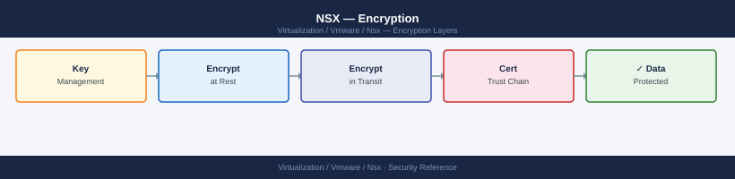

---
tags:
  - nsx
  - nsx-4
  - security
  - vmware
---
# NSX — Encryption


```bash
# From a client machine — test TLS negotiation
openssl s_client -connect nsx-manager.example.local:443 -tls1   # Should fail (TLS 1.0 rejected)
openssl s_client -connect nsx-manager.example.local:443 -tls1_1 # Should fail (TLS 1.1 rejected)
openssl s_client -connect nsx-manager.example.local:443 -tls1_2 # Should succeed
openssl s_client -connect nsx-manager.example.local:443 -tls1_3 # Should succeed if TLS 1.3 enabled

# Check the presented certificate
openssl s_client -connect nsx-manager.example.local:443 -tls1_2 2>/dev/null | \
  openssl x509 -noout -dates -subject -issuer
```

```bash
# List all imported certificates
curl -sk -u 'admin:password' \
  "https://<nsx-manager>/api/v1/trust-management/certificates" | \
  python3 -c "
import sys, json
d = json.load(sys.stdin)
for c in d.get('results', []):
    cid   = c.get('id', '?')
    name  = c.get('display_name', '?')
    expiry = c.get('not_after', '?')
    print(f'  {cid:<40} {name:<30} expires={expiry}')
"

# Thumbprint of the API certificate (used for vCenter trust)
nsxcli
get certificate api thumbprint
```
```bash
# Step 1 — Generate a CSR on NSX Manager
curl -sk -u 'admin:password' \
  -X POST \
  -H "Content-Type: application/json" \
  -d '{
    "resource_type": "CsrProperties",
    "display_name": "nsx-api-cert",
    "subject": {
      "attributes": [
        {"key": "CN", "value": "nsx-manager.example.local"},
        {"key": "O",  "value": "Corp Inc"},
        {"key": "C",  "value": "GB"}
      ]
    },
    "key_size": "2048",
    "algorithm": "RSA",
    "extensions": {
      "dns_names": ["nsx-manager.example.local"],
      "ip_addresses": ["10.0.0.50"]
    }
  }' \
  "https://<nsx-manager>/api/v1/trust-management/csrs" | python3 -m json.tool
```
```bash
# Step 2 — Import the signed certificate
CERT_PEM=$(cat nsx-api-signed.crt | awk '{printf "%s\\n", $0}')
KEY_PEM=$(cat nsx-api.key | awk '{printf "%s\\n", $0}')

curl -sk -u 'admin:password' \
  -X POST \
  -H "Content-Type: application/json" \
  -d "{
    \"pem_encoded\": \"${CERT_PEM}\",
    \"private_key\": \"${KEY_PEM}\"
  }" \
  "https://<nsx-manager>/api/v1/trust-management/certificates?action=import"
# Returns the certificate ID
```
```bash
# Step 3 — Apply the certificate to the API endpoint
curl -sk -u 'admin:password' \
  -X POST \
  "https://<nsx-manager>/api/v1/node/services/http?action=apply_certificate&certificate_id=<cert-id>"
```
```bash
# Check expiry of all NSX-managed certificates
curl -sk -u 'admin:password' \
  "https://<nsx-manager>/api/v1/trust-management/certificates?details=true" | \
  python3 -c "
import sys, json
from datetime import datetime, timezone
d = json.load(sys.stdin)
now = datetime.now(timezone.utc)
for c in d.get('results', []):
    name   = c.get('display_name', c.get('id','?'))
    expiry = c.get('not_after','')
    if expiry:
        exp_dt = datetime.fromisoformat(expiry.replace('Z','+00:00'))
        days   = (exp_dt - now).days
        flag   = '' if days > 60 else '  *** EXPIRING SOON' if days > 14 else '  *** EXPIRED/CRITICAL'
        print(f'  {name:<40} expires={expiry[:10]}  days_remaining={days}{flag}')
"
```
```bash
# On NSX Manager node
nsxcli
set service syslog exporter siem-tls level info protocol TLS server 10.0.0.100 port 6514

# Verify
get service syslog exporters
```
```bash
curl -sk -u 'admin:password' \
  -X POST \
  -H "Content-Type: application/json" \
  -d "{\"pem_encoded\": \"$(cat siem-ca.crt | awk '{printf "%s\\n", $0}')\"}" \
  "https://<nsx-manager>/api/v1/trust-management/certificates?action=import"
```

## Before you begin

- **Access:** vCenter Administrator role
- **Change management:** security changes require CAB approval in most environments
- **Rollback plan:** document current state before any security control change
- **Testing:** validate in a non-production environment first where possible

---

## See also

- [NSX — Hardening](../hardening/)
- [NSX — Health Checks](../../operations/health-checks/)
