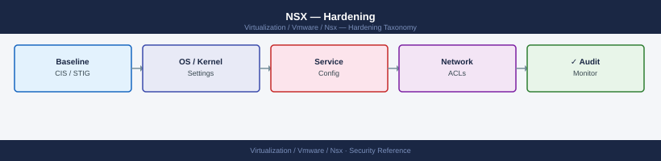

---
tags:
  - nsx
  - nsx-4
  - security
  - vmware
---
# NSX — Hardening



```bash
curl -sk -u 'admin:password' \
  "https://<nsx-manager>/policy/api/v1/infra/domains/default/security-policies/default-layer3-section/rules" | \
  python3 -c "
import sys, json
d = json.load(sys.stdin)
for r in d.get('results', []):
    if r.get('sequence_number', 0) == 65535:
        print(f'Rule 65535: action={r.get(\"action\")}')
"
# Expected: action=DROP
```

```bash
# SSH to Edge node — list services
get services

# Disable a specific service (example: LB if not using NSX load balancer)
set service load-balancer stop

# Services that should always be running on production Edge:
#   dataplane, router, manager (agent to NSX Manager)
# Services that may be stopped if unused:
#   load-balancer, dhcp, dns
```
```bash
# SSH to Active Edge
set edge-cluster failover
# T0 gateway moves to Standby Edge — BGP reconverges

# Verify BGP on new Active Edge
get bgp neighbor summary
# All peers should be Established within 10–30 seconds

# Verify routing table intact
vrf <tier0-vrf>
get route
```
```bash
# Confirm BGP neighbor has password set
curl -sk -u 'admin:password' \
  "https://<nsx-manager>/policy/api/v1/infra/tier-0s/<t0-id>/locale-services/default/bgp/neighbors" | \
  python3 -c "
import sys, json
d = json.load(sys.stdin)
for n in d.get('results', []):
    has_pwd = 'YES' if n.get('password') else 'NO'
    print(f'{n.get(\"display_name\",\"?\")}  {n.get(\"neighbor_address\",\"?\")}  password={has_pwd}')
"
```
```bash
# On ESXi host
esxcli software vib list | grep -i nsx | awk '{print $1, $4}'
# The acceptance level column should show VMwareCertified or VMwareAccepted
```
```bash
# On each ESXi host — confirm DFW filters exist
summarize-dvfilter | grep -c "vmware-sfw"
# Count should equal the number of powered-on VM vNICs on this host
# A count of 0 means DFW is not applying to VMs — escalate immediately
```

## Before you begin

- **Access:** vCenter Administrator role
- **Change management:** security changes require CAB approval in most environments
- **Rollback plan:** document current state before any security control change
- **Testing:** validate in a non-production environment first where possible

---

## See also

- [NSX — Access Control](access-control/)
- [NSX — Authentication](authentication/)
- [NSX — Health Checks](../operations/health-checks/)
