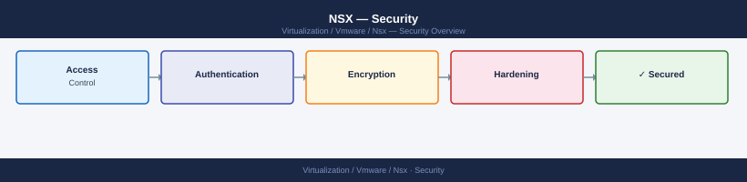

---
tags:
  - nsx
  - nsx-4
  - security
  - vmware
---
# NSX — Security

Security reference for VMware NSX. Covers NSX Manager authentication, role-based access control, data-in-transit encryption, certificate management, and DFW hardening baselines.

*Applies to: NSX-T 3.x / NSX 4.x*

<a class="kb-card" href="authentication/">
  <strong>Authentication</strong>
  SSO integration, local accounts, and API authentication.
</a>

<a class="kb-card" href="access-control/">
  <strong>Access Control</strong>
  Roles, permissions, and least privilege access.
</a>

<a class="kb-card" href="encryption/">
  <strong>Encryption</strong>
  Data-in-transit encryption and certificate management.
</a>

<a class="kb-card" href="hardening/">
  <strong>Hardening</strong>
  Security baselines, DFW policy, and compliance.
</a>

