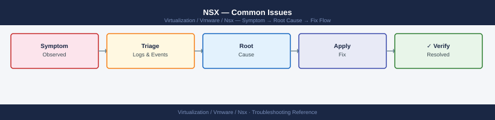

---
tags:
  - nsx
  - nsx-4
  - troubleshooting
  - vmware
search:
  boost: 2
---
# NSX — Common Issues


```bash
# Step 1 — Confirm the VM's segment and gateway IP
# Check segment config in NSX Manager UI or API
curl -sk -u 'admin:password' \
  "https://<nsx-manager>/policy/api/v1/infra/segments/<segment-id>"

# Step 2 — Check DFW on the VM's ESXi host
# SSH to the ESXi host running the VM
summarize-dvfilter | grep <vm-name>
vsipioctl getrules -f <filter-name>
vsipioctl getstats -f <filter-name>

# Look for a DENY or DROP rule with non-zero packet count
# The last rule (65535) being hit with high counts = default deny is blocking

# Step 3 — Traceflow from the VM to the gateway
# NSX Manager UI: Plan & Troubleshoot → Traceflow
# Source: VM vNIC, Destination: gateway IP, Protocol: ICMP
```


```text title="Expected output"
{
  "resource_type": "Segment",
  "id": "segment-prod-web-01",
  "display_name": "Production-Web-Tier",
  "subnets": [
    {
      "gateway_address": "192.168.10.1/24",
      "network": "192.168.10.0/24"
    }
  ],
  "connectivity_path": "/infra/tier-1s/tier1-prod",
  "state": "realized"
}

VM: prod-web-vm-04
   Module ID: 4262, Slot: 1, Generation: 3
   Filter: DVFILTER-FWPOLICY-prod-web-vm-04-eth0

Filter: DVFILTER-FWPOLICY-prod-web-vm-04-eth0
  Rule 100 (ALLOW TCP 443): packets=45821, bytes=28934012
  Rule 200 (ALLOW TCP 80): packets=12043, bytes=5621847
  Rule 65535 (DEFAULT DENY): packets=3847, bytes=284956
```

!!! warning "Common errors"
    **`curl: (60) SSL certificate problem: self signed certificate`** — Add the `-k` flag (already present) or import the NSX Manager CA certificate into your system trust store.
    **`summarize-dvfilter: command not found`** — Ensure you are SSH'd directly to the ESXi host (not vCenter) and running as root or with appropriate privileges.
    **`vsipioctl: No such file or directory`** — Verify the filter name matches exactly (case-sensitive) and that the DFW module is loaded on the ESXi host with `esxcli system module list | grep dfwpf`.
```bash
# From NSX Manager CLI
nsxcli
get tunnel status
# Look for DOWN tunnels between specific TEP pairs

get tunnel status <remote-tep-ip>

# Identify which hosts have the affected TEPs
get tunnel endpoints

# From the ESXi host — verify TEP IP is assigned
esxcli network ip interface ipv4 get | grep vmk

# Test TEP reachability
vmkping -I vmk<n> <remote-tep-ip>

# Test with the right MTU
vmkping -I vmk<n> -d -s 1572 <remote-tep-ip>
```

```text title="Expected output"
nsxcli> get tunnel status
Tunnel Status:
  Source TEP       Destination TEP  Status    Last Status Change
  192.168.100.45   192.168.100.46   UP        2024-01-15 14:32:18
  192.168.100.45   192.168.100.47   DOWN      2024-01-15 13:45:02
  192.168.100.46   192.168.100.45   UP        2024-01-15 14:32:19
  192.168.100.46   192.168.100.47   DOWN      2024-01-15 13:44:55

nsxcli> get tunnel status 192.168.100.47
Tunnel Status for Remote TEP 192.168.100.47:
  Source TEP       Status    Packets Lost  Last Heartbeat
  192.168.100.45   DOWN      1247          2024-01-15 13:45:02
  192.168.100.46   DOWN      1089          2024-01-15 13:44:55

nsxcli> get tunnel endpoints
TEP Configuration:
  Host Name        TEP IP           VLAN  Segment ID
  esx-host-01.lab  192.168.100.45   0     nsx-overlay-1
  esx-host-02.lab  192.168.100.46   0     nsx-overlay-1
  esx-host-03.lab  192.168.100.47   0     nsx-overlay-1

[esx-host-01:~] esxcli network ip interface ipv4 get | grep vmk
vmk0                 DHCP       true      192.168.1.50      255.255.255.0
vmk1                 DHCP       true      192.168.100.45    255.255.255.0
vmk10                DHCP       true      192.168.101.50    255.255.255.0

[esx-host-01:~] vmkping -I vmk1 192.168.100.47
PING 192.168.100.47 (192.168.100.47): 56 data bytes
Request timed out.
Request timed out.
Request timed out.
--- 192.168.100.47 statistics ---
3 packets transmitted, 0 packets received, 100% packet loss

[esx-host-01:~] vmkping -I vmk1 -d -s 1572 192.168.100.47
PING 192.168.100.47 (192.168.100.47): 1572 data bytes
Request timed out.
Request timed out.
Request timed out.
--- 192.168.100.47 statistics ---
3 packets transmitted, 0 packets received, 100% packet loss
```

!!! warning "Common errors"
    **`Request timed out.`** — Verify network connectivity between TEP hosts, check firewall rules allow UDP 6081 (VXLAN), and confirm the remote TEP IP is reachable via `ping` from the ESXi management network first.
    **`vmkping: Unknown option`** — Use correct vmkping syntax with interface flag as `-I vmk<n>` (capital I) and ensure the vmkernel port
```bash
# Step 1 — Confirm the policy is published (not in draft)
curl -sk -u 'admin:password' \
  "https://<nsx-manager>/policy/api/v1/infra/domains/default/security-policies/<policy-id>"
# Check: "publish_state": "realized"

# Step 2 — Check realisation status on the transport node
curl -sk -u 'admin:password' \
  "https://<nsx-manager>/policy/api/v1/infra/realized-state/realized-entities?intent_path=<policy-path>"

# Step 3 — Check rules on the ESXi host
# SSH to ESXi host running the VM
summarize-dvfilter | grep <vm-name>
vsipioctl getrules -f <filter-name> | grep <rule-id>

# Step 4 — Check group membership
# Is the VM actually in the security group referenced by the rule?
curl -sk -u 'admin:password' \
  "https://<nsx-manager>/policy/api/v1/infra/domains/default/groups/<group-id>/members/virtual-machines"
```

```text title="Expected output"
{
  "resource_type": "SecurityPolicy",
  "id": "policy-001",
  "display_name": "prod-web-tier-policy",
  "publish_state": "realized",
  "path": "/infra/domains/default/security-policies/policy-001",
  "rules": [
    {
      "id": "rule-1",
      "display_name": "allow-http",
      "action": "ALLOW",
      "sequence_number": 0
    }
  ]
}

Realized state check:
{
  "results": [
    {
      "entity_type": "SecurityPolicy",
      "state": "REALIZED",
      "realization_specific_identifier": "policy-001"
    }
  ]
}

ESXi dvfilter summary:
vm-prod-web-01 VNic:4 Enabled:true NumFilters:2 Filters:nsx-dvfilter-generic,nsx-dvfilter-fwall

vsipioctl getrules output:
Rule ID: rule-1 | Action: ALLOW | Direction: IN_OUT | Protocol: TCP | Port: 80 | Source: 10.0.1.0/24

Group membership check:
{
  "results": [
    {
      "external_id": "vm-prod-web-01",
      "display_name": "vm-prod-web-01",
      "resource_type": "VirtualMachine"
    }
  ],
  "result_count": 1
}
```

!!! warning "Common errors"
    **`curl: (60) SSL certificate problem: self signed certificate`** — Add `-k` flag to skip SSL verification, or import the NSX Manager certificate into your trusted store.
    **`HTTP 404 Not Found`** — Verify the policy-id, group-id, and filter-name are correct and exist in the NSX Manager inventory.
    **`summarize-dvfilter: command not found`** — SSH directly to the ESXi host (not vCenter) where the VM is running, as this command is only available on ESXi.
```bash
# From any reachable Manager node
nsxcli
get cluster status
get managers
get corfu-cluster status

# Check services on this node
get services
get service http
get service manager
```

```text title="Expected output"
NSX CLI (build 20.0.3.1)
Connected to 192.168.1.10

cluster status:
  Cluster ID: 550e8400-e29b-41d4-a716-446655440000
  Status: STABLE
  Node Count: 3
  Leader: nsx-manager-01.corp.local (192.168.1.10)

managers:
  UUID                                   Hostname              IP Address    Status   Version
  550e8400-e29b-41d4-a716-446655440000   nsx-manager-01       192.168.1.10   UP       20.0.3.1
  550e8400-e29b-41d4-a716-446655440001   nsx-manager-02       192.168.1.11   UP       20.0.3.1
  550e8400-e29b-41d4-a716-446655440002   nsx-manager-03       192.168.1.12   UP       20.0.3.1

corfu-cluster status:
  Status: HEALTHY
  Node Count: 3
  Quorum: ESTABLISHED

services:
  Service Name          Status    PID      Uptime
  manager               UP        4521     45d 12h
  http                  UP        3847     45d 12h
  cluster               UP        4102     45d 12h
  messaging             UP        4203     45d 12h

service http:
  Status: UP
  Port: 443
  Connections: 1247
  Memory: 512 MB

service manager:
  Status: UP
  Port: 5480
  Memory: 2048 MB
  Threads: 156
```

!!! warning "Common errors"
    **`nsxcli: command not found`** — SSH to an NSX Manager node directly (not a vCenter or ESXi host) and ensure you have manager-level credentials.
    **`Error: Unable to connect to cluster`** — Verify network connectivity to the Manager node on port 5480 and confirm the cluster status is STABLE before retrying.
    **`Error: Service manager is DOWN`** — Restart the manager service with `restart service manager` and check system logs via `get log-file` if the service fails to come back up.
```bash
# Check transport node state details
curl -sk -u 'admin:password' \
  "https://<nsx-manager>/api/v1/transport-nodes/<tn-id>/state"

# Check the specific error message
# It will indicate which step failed: VIB install, TEP IP allocation, etc.

# On the ESXi host (SSH)
esxcli software vib list | grep -i nsx
# If VIBs are missing or showing wrong version, re-run preparation

# Check IP pool has available IPs
curl -sk -u 'admin:password' \
  "https://<nsx-manager>/api/v1/pools/ip-pools/<pool-id>/ip-allocations"
```

```text title="Expected output"
{
  "transport_node_id": "tn-12345678-abcd-ef01-2345-6789abcdef01",
  "state": "FAILED",
  "status": "DOWN",
  "failure_details": {
    "error_code": "INSTALL_FAILED",
    "error_message": "NSX VIB installation failed on host esxi-prod-01.lab.local",
    "failed_step": "VIB_INSTALL",
    "timestamp": "2024-01-15T14:32:18.123Z"
  }
}

Name                                 Version                Install Date
nsx-vib-esx-vsip                     3.2.1.0-20456789       2024-01-10
nsx-vib-esx-nsx-lldp                 3.2.1.0-20456789       2024-01-10

{
  "results": [
    {
      "ip_address": "192.168.100.45",
      "allocation_id": "alloc-uuid-001",
      "status": "ALLOCATED",
      "host_id": "esxi-prod-01"
    },
    {
      "ip_address": "192.168.100.46",
      "allocation_id": "alloc-uuid-002",
      "status": "ALLOCATED",
      "host_id": "esxi-prod-02"
    }
  ],
  "result_count": 2,
  "pool_size": 10,
  "available_ips": 8
}
```

!!! warning "Common errors"
    **`curl: (60) SSL certificate problem: self signed certificate`** — Add the `-k` flag to skip certificate verification, or import the NSX Manager certificate into your trusted store.
    **`HTTP 401 Unauthorized`** — Verify the admin credentials are correct and the user has API access permissions in NSX Manager.
    **`"error_message": "NSX VIB installation failed"` with `"failed_step": "VIB_INSTALL"`** — SSH to the ESXi host and check `/var/log/esxupdate.log` for the specific VIB installation error, then re-run host preparation from NSX Manager.
```bash
# SSH to Edge node
get node cpu-usage
get service dataplane stats

# Check active connections
get load-balancer status
get load-balancer virtual-servers
get nat translations | wc -l
```

```d2
direction: down

symptom: Identify Symptom {shape: diamond}
diagnostic_flow: "Diagnostic Flow" {shape: rectangle}
verify_resolution: "Verify resolution" {shape: rectangle}
resolution: Resolve or Escalate {shape: oval}

symptom -> diagnostic_flow: investigate
symptom -> verify_resolution: investigate
diagnostic_flow -> resolution
verify_resolution -> resolution
```

## Diagnostic Flow

```d2
direction: right

S: "What is the symptom?" {shape: rectangle}
A: "VM cannot reach\nanother VM" {shape: rectangle}
B: "North-south broken\n/ BGP down" {shape: rectangle}
C: "Transport node\nconfig failed" {shape: rectangle}
D: "NSX Manager\nunreachable" {shape: rectangle}
A1: "Run Traceflow in NSX UI\nbetween source and dest" {shape: rectangle}
A2: "A2" {shape: rectangle}
A3: "→ DFW Rules section\ncheck applied policy" {shape: rectangle}
A4: "→ Segment Config section\ncheck port binding" {shape: rectangle}
A5: "→ Routing section\ncheck route tables" {shape: rectangle}
B1: "B1" {shape: rectangle}
B2: "→ Edge Failure section\ncheck HA and BFD" {shape: rectangle}
B3: "B3" {shape: rectangle}
B4: "→ BGP section\ncheck AS, timers, upstream" {shape: rectangle}
B5: "Check T0 static routes\nand route redistribution" {shape: rectangle}
C1: "→ Transport Node section\ncheck VIBs and TEP IP" {shape: rectangle}
D1: "D1" {shape: rectangle}
D2: "→ Manager Cluster section" {shape: rectangle}
D3: "Check API gateway\nand LB VIP" {shape: rectangle}

S -> A
S -> B
S -> C
S -> D
A -> A1
A2 -> A3
A2 -> A4
A2 -> A5
B1 -> B2
B3 -> B4
B3 -> B5
C -> C1
D1 -> D2
D1 -> D3
```

---

## Before you begin

- **Access:** SSH to vCenter Shell and ESXi hosts; vSphere Client read access
- **Gather first:** recent error message text, event timestamps, and affected object names
- **Scope:** confirm whether the issue affects a single object, host, cluster, or site
- **Escalation:** open a vendor support ticket before running any destructive step
- **Logging:** document each command and output — required if escalation is needed

---

---

## See also

- [NSX Data Plane — Internals](../../../internals/nsx-data-plane/)
- [NSX — Operations](../../operations/)
- [Scenarios — NSX Connectivity Broken](../../../topics/scenarios/nsx-connectivity-broken/)

---

## Verify resolution

- **Alarms cleared:** Home → Alarms — the triggering alarm is no longer active
- **Event log:** confirm no new related error events in the last 5 minutes
- **Functional test:** perform the action that was failing (connect, vMotion, storage I/O) — confirm it succeeds
- **Monitor:** leave the vSphere Client open for 10 minutes and confirm the issue does not recur
