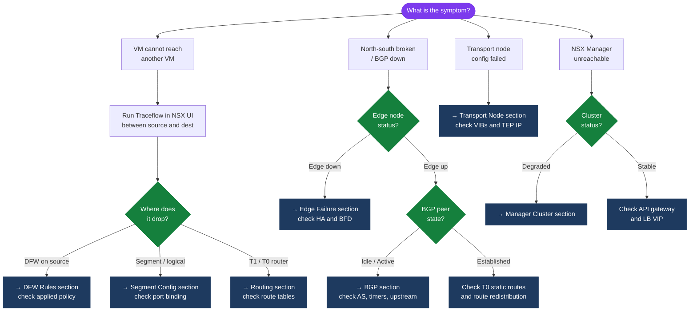

---
tags:
  - nsx
  - nsx-4
  - troubleshooting
  - vmware
---
# NSX — Common Issues

```bash
# Step 1 — Confirm the VM's segment and gateway IP
# Check segment config in NSX Manager UI or API
curl -sk -u 'admin:password' \
  "https://<nsx-manager>/policy/api/v1/infra/segments/<segment-id>"

# Step 2 — Check DFW on the VM's ESXi host
# SSH to the ESXi host running the VM
summarize-dvfilter | grep <vm-name>
vsipioctl getrules -f <filter-name>
vsipioctl getstats -f <filter-name>

# Look for a DENY or DROP rule with non-zero packet count
# The last rule (65535) being hit with high counts = default deny is blocking

# Step 3 — Traceflow from the VM to the gateway
# NSX Manager UI: Plan & Troubleshoot → Traceflow
# Source: VM vNIC, Destination: gateway IP, Protocol: ICMP
```
```text
┌───────────────────────────────────────── NSX — Common Issues ─────────────────────────────────────────┐
│                                                                                                       │
│  BGP session down, DFW unexpected drops, transport node failures, and fixes.                          │
│                                                                                                       │
│   ┌──────────────────────────────────────────────┐  ┌─────────────────────────────────────────────┐   │
│   │             BGP / Routing Issues             │  │               DFW Drop Issues               │   │
│   │           Session Idle or Connect            │  │         Traffic unexpectedly dropped        │   │
│   │            Check Edge uplink VLAN            │  │             Check DFW rule order            │   │
│   │           Verify BGP timers match            │  │             Enable DFW flow logs            │   │
│   │            Check ASN/neighbor IP             │  │              Use Traceflow tool             │   │
│   │           get bgp neighbor summary           │  │            Check group membership           │   │
│   └──────────────────────────────────────────────┘  └─────────────────────────────────────────────┘   │
│                                                                                                       │
│  BGP/routing diagnosis first; DFW Traceflow for east-west drop issues.                                │
│                                                                                                       │
│                          ▼                                                 ▼                          │
│                                                                                                       │
│   ┌──────────────────────────────────────────────┐  ┌─────────────────────────────────────────────┐   │
│   │            Transport Node Issues             │  │            Manager Cluster Issues           │   │
│   │             Node shows degraded              │  │             Node shows DEGRADED             │   │
│   │           Check NSX agent on ESXi            │  │           Check disk space on mgr           │   │
│   │            Resync transport node             │  │            Restart proton service           │   │
│   │            Check TEP connectivity            │  │              Verify NTP in sync             │   │
│   │           N-VDS mtu / uplink check           │  │            Check /var/log/proton            │   │
│   └──────────────────────────────────────────────┘  └─────────────────────────────────────────────┘   │
│                                                                                                       │
│  Physical Infrastructure (the hardware everything above runs on):                                     │
│  NSX Manager VMs, Edge VMs, ESXi transport nodes, ToR switches, vCenter                               │
│                                                                                                       │
│  Key terms:                                                                                           │
│                                                                                                       │
│  BGP session = routing peer; Idle/Connect = not established                                           │
│  Traceflow   = NSX tool; sends test packet to debug path/drops                                        │
│  DFW flow log= per-rule hit log; enabled in rule settings                                             │
│  Transport node = ESXi/Edge with N-VDS; resync forces config refresh                                  │
│  TEP         = Tunnel Endpoint; GENEVE source; ping to verify                                         │
│  N-VDS       = NSX distributed switch; check uplink binding                                           │
│  proton      = NSX Manager core service; restart to recover stuck state                               │
│  DEGRADED    = NSX cluster status; one or more nodes unhealthy                                        │
│  Group memb  = DFW group members; wrong group = wrong firewall policy                                 │
│  ASN         = Autonomous System Number; must match on BGP peers                                      │
│  Edge uplink = VLAN uplink on Edge to physical switch; check tagging                                  │
│  Resync      = NSX Manager pushes config to transport node again                                      │
│                                                                                                       │
└───────────────────────────────────────────────────────────────────────────────────────────────────────┘
```
```bash
# From NSX Manager CLI
nsxcli
get tunnel status
# Look for DOWN tunnels between specific TEP pairs

get tunnel status <remote-tep-ip>

# Identify which hosts have the affected TEPs
get tunnel endpoints

# From the ESXi host — verify TEP IP is assigned
esxcli network ip interface ipv4 get | grep vmk

# Test TEP reachability
vmkping -I vmk<n> <remote-tep-ip>

# Test with the right MTU
vmkping -I vmk<n> -d -s 1572 <remote-tep-ip>
```
```bash
# Step 1 — Confirm the policy is published (not in draft)
curl -sk -u 'admin:password' \
  "https://<nsx-manager>/policy/api/v1/infra/domains/default/security-policies/<policy-id>"
# Check: "publish_state": "realized"

# Step 2 — Check realisation status on the transport node
curl -sk -u 'admin:password' \
  "https://<nsx-manager>/policy/api/v1/infra/realized-state/realized-entities?intent_path=<policy-path>"

# Step 3 — Check rules on the ESXi host
# SSH to ESXi host running the VM
summarize-dvfilter | grep <vm-name>
vsipioctl getrules -f <filter-name> | grep <rule-id>

# Step 4 — Check group membership
# Is the VM actually in the security group referenced by the rule?
curl -sk -u 'admin:password' \
  "https://<nsx-manager>/policy/api/v1/infra/domains/default/groups/<group-id>/members/virtual-machines"
```
```bash
# From any reachable Manager node
nsxcli
get cluster status
get managers
get corfu-cluster status

# Check services on this node
get services
get service http
get service manager
```
```bash
# Check transport node state details
curl -sk -u 'admin:password' \
  "https://<nsx-manager>/api/v1/transport-nodes/<tn-id>/state"

# Check the specific error message
# It will indicate which step failed: VIB install, TEP IP allocation, etc.

# On the ESXi host (SSH)
esxcli software vib list | grep -i nsx
# If VIBs are missing or showing wrong version, re-run preparation

# Check IP pool has available IPs
curl -sk -u 'admin:password' \
  "https://<nsx-manager>/api/v1/pools/ip-pools/<pool-id>/ip-allocations"
```
```bash
# SSH to Edge node
get node cpu-usage
get service dataplane stats

# Check active connections
get load-balancer status
get load-balancer virtual-servers
get nat translations | wc -l
```

## Diagnostic Flow



---

## Before you begin

- **Access:** SSH to vCenter Shell and ESXi hosts; vSphere Client read access
- **Gather first:** recent error message text, event timestamps, and affected object names
- **Scope:** confirm whether the issue affects a single object, host, cluster, or site
- **Escalation:** open a vendor support ticket before running any destructive step
- **Logging:** document each command and output — required if escalation is needed

---

---

## See also

- [NSX Data Plane — Internals](../../../internals/nsx-data-plane/)
- [NSX — Operations](../../operations/)
- [Scenarios — NSX Connectivity Broken](../../../topics/scenarios/nsx-connectivity-broken/)

---

## Verify resolution

- **Alarms cleared:** Home → Alarms — the triggering alarm is no longer active
- **Event log:** confirm no new related error events in the last 5 minutes
- **Functional test:** perform the action that was failing (connect, vMotion, storage I/O) — confirm it succeeds
- **Monitor:** leave the vSphere Client open for 10 minutes and confirm the issue does not recur
