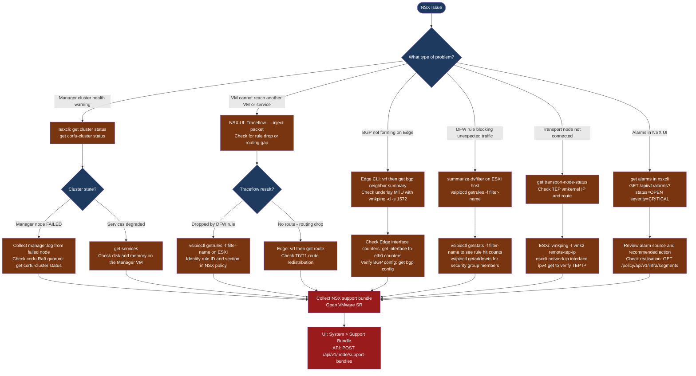

---
tags:
  - nsx
  - nsx-4
  - troubleshooting
  - vmware
search:
  boost: 1.5
---
# NSX — Diagnostics

<div class="kb-summary">
NSX diagnostic commands: check cluster and transport node health with nsxcli, inspect manager and audit logs, diagnose Edge BGP routing, inspect DFW filters on ESXi hosts with vsipioctl, run Traceflow for hop-by-hop path analysis, capture packets on Edge and ESXi, and generate the NSX support bundle for VMware SRs.

*Applies to: NSX 4.x*
</div>




```d2
direction: down

symptom: Identify Symptom {shape: diamond}
step_1_check_nsx_manager_cluster_hea: "Step 1 — Check NSX Manager cluster health" {shape: rectangle}
step_2_check_alarms_and_transport_no: "Step 2 — Check alarms and transport node status" {shape: rectangle}
step_3_diagnose_tep_connectivity_on_: "Step 3 — Diagnose TEP connectivity on ESXi hosts" {shape: rectangle}
step_4_inspect_dfw_filters_on_esxi: "Step 4 — Inspect DFW filters on ESXi" {shape: rectangle}
step_5_diagnose_edge_node_routing_an: "Step 5 — Diagnose Edge node routing and BGP" {shape: rectangle}
step_6_run_traceflow_for_hopbyhop_pa: "Step 6 — Run Traceflow for hop-by-hop path analysis" {shape: rectangle}
resolution: Resolve or Escalate {shape: oval}

symptom -> step_1_check_nsx_manager_cluster_hea: investigate
symptom -> step_2_check_alarms_and_transport_no: investigate
symptom -> step_3_diagnose_tep_connectivity_on_: investigate
symptom -> step_4_inspect_dfw_filters_on_esxi: investigate
symptom -> step_5_diagnose_edge_node_routing_an: investigate
symptom -> step_6_run_traceflow_for_hopbyhop_pa: investigate
step_1_check_nsx_manager_cluster_hea -> resolution
step_2_check_alarms_and_transport_no -> resolution
step_3_diagnose_tep_connectivity_on_ -> resolution
step_4_inspect_dfw_filters_on_esxi -> resolution
step_5_diagnose_edge_node_routing_an -> resolution
step_6_run_traceflow_for_hopbyhop_pa -> resolution
```

## Before you begin

- **Access:** SSH to an NSX Manager node (admin user); NSX UI credentials; ESXi root SSH access; Edge node admin SSH access
- **Gather first:** the specific symptom (VM unreachable, BGP down, DFW rule unexpected behavior, transport node alarm), affected segment or gateway name, and when the issue started
- **Scope:** confirm whether the issue affects one VM, one segment, one Edge gateway, or the entire NSX Manager cluster

---

## Step 1 — Check NSX Manager cluster health

```bash
# SSH to NSX Manager node
ssh admin@<nsx-manager-ip>

# Enter NSX CLI
nsxcli

# Manager cluster and node status
get cluster status
# Expected: all 3 nodes STABLE

get managers
# Shows: node IDs, IPs, roles

get corfu-cluster status
# Corfu = NSX distributed control plane database (Raft)
# Expected: all nodes connected; leader elected

# All NSX services
get services
get service manager     # Management plane
get service controller  # Control plane
get service http        # API

# Version and node inventory
get version
get nodes
```

---

## Step 2 — Check alarms and transport node status

```bash
# All open alarms (from nsxcli)
get alarms | grep -i "critical\|high"

# Via REST API — open critical alarms with source and message
curl -sk -u 'admin:<password>' \
  "https://<nsx-manager>/api/v1/alarms?status=OPEN&severity=CRITICAL" | python3 -c "
import sys, json
d = json.load(sys.stdin)
print(f'Critical alarms: {d.get(\"result_count\",0)}')
for a in d.get('results',[]):
    src  = a.get('alarm_source',{}).get('display_name','?')
    summ = a.get('summary','')[:120]
    print(f'  {src}: {summ}')
"

# All transport nodes and their connection state
get transport-nodes
get transport-node-status
# Expected: all nodes CONNECTED; problem = DISCONNECTED or DEGRADED

# Transport node tunnel status
get tunnel status
get tunnel endpoints
# Expected: all TEP tunnels UP; problem = DOWN or UNKNOWN

# Via REST API — specific transport node state
curl -sk -u 'admin:<password>' \
  "https://<nsx-manager>/api/v1/transport-nodes/<tn-id>/state" | python3 -c "
import sys, json
d = json.load(sys.stdin)
print(f'State: {d.get(\"state\",\"?\")}')
print(f'Transport failures: {d.get(\"transport_failures\",[])}')
"
```

---

## Step 3 — Diagnose TEP connectivity on ESXi hosts

```bash
# SSH to the ESXi host as root

# Verify NSX VIBs are installed
esxcli software vib list | grep -i nsx
# Expected: nsx-vib entries present

# TEP vmkernel interface IP
esxcli network ip interface ipv4 get
# Look for: vmk2 or vmk10 with the TEP IP assigned

# TEP route to reach remote TEPs
esxcli network ip route ipv4 list | grep <tep-subnet>

# Test TEP connectivity to a remote ESXi host TEP
vmkping -I vmk2 <remote-tep-ip>
# Expected: 0% loss

# Test MTU — Geneve requires 1600 bytes; test with DF bit set
vmkping -I vmk2 -d -s 1572 <remote-tep-ip>
# -d = DF bit; -s 1572 = data payload (adds 28 bytes = 1600 total)
# Problem: packet loss = MTU mismatch on the physical underlay
```

---

## Step 4 — Inspect DFW filters on ESXi

```bash
# SSH to ESXi host as root

# List all DFW filter instances (one per vNIC)
summarize-dvfilter
# Or filter for a specific VM
summarize-dvfilter | grep <vm-name>
# Note the filter name (e.g., nic-123456-eth0-vmware-sfw.2)

# View rules applied to a specific filter
vsipioctl getrules -f <filter-name>
# Shows: rule ID, action (pass/drop), source/dest IPs, ports, direction

# View rule hit statistics (to identify which rule is blocking)
vsipioctl getstats -f <filter-name>
# Shows: per-rule packet/byte counters — high counts on a drop rule = culprit

# View security group members (address sets) used in this filter
vsipioctl getaddrsets -f <filter-name>

# View service definitions
vsipioctl getservices -f <filter-name>

# VDS and VNI mapping (overlay to host port mapping)
net-vdl2 -M all -s 0
```

---

## Step 5 — Diagnose Edge node routing and BGP

```bash
# SSH to Edge node as admin

# List all logical routers (T0/T1 VRFs) on this Edge
get logical-routers
# Note the vrf ID for the T0 gateway

# Enter the T0 VRF context
vrf <vrf-id>

# BGP neighbor summary
get bgp neighbor summary
# Expected: all peers in Established state
# Problem: Idle, Active, or Connect = BGP session not formed

# BGP peer detail
get bgp neighbor <peer-ip>
get bgp neighbor <peer-ip> routes
get bgp neighbor <peer-ip> advertised-routes

# Routing table
get route
get route detail

# Exit VRF
exit

# Edge interface counters (check for errors on uplink)
get interfaces
get interface fp-eth0
get interface fp-eth0 counters

# Edge HA status
get edge-cluster status
get high-availability status
get high-availability channels

# Edge system resources
get node cpu-usage
get node memory
```

---

## Step 6 — Run Traceflow for hop-by-hop path analysis

```bash
# Via NSX UI (recommended): Plan > Traceflow
# Select source logical port, inject ICMP/TCP/UDP packet, view hop results

# Via REST API:
curl -sk -u 'admin:<password>' \
  -X POST \
  -H "Content-Type: application/json" \
  -d '{
    "lport_id": "<source-vm-logical-port-id>",
    "packet": {
      "eth_header": {
        "src_mac": "<source-vm-mac>",
        "dst_mac": "<gateway-or-dest-mac>"
      },
      "ip_header": {
        "src_ip": "10.0.1.10",
        "dst_ip": "10.0.2.20",
        "ttl": 64,
        "protocol": 1
      },
      "icmp_header": {"icmp_type": 8, "icmp_code": 0},
      "resource_type": "FieldsPacketData",
      "transport_type": "UNICAST"
    }
  }' \
  "https://<nsx-manager>/api/v1/traceflows"

# Poll for Traceflow results
curl -sk -u 'admin:<password>' \
  "https://<nsx-manager>/api/v1/traceflows/<traceflow-id>"
# Look for: DROPPED observations with the rule ID that blocked the packet

# Check policy realisation (segment, DFW policy, T0 gateway)
curl -sk -u 'admin:<password>' \
  "https://<nsx-manager>/policy/api/v1/infra/segments/<segment-id>/state"
curl -sk -u 'admin:<password>' \
  "https://<nsx-manager>/policy/api/v1/infra/tier-0s/<t0-id>/state"
```

---

## Step 7 — Packet capture and collect support bundle

```bash
# Packet capture on Edge node uplink
ssh admin@<edge-ip>
debug packet capture interface fp-eth0 count 500
debug packet capture interface fp-eth0 filter "host 10.0.0.1 and tcp port 179" count 200
debug packet capture interface nsx-geneve count 500    # Overlay traffic

# Write to PCAP file for Wireshark
debug packet capture interface fp-eth0 file /tmp/edge-cap.pcap count 1000
scp /tmp/edge-cap.pcap user@jumphost:/tmp/

# Packet capture on ESXi host (physical NIC)
pktcap-uw --capture Uplink --switchport <portid> --outfile /tmp/vmnic-cap.pcap --count 500
pktcap-uw --capture VmVnic --switchport <portid> --outfile /tmp/vm-cap.pcap --count 200
pktcap-uw --capture Uplink --switchport <portid> --filter "port 6081" --outfile /tmp/geneve-cap.pcap

# Find portID for a VM's vNIC
net-stats -l | grep <vm-name>

# Generate NSX support bundle (includes all Manager + Edge + transport node logs)
curl -sk -u 'admin:<password>' \
  -X POST \
  -H "Content-Type: application/json" \
  -d '{"log_age": 48}' \
  "https://<nsx-manager>/api/v1/node/support-bundles"

# Edge support bundle (from each Edge node)
ssh admin@<edge-ip>
collect tech-support

# Cluster status snapshot for the SR
nsxcli
get cluster status > /tmp/cluster-status.txt
get transport-node-status >> /tmp/cluster-status.txt
get tunnel status >> /tmp/cluster-status.txt
```

---

## Log locations

| Component | Path / Command | What to look for |
|---|---|---|
| NSX Manager | `/var/log/vmware/nsx-manager/manager.log` | Config realisation, cluster errors |
| Audit log | `/var/log/vmware/nsx-manager/audit.log` | Admin actions, role changes |
| BFD (routing) | `/var/log/bfd.log` (on Manager/Edge) | Fast link failure detection events |
| NSX syslog | `/var/log/nsx-syslog` | Aggregated events; forward to SIEM |
| ESXi DFW | `vsipioctl getstats -f <filter>` on ESXi | Per-rule drop hit counts |
| Edge | `/var/log/nsx-*.log` on Edge VM | BGP, routing, packet forwarding errors |
| Support bundle | `POST /api/v1/node/support-bundles` | All-in-one — required for VMware SR |

---

## See also

- [NSX — Common Issues](common-issues/)
- [NSX — Escalation](escalation/)

## Verify resolution

- `get cluster status` in nsxcli shows all 3 Manager nodes STABLE
- `get transport-node-status` shows all transport nodes CONNECTED
- `get tunnel status` shows all TEP tunnels UP
- Traceflow test from source VM to destination returns DELIVERED with no DROPPED observation
- `get bgp neighbor summary` on the Edge shows all peers Established
- `get alarms` returns no CRITICAL or HIGH severity open alarms
