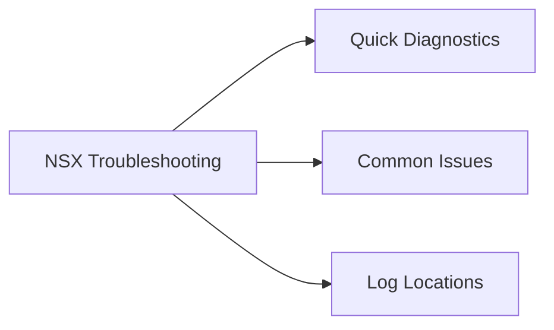

# NSX Troubleshooting

Reference procedures for diagnosing NSX-T issues.

<div class="kb-grid kb-grid-3">
<a class="kb-card" href="edge-health/"><strong>Edge Health</strong><span>NSX edge node health, transport connectivity, routing state, and service validation.</span></a>
</div>



## Quick Diagnostics

### Edge Node Health

```bash
# On NSX Manager
GET /api/v1/transport-nodes/<edge-node-id>/status

# Via CLI on Edge node (SSH)
get service router
get bgp neighbor summary
get logical-routers

# Verify TEP connectivity
ping ++netstack=vxlan <remote-tep-ip>
```

### Transport Node Status

```bash
# List all transport nodes and their connectivity state
GET /api/v1/transport-nodes?transport_zone_id=<tz-id>

# Check TEP assignment
GET /api/v1/transport-nodes/<node-id>

# Verify uplink connectivity
esxcli network ip interface ipv4 get   # On ESXi host — confirm TEP IP assigned
esxcli network ip route ipv4 list      # Confirm TEP traffic goes via correct uplink
```

### NSX Manager Cluster Health

```bash
# SSH to any NSX Manager node
get cluster status          # All nodes should show "STABLE"
get services                # All core services should show "running"
get certificate cluster     # Certificates should not be expiring

# Full cluster diagnostics
GET /api/v1/cluster/status
```

## Common Issues

| Symptom | Likely Cause | First Check |
|---|---|---|
| VM cannot reach gateway | Segment not connected to tier-1 | NSX Manager → Segments → check attachment |
| BGP peer down on Edge | Physical underlay connectivity issue | Ping Edge uplink IP from router; check MTU |
| TEP tunnel down | VLAN mismatch or MTU below 1600 | `esxcli network vswitch dvs vmware list` |
| NSX Manager unreachable | Certificate expiry or disk full | SSH to NSX Manager; `df -h`; `get certificate cluster` |
| DFW rule not applying | Rule not in correct scope or disabled | Check Rule → Applied To field; confirm rule is enabled |

## Log Locations

```bash
# NSX Manager logs
tail -f /var/log/syslog | grep -i nsx

# Edge node logs (SSH to Edge)
get log-file syslog follow

# ESXi NSX kernel module logs
cat /var/log/vmkernel.log | grep -i vxlan
```
