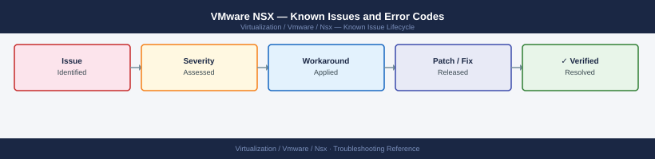

---
tags:
  - troubleshooting
  - nsx
  - vmware
  - known-issues
  - nsx-4
---
# VMware NSX — Known Issues and Error Codes

Catalog of known NSX-T / NSX 4.x bugs, error codes, and workarounds covering management plane, data plane, and overlay networking issues.

*Applies to: NSX-T 3.x / NSX 4.x*

## Before you begin

- Check Manager cluster health first: `GET /api/v1/cluster/status` or NSX UI → System → Appliances.
- NSX control plane issues are almost always Manager HA or messaging bus related — check RabbitMQ (port 5671) connectivity from transport nodes.
- `proton` is the NSX Manager's core API service — if it's down, restart it via `st start proton` in the Manager SSH session.

## Manager and Control Plane

| Error / Symptom | Affected Versions | Cause | Workaround / Fix | Fixed In |
|---|---|---|---|---|
| NSX Manager UI shows `Degraded` — 3-node cluster | NSX-T 3.x / NSX 4.x | One Manager node lost quorum (disk full, crash, network partition) | SSH to each Manager; run `get cluster status`; restore quorum or redeploy failed node | N/A |
| `Configuration out of sync` on transport node | NSX-T 3.x | MPA (Management Plane Agent) disconnect on transport node | On transport node: `esxcli software vib list | grep nsx`; restart MPA via `nsxcli -c 'restart process mpa'` | Varies |
| Firewall rules not pushed to hosts after policy change | NSX-T 3.x / 4.x | Message bus (RabbitMQ) queue backed up | Check 5671 reachability from ESXi to NSX Manager; restart `netcpa` on affected host | N/A |
| NSX Manager API returns `503` for all requests | NSX 4.x | `proton` process OOM killed | SSH to Manager: `st restart proton`; check disk usage (`df -h`) | N/A |

## Overlay / Geneve

| Error / Symptom | Affected Versions | Cause | Workaround / Fix | Fixed In |
|---|---|---|---|---|
| VMs on different hosts cannot communicate (same segment) | NSX-T 3.x | Geneve UDP 6081 blocked between TEP IPs | Verify firewall allows UDP 6081 between all TEP VLAN hosts; check MTU (TEP VLAN must be ≥1600) | N/A |
| `ARP suppression not working` — excessive ARP broadcasts | NSX-T 3.x | ARP table on logical switch not propagating correctly | Disable/re-enable ARP suppression on segment; check MAC/ARP table sync | 3.2 |
| Packet drops on overlay with jumbo frames disabled | NSX-T 3.x / 4.x | Default MTU insufficient for Geneve encapsulation overhead | Set TEP VLAN MTU to ≥1600 (recommended 9000); set uplink MTU to match | N/A |

## Edge and Routing

| Error / Symptom | Affected Versions | Cause | Workaround / Fix | Fixed In |
|---|---|---|---|---|
| BGP session flapping on Tier-0 Gateway | NSX-T 3.x | BFD interval too aggressive for physical switch capability | Increase BFD min-interval (`set bfd-config`); align with upstream switch capability | N/A |
| `ECMP route missing` after Edge node reboot | NSX-T 3.x | BGP reconvergence delay — routes not re-advertised fast enough | Reduce BGP hold-timer; check Edge node memory (OOM can cause route withdraw) | N/A |
| NAT rule not applying to traffic | NSX-T 3.x / 4.x | Rule priority conflict; lower-priority rule matching first | Review NAT rule priority; NAT rules apply lowest-priority-first | N/A |

## Distributed Firewall

| Error / Symptom | Affected Versions | Cause | Workaround / Fix | Fixed In |
|---|---|---|---|---|
| DFW rules show `Realized` but traffic still blocked | NSX-T 3.x | Rule realized on wrong vNIC; tag mismatch | Verify VM tag assignment in NSX inventory; check `esxcli network firewall` for rule count on host | N/A |
| `Maximum rules exceeded` alarm on host | NSX-T 3.x | >30,000 DFW rules on single host | Consolidate policy groups; use IP sets rather than individual IPs in rules | N/A |

## Certificates

| Error / Symptom | Affected Versions | Cause | Workaround / Fix | Fixed In |
|---|---|---|---|---|
| NSX Manager API certificate expired — UI inaccessible | NSX-T 3.x | Default self-signed cert expires after 3 years | Replace certificate via `POST /api/v1/trust-management/certificates` (KB 77523) | N/A |

## See also

- [VMware NSX — Common Issues](common-issues/)
- [VMware vCenter — Known Issues](../../vcenter/troubleshooting/known-issues.md)
- [VMware ESXi — Known Issues](../../esxi/troubleshooting/known-issues.md)
