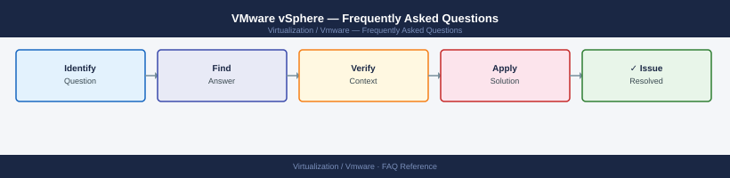

---
tags:
  - vmware
  - faq
  - operations
---
# VMware vSphere — Frequently Asked Questions

Common questions about VMware vSphere operations, configuration, and troubleshooting. For step-by-step procedures, see the <a href="index.md">Operations</a> section.

## General

**Q: How do I get a consolidated version view across a vSphere environment?**
A: vCenter → Menu → Lifecycle Manager → Cluster Compliance shows all host patch levels. For vCenter itself: vCenter → Administration → Deployment → System Configuration → Nodes → Software Version.

**Q: How do I check the current VMware vSphere version?**
A: `vCenter → Administration → Deployment → System Configuration → Software Version`

## Configuration

**Q: What is the default DRS automation level and when should it change?**
A: DRS defaults to 'Fully Automated' for new clusters. Use 'Partially Automated' for production clusters where you want to approve vMotion recommendations before execution. Use 'Manual' only for troubleshooting.

**Q: How do I enable vSphere Tanzu (Workload Management) on a cluster?**
A: vCenter → Workload Management → Enable. Select the cluster, configure the supervisor network (NSX or VDS-based), and Kubernetes API endpoint. Requires vSphere 7.0+ with Enterprise Plus licence and NSX or VDS-based networking.

## Operations

**Q: How do I plan and execute a vSphere upgrade from 7.x to 8.x?**
A: Upgrade order: vCenter first, then ESXi hosts. Check compatibility matrix (HCL, guest OS, solutions). Use vLCM for ESXi upgrades. Upgrade one cluster at a time. Test VMs on upgraded hosts before decommissioning old hosts.

**Q: What is the correct procedure to add a new cluster to vCenter?**
A: vCenter → Datacenter → New Cluster. Configure DRS, HA, and vSAN settings. Add hosts. Apply cluster host profile. Configure storage and networking. Run cluster quickstart for guided setup.

## Troubleshooting

**Q: vCenter shows 'HA host isolated'. What does it mean?**
A: The host cannot reach the HA management network. vSphere HA isolation response may restart VMs on the isolated host on other hosts. Check management network connectivity. Configure isolation addresses (isolation.address) to reduce false positives.

**Q: vCenter performance degraded after a large environment expansion — where do I start?**
A: Check VCSA resource utilisation (vcenter-cli shell: `df -h`, `top`). Consider upgrading VCSA hardware profile for large environments (25K+ VMs requires Large or X-Large deployment). Review vCenter statistics level — level 3/4 increases DB load.

## Backup and Recovery

**Q: How often should I back up vCenter?**
A: Daily file-based backup: VCSA Management UI → Backup. Include database and seat data. Store remote (NFS/SFTP). Test restore quarterly using the VCSA restore wizard. Never use VM snapshots as the sole vCenter backup method.

**Q: Can I restore vCenter without restoring the ESXi hosts?**
A: Yes — VCSA restore is independent of ESXi hosts. Restore VCSA to a new appliance; it reconnects to existing ESXi hosts automatically. VMs continue running on ESXi during vCenter restore (EVC mode may need re-verification).

## See Also

- [VMware vSphere Operations](index.md)
- [VMware vSphere Troubleshooting](../../troubleshooting/index.md)
