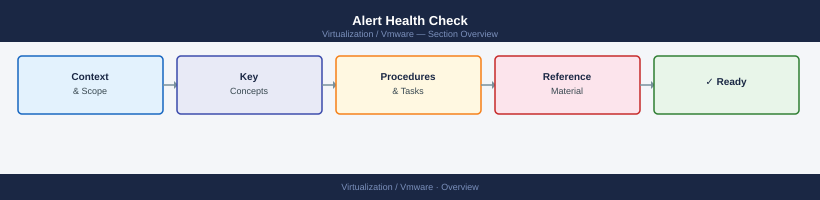

---
tags:
  - operations
---
# Alert Health Check

Alert Health Check reference covering Active Alerts Review, Aria Operations Alerts, Hardware Alerts, Backup Alerts, Repeat Alerts and 2 more sections.

*Applies to: vSphere 7.x / 8.x*

## Before you begin

- **Access:** Admin credentials on all affected systems
- **Timing:** safe to run during business hours unless a step is marked ⚠ (causes interruption)
- **Dependencies:** no active upgrades or migrations on the same infrastructure
- **Logging:** capture command output — paste into the change record on completion

---

## Active Alerts Review

- Review all critical alerts in vCenter — confirm each has an owner or action
- Review warning alerts — identify any that have been open longer than expected
- Check for alerts that triggered during a recent maintenance window

## Aria Operations Alerts

- Review Aria Operations alert dashboard
- Identify any critical or high-severity alerts
- Confirm alerts are not suppressed unnecessarily outside maintenance windows

## Hardware Alerts

- Review iDRAC alerts for all VxRail nodes and other servers
- Confirm no outstanding disk, memory, NIC, or PSU alerts

## Backup Alerts

- Review backup platform for failed or missed jobs
- Confirm all critical VMs and systems have a successful recent backup

## Repeat Alerts

- Identify alerts that fire repeatedly without resolution
- Review repeat alerts for tuning or permanent fixes
- Suppress intentionally only with a documented reason and expiry

## False Positives and Stale Alerts

- Remove or disable alerts that no longer apply
- Review alert thresholds — adjust if consistently firing below the meaningful threshold

## Alert Owner and Next Action

For each open critical alert, confirm:
- Owner assigned
- Next action documented
- Escalation path clear if not resolved within SLA

---

## Verify

- Confirm the operation completed without errors in the log or management UI
- Verify the expected state change is visible (service running, object created, config applied)
- Document the outcome in the change record

## See also

- [Capacity Review](capacity-review.md)
- [Daily Health Check](daily-health-check.md)
- [Management Access Check](management-access-check.md)
- [Virtualization Health Checks](index.md)
