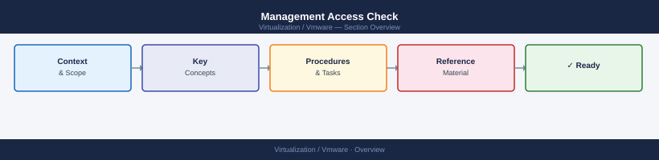

---
tags:
  - operations
---
# Management Access Check


<div class="kb-summary">
Run this check weekly to confirm all management endpoints are reachable and access controls are healthy.

*Applies to: vSphere 7.x / 8.x*
</div>



Checks to perform in vCenter UI:
- [ ] vCenter SSO Health: Administration → Single Sign On → Diagnostics → Diagnostic Site Connectivity
- [ ] Identity sources: Administration → Single Sign On → Configuration → Identity Sources — all should show Connected
- [ ] System health: Administration → Deployments → System Configuration — all services green

```d2
direction: right

begin_checks: "Begin Checks" {shape: oval}
nsx_manager_access: "NSX Manager Access" {shape: rectangle}
sddc_manager_access_vcf: "SDDC Manager Access (VCF)" {shape: rectangle}
aria_operations_access: "Aria Operations Access" {shape: rectangle}
adldap_identity_source_health: "AD/LDAP Identity Source Health" {shape: rectangle}
access_control_review: "Access Control Review" {shape: rectangle}
failed_login_monitoring: "Failed Login Monitoring" {shape: rectangle}
generate_report: "Generate Report" {shape: oval}

begin_checks -> nsx_manager_access
nsx_manager_access -> sddc_manager_access_vcf
sddc_manager_access_vcf -> aria_operations_access
aria_operations_access -> adldap_identity_source_health
adldap_identity_source_health -> access_control_review
access_control_review -> failed_login_monitoring
failed_login_monitoring -> generate_report
```

## Before you begin

- **Access:** Admin credentials on all affected systems
- **Timing:** safe to run during business hours unless a step is marked ⚠ (causes interruption)
- **Dependencies:** no active upgrades or migrations on the same infrastructure
- **Logging:** capture command output — paste into the change record on completion

---

## NSX Manager Access

```bash
# Verify NSX Manager cluster health (SSH to NSX Manager)
get cluster status   # Should show: STABLE
get services         # All critical services should show: running
```

## SDDC Manager Access (VCF)

```bash
# SDDC Manager API health check
curl -k -u admin@local:password https://sddc-manager.example.local/v1/health-summary | python3 -m json.tool
```

## Aria Operations Access

Confirm Aria Ops is receiving telemetry:
1. Log in to `https://aria-ops.example.local`
2. Environment → Object Browser → confirm vCenter adapter shows `Collection State: OK`
3. Check last collection time — should be within the last 5 minutes

## AD/LDAP Identity Source Health

```bash
# Test LDAP connectivity (run from a Linux admin host)
ldapsearch -H ldaps://dc1.example.local:636 -D "cn=svc_vcenter,ou=service_accounts,dc=corp,dc=local" \
    -w '<password>' -b "dc=corp,dc=local" "(sAMAccountName=admin)" sAMAccountName
# Should return at least one result
```

## Access Control Review

Run monthly (in addition to weekly connectivity checks):

- [ ] Review stale user accounts: Administration → Users and Groups — remove leavers
- [ ] Review service account usage: confirm all service accounts still needed
- [ ] Verify MFA is enforced for admin console access (via SSO policy or Workspace ONE Access)
- [ ] Review vCenter role assignments: Administration → Access Control → Roles
- [ ] Confirm no direct permission grants to individual users (should be via group memberships)
- [ ] Check break-glass accounts: password still in vault; access log reviewed

## Failed Login Monitoring

```bash
# Check vCenter SSO audit log for failed logins
# /storage/log/vmware/sso/vmware-sts-idmd.log on vCenter appliance
grep "AuthenticationException\|failed.*login\|InvalidCredentials" /var/log/vmware/sso/vmware-sts-idmd.log | tail -20
```

Alert on > 5 failed logins for any account in a 15-minute window.

---

## Verify

- Confirm the operation completed without errors in the log or management UI
- Verify the expected state change is visible (service running, object created, config applied)
- Document the outcome in the change record

## See also

- [Alert Health Check](alert-review.md)
- [Capacity Review](capacity-review.md)
- [Daily Health Check](daily-health-check.md)
- [Virtualization Health Checks](index.md)
