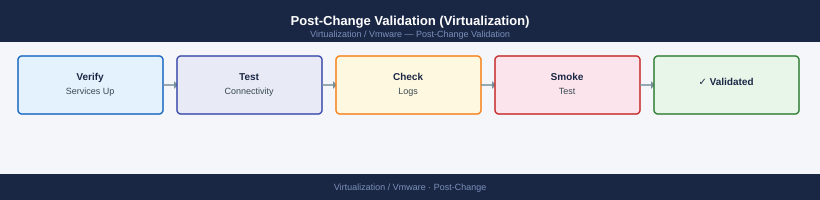

---
tags:
  - operations
description: "Run these checks after any infrastructure change — maintenance, upgrade, patch, or configuration modification. Document evidence in the change record..."
---
# Post-Change Validation (Virtualization)


<div class="kb-summary">
Run these checks after any infrastructure change — maintenance, upgrade, patch, or configuration modification. Document evidence in the change record before closing.

*Applies to: vSphere 7.x / 8.x*
</div>



```d2
direction: right

begin_checks: "Begin Checks" {shape: oval}
nsx_if_change_was_nsxrelated: "NSX (if change was NSX-related)" {shape: rectangle}
backup_validation: "Backup Validation" {shape: rectangle}
monitoring_validation: "Monitoring Validation" {shape: rectangle}
application_validation: "Application Validation" {shape: rectangle}
change_record_closure: "Change Record Closure" {shape: rectangle}
verify: "Verify" {shape: rectangle}
generate_report: "Generate Report" {shape: oval}

begin_checks -> nsx_if_change_was_nsxrelated
nsx_if_change_was_nsxrelated -> backup_validation
backup_validation -> monitoring_validation
monitoring_validation -> application_validation
application_validation -> change_record_closure
change_record_closure -> verify
verify -> generate_report
```

## Before you begin

- **Access:** Admin credentials on all affected systems
- **Timing:** safe to run during business hours unless a step is marked ⚠ (causes interruption)
- **Dependencies:** no active upgrades or migrations on the same infrastructure
- **Logging:** capture command output — paste into the change record on completion

---

## NSX (if change was NSX-related)

```bash
# Verify NSX Manager cluster stability
get cluster status   # All nodes: STABLE

# Verify edge nodes are healthy
get service router
get logical-routers
```


```text title="Expected output"
Cluster Status: STABLE
  Node 1 (nsx-mgr-01.lab.local): STABLE - 192.168.1.10
  Node 2 (nsx-mgr-02.lab.local): STABLE - 192.168.1.11
  Node 3 (nsx-mgr-03.lab.local): STABLE - 192.168.1.12
  Last Sync: 2024-01-15T14:32:18Z

Service Router Status:
  SR-01: UP (Active) - CPU: 45% | Memory: 62%
  SR-02: UP (Standby) - CPU: 12% | Memory: 28%

Logical Routers:
  lr-prod-01: ACTIVE - 10.0.0.1/24
  lr-prod-02: ACTIVE - 10.1.0.1/24
  lr-dev-01: ACTIVE - 10.2.0.1/24
  lr-test-01: ACTIVE - 10.3.0.1/24
```

!!! warning "Common errors"
    **`Error: Unable to connect to cluster manager at 192.168.1.10:443`** — Verify NSX Manager VMs are powered on and network connectivity exists from your management host.
    **`Cluster Status: DEGRADED - Node nsx-mgr-02 unreachable`** — SSH to the unreachable node and check network interfaces with `ip link show` and restart networking if needed.
    **`Service Router SR-01: DOWN - Last heartbeat 5m ago`** — Reboot the edge VM or check its management network connectivity and NSX Controller registration status.
## Backup Validation

```powershell
# Confirm backup jobs are not in failed state after change
# (Veeam)
Get-VBRJob | Where-Object {$_.GetLastState() -eq "Failed"} | Select-Object Name, LastRun

# (CommVault — check via Command Center UI for jobs since change window start)
```

## Monitoring Validation

1. Log in to Aria Operations → confirm no new critical or immediate alerts generated by the change
2. Verify collection is still running: Environment → `<cluster name>` → Collection State: OK
3. Check that baseline alerts that existed before the change are not masked by new false positives

## Application Validation

If the change affected production workloads:
- Contact the application owner to confirm the application is functioning correctly
- Run a basic functional test (login to the app, execute a representative transaction)
- Record the application owner's confirmation in the change record

## Change Record Closure

Before closing the change:

- [ ] All hosts connected: confirmed
- [ ] HA/DRS status: verified green
- [ ] vSAN health: no new alarms
- [ ] No unexpected VM state changes
- [ ] Datastores accessible
- [ ] Backup jobs not broken
- [ ] Monitoring collecting data
- [ ] Application owner sign-off (for production changes)
- [ ] Final component versions captured:
  ```powershell
  Get-VMHost | Select-Object Name, Version, Build | Sort-Object Name
  (Get-View ServiceInstance).Content.About.Version   # vCenter version
  ```
- [ ] Change record updated with evidence screenshots or command output

---

## Verify

- Confirm the operation completed without errors in the log or management UI
- Verify the expected state change is visible (service running, object created, config applied)
- Document the outcome in the change record

## See also

- [Alert Health Check](alert-review.md)
- [Capacity Review](capacity-review.md)
- [Daily Health Check](daily-health-check.md)
- [Virtualization Health Checks](index.md)
