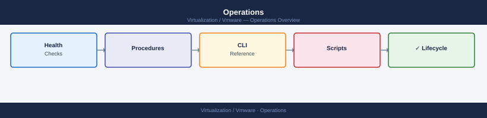

---
tags:
  - operations
---
# Operations

Operational procedures, health checks, troubleshooting guides, and runbooks for the virtualization platform.

*Applies to: vSphere 7.x / 8.x*

<a class="kb-card" href="health-checks/">
  <strong>Health Checks</strong>
  Pre- and post-change health checks, daily checks, and validation procedures.
</a>

<a class="kb-card" href="morning-health-check/">
  <strong>Morning Health Check</strong>
  Start-of-shift routine covering vCenter, ESXi cluster, vSAN, NSX, and Aria Operations in under 20 minutes.
</a>

<a class="kb-card" href="troubleshooting/">
  <strong>Troubleshooting</strong>
  Troubleshooting guides, known issues, and resolution steps across all platforms.
</a>

<a class="kb-card" href="runbooks/">
  <strong>Runbooks</strong>
  Step-by-step operational runbooks for common tasks and incidents.
</a>

