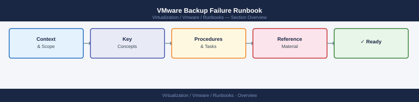
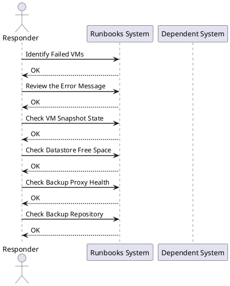

---
tags:
  - operations
---
# VMware Backup Failure Runbook

VMware Backup Failure Runbook reference covering Identify Failed VMs, Review the Error Message, Check VM Snapshot State, Check Datastore Free Space, Check Backup Proxy Health and 5 more sections.

*Applies to: vSphere 7.x / 8.x*

## Before you begin

- **Access:** Admin credentials on all affected systems
- **Timing:** safe to run during business hours unless a step is marked ⚠ (causes interruption)
- **Dependencies:** no active upgrades or migrations on the same infrastructure
- **Logging:** capture command output — paste into the change record on completion

---

## Identify Failed VMs

- Review the backup platform for failed or missed backup jobs
- Note the VM name, backup job name, error message, and failure time

## Review the Error Message

Common backup errors:
- Snapshot creation failure
- Snapshot consolidation warning
- Datastore out of space
- Network or proxy connectivity failure
- vCenter API error

## Check VM Snapshot State

- In vCenter: right-click the VM → Snapshots → Manage Snapshots
- Confirm no stale backup snapshots are present
- If consolidation is needed: right-click VM → Snapshots → Consolidate

## Check Datastore Free Space

- Confirm the datastore hosting the VM has sufficient free space
- Free space less than 10% can block snapshot creation

## Check Backup Proxy Health

- Confirm the backup proxy VM is powered on and reachable
- Review proxy logs in the backup platform

## Check Backup Repository

- Confirm the backup repository has sufficient free space
- Confirm the repository is accessible from the proxy

## Check vCenter Permissions

- Confirm the backup service account has the required vCenter permissions
- Review vCenter roles and recent permission changes

## Retry the Backup

- If the root cause is resolved, manually retry the backup job
- Monitor the retry and confirm it completes successfully

## Escalate Recurring Failures

- If the same VM fails repeatedly, escalate to the backup platform team
- Open a support case with the backup vendor if needed

## Document Resolution

- Update the backup platform job notes with the root cause and fix
- Update the incident ticket with findings and resolution

---

## Verify

- Confirm the operation completed without errors in the log or management UI
- Verify the expected state change is visible (service running, object created, config applied)
- Document the outcome in the change record

## See also

- [VMware Certificate Renewal Runbook](certificate-renewal-planning.md)
- [vCenter Certificate Rotation Runbook](certificate-rotation.md)
- [ESXi Host Maintenance Mode Runbook](esxi-host-maintenance.md)
- [Virtualization Runbooks](index.md)
