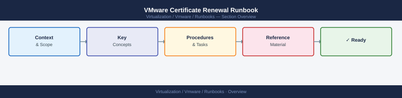
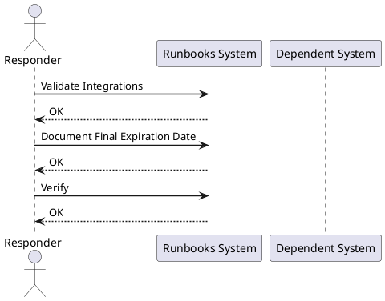

---
tags:
  - operations
---
# VMware Certificate Renewal Runbook

VMware Certificate Renewal Runbook reference covering Identify the Expiring Certificate, Confirm Affected Products, Capture Current Certificate Details, Confirm Backup Exists, Schedule Maintenance Window and 4 more sections.

*Applies to: vSphere 7.x / 8.x*

Only restart services after confirming the new certificate is applied.

## Before you begin

- **Access:** Admin credentials on all affected systems
- **Timing:** safe to run during business hours unless a step is marked ⚠ (causes interruption)
- **Dependencies:** no active upgrades or migrations on the same infrastructure
- **Logging:** capture command output — paste into the change record on completion

---

## Validate Integrations

- vCenter browser access — no certificate warning
- SSO login for local and AD accounts
- Aria, NSX, backup, and monitoring integrations confirmed

## Document Final Expiration Date

- Update the certificate inventory with the new expiration date
- Set a review reminder 60 days before the new expiration

---

## Verify

- Confirm the operation completed without errors in the log or management UI
- Verify the expected state change is visible (service running, object created, config applied)
- Document the outcome in the change record

## See also

- [VMware Backup Failure Runbook](backup-failure.md)
- [vCenter Certificate Rotation Runbook](certificate-rotation.md)
- [ESXi Host Maintenance Mode Runbook](esxi-host-maintenance.md)
- [Virtualization Runbooks](index.md)
