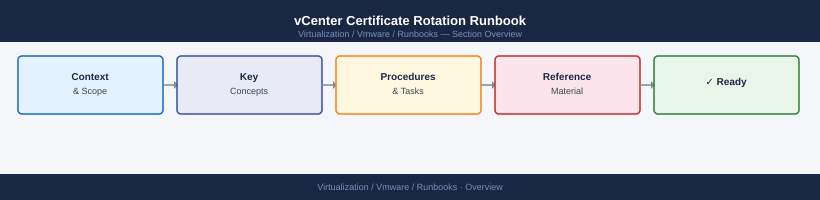
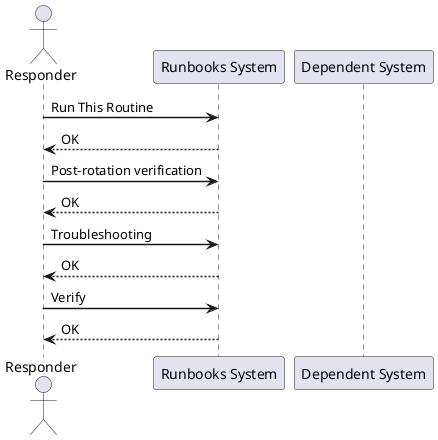

---
tags:
  - operations
  - vmware
---
# vCenter Certificate Rotation Runbook

<div class="kb-summary">

| Field | Value |
|---|---|
| Risk | High — certificate replacement causes brief service interruption; all agents must re-register |
| Approval | Change ticket required; schedule during a maintenance window |
| Estimated time | 1–3 hours for full VMCA-signed rotation; 2–4 hours for custom CA |
| Impact | All vSphere agents and vCenter services restart; 5–10 minute service interruption per node |

*Applies to: vSphere 7.x / 8.x*
</div>





## Before you begin

- **Access:** Admin credentials on all affected systems
- **Timing:** safe to run during business hours unless a step is marked ⚠ (causes interruption)
- **Dependencies:** no active upgrades or migrations on the same infrastructure
- **Logging:** capture command output — paste into the change record on completion

---

!!! warning "Service interruption"
    Certificate rotation restarts vCenter SSO and platform services. All vSphere Client sessions will disconnect. Allow 15–30 minutes and schedule a maintenance window.

## Run This Routine

### Pre-rotation checks

1. **Take a VCSA backup** — run the [vCenter File-Based Backup Runbook](vcenter-backup/) before any certificate change.

2. **Check current certificate expiry**:
   ```bash
   # SSH to VCSA as root
   for cert in /etc/vmware-vpx/ssl/rui.crt /etc/vmware/vmca/cacert.pem; do
     echo "=== $cert ==="; openssl x509 -in $cert -noout -dates; done
   ```

3. **Check vCenter services are healthy** — all services must be Running before rotation:
   ```bash
   service-control --status --all | grep -v running
   ```
   No output = all services running. Address any stopped services before continuing.

4. **Check replication partners** — if PSC replication is in use, confirm all nodes are in sync.

---

### Option A — Renew VMCA-signed Machine SSL (most common)

Used when: Machine SSL cert is expiring; VMCA root is still valid.

```bash
# On the VCSA via SSH:
/usr/lib/vmware-vmca/bin/certificate-manager
```

Choose option **3** (Replace Machine SSL certificate with VMCA Certificate):
- Confirm environment details when prompted
- The tool replaces the Machine SSL cert, restarts `nginx` and `vsphere-client`
- vCenter will be briefly unreachable (~2–5 min)

Verify:
```bash
echo | openssl s_client -connect vcenter.example.local:443 2>/dev/null | openssl x509 -noout -dates
```

---

### Option B — Renew VMCA root and all dependent certificates

Used when: VMCA root itself is expiring or needs to be replaced.

```bash
/usr/lib/vmware-vmca/bin/certificate-manager
```

Choose option **8** (Reset all certificates) — this:
1. Generates a new VMCA root
2. Re-issues all Machine SSL and Solution User certs
3. Restarts all vCenter services
4. All ESXi hosts re-register with the new certs (may take 5–15 min per host)

**Expected downtime:** ~10–20 minutes for vCenter services to restart.

---

### Option C — Replace Machine SSL with a custom CA certificate

Used when: corporate policy requires certs from an internal CA (not VMCA).

1. **Generate a CSR on the VCSA**:
   ```bash
   /usr/lib/vmware-vmca/bin/certificate-manager
   # Option 1: Generate CSR
   # Fill in: FQDN, IP SANs, org details
   # Output: /tmp/ssl/machine_ssl.csr
   ```

2. **Submit the CSR to your internal CA** and obtain the signed cert + CA chain.

3. **Import the signed cert**:
   ```bash
   /usr/lib/vmware-vmca/bin/certificate-manager
   # Option 1: Replace Machine SSL cert → Import certificate
   # Provide: signed cert file, private key file, CA chain file
   ```

---

## Post-rotation verification

```bash
# 1. Confirm Machine SSL cert is new
echo | openssl s_client -connect vcenter.example.local:443 2>/dev/null | openssl x509 -noout -subject -dates

# 2. Confirm all services are running
service-control --status --all | grep -v running

# 3. Log into vCenter Web Client — confirm login works without cert warning
# If browser shows a cert warning: import the new VMCA root into trusted CAs in browser/OS

# 4. Check ESXi host connection state
esxcli system certificate list  # run on each host
```

---

## Troubleshooting

| Symptom | Cause | Fix |
|---|---|---|
| Certificate manager exits with error "Certificate mismatch" | Private key does not match the certificate | Re-generate CSR and re-issue the cert; never reuse a private key from a different CSR |
| vCenter UI unreachable after cert rotation | Service failed to restart | SSH to VCSA: `service-control --start --all`; check `/var/log/vmware/vmca/vmcad.log` |
| ESXi hosts show "Disconnected" after VMCA root rotation | Hosts have stale VMCA trust | Wait 15 min for auto-reconciliation; if persistent: reconnect host from vCenter → right-click → Reconnect |
| SSO login fails after STS cert rotation | Browser cached SSO token is invalid | Clear browser cookies and session; re-login |
| `certificate-manager` prompts for SSO admin password repeatedly | Wrong password format | Use full UPN: `administrator@vsphere.local` |

---

## See also

- [Certificate Chain — Internals](../../internals/certificate-chain/)
- [Scenarios — Certificate Expiry and Rotation](../../topics/scenarios/certificate-expiry-rotation/)
- [vCenter — Security](../../vcenter/security/)

---

## Verify

- **Alarms:** vSphere Client → Home → Alarms — no new critical alarms after the operation
- **Events:** monitor the vCenter Events view for the affected object for 5 minutes
- **Health check:** run the morning health-check sequence for the affected product tier
