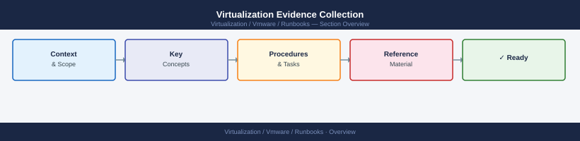
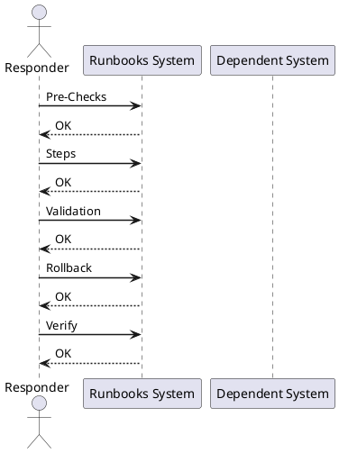

---
tags:
  - operations
---
# Virtualization Evidence Collection

Virtualization Evidence Collection reference covering Overview, Pre-Checks, Steps, Validation, Rollback and 1 more sections.

*Applies to: vSphere 7.x / 8.x*

## Before you begin

- **Access:** Admin credentials on all affected systems
- **Timing:** safe to run during business hours unless a step is marked ⚠ (causes interruption)
- **Dependencies:** no active upgrades or migrations on the same infrastructure
- **Logging:** capture command output — paste into the change record on completion

---

## Overview

Use this before vendor escalation, RCA work, or major incident review.

## Pre-Checks

- Confirm issue scope.
- Confirm affected objects.
- Confirm timestamps.
- Confirm recent changes.
- Confirm ticket or case number if available.

## Steps

1. Capture screenshots of alarms.
2. Export recent tasks and events.
3. Capture affected object names.
4. Capture timestamps and timezone.
5. Collect support bundles if needed.
6. Record commands already run.
7. Record impact and current status.

## Validation

- Evidence is complete enough for handoff.
- Timeline is clear.
- Affected systems are listed.
- Next owner has what they need.

## Rollback

- Stop the change if impact increases.
- Return settings to the last known good state where possible.
- Reconnect affected systems if disconnected.
- Escalate with logs, timestamps, screenshots, and task IDs.

## Notes

Keep this page updated with local commands, screenshots, system names, and known environment quirks.

---

## Verify

- Log bundle is collected and stored in the designated evidence folder with the incident number
- Screenshots include timestamps and are named with the incident ID
- vCenter log bundle export completed without errors
- All evidence referenced in the incident ticket is accessible to the team

## See also

- [VMware Backup Failure Runbook](backup-failure.md)
- [VMware Certificate Renewal Runbook](certificate-renewal-planning.md)
- [vCenter Certificate Rotation Runbook](certificate-rotation.md)
- [Virtualization Runbooks](index.md)
