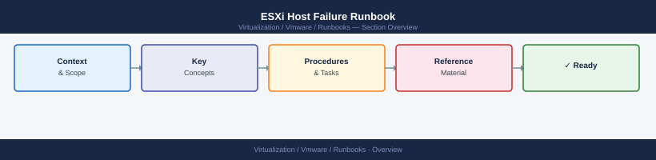

---
tags:
  - operations
---
# ESXi Host Failure Runbook

ESXi Host Failure Runbook reference covering Confirm Impact, Check Power State, Check Management Network, Check Hardware Management Interface, Review vCenter Alarms and 4 more sections.

*Applies to: vSphere 7.x / 8.x*

## Before you begin

- **Access:** Admin credentials on all affected systems
- **Timing:** safe to run during business hours unless a step is marked ⚠ (causes interruption)
- **Dependencies:** no active upgrades or migrations on the same infrastructure
- **Logging:** capture command output — paste into the change record on completion

---

## Confirm Impact

- Identify the affected host
- Check vCenter — is the host Disconnected, Not Responding, or in Error?
- Identify which VMs were running on the host
- Confirm HA status — have VMs been restarted on other hosts?

## Check Power State

- Log into iDRAC and confirm power state
- If powered off unexpectedly, check power supply health and power events in iDRAC

## Check Management Network

- Ping the host management IP
- Check DNS forward and reverse lookup for the hostname
- Confirm the management switch port is active

## Check Hardware Management Interface

- Log into iDRAC and review hardware health
- Check for disk, memory, NIC, or PSU failures
- Review Lifecycle Controller logs for recent hardware events

## Review vCenter Alarms

- Confirm which alarms are active on the host
- Check related cluster and datastore alarms

## Identify Affected VMs

- Confirm which VMs were running on the failed host
- Verify HA has restarted critical VMs on other hosts
- Check application owners for any workloads that did not restart

## Logs to Collect

- iDRAC hardware logs and screenshots
- vCenter events from the time of the failure
- ESXi host logs if accessible via SSH or support bundle
- Aria Operations alerts at the time of failure

## Engage Hardware Support

- Open a Dell support case if hardware failure is confirmed
- Provide iDRAC logs, hardware event screenshots, and host serial number

## Validate Cluster Health After Recovery

- Confirm all remaining hosts are Connected
- Confirm HA and DRS are active
- Confirm vSAN object health is green if vSAN is used
- Confirm VMs are running on healthy hosts
- Update the change or incident ticket with findings

---

## Verify

- Target host shows 0 running VMs in vCenter inventory
- All evacuated VMs are in Powered On state on remaining cluster hosts
- vSAN health is green — no component degradation from the host removal
- HA and DRS are enabled on the cluster

## See also

- [VMware Backup Failure Runbook](backup-failure.md)
- [VMware Certificate Renewal Runbook](certificate-renewal-planning.md)
- [vCenter Certificate Rotation Runbook](certificate-rotation.md)
- [Virtualization Runbooks](index.md)
