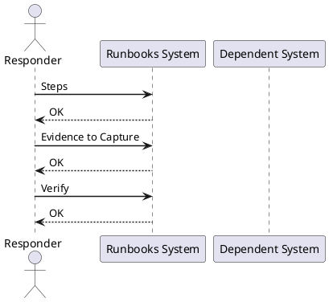

---
tags:
  - operations
description: "Incident Response Runbook reference covering Steps, Evidence to Capture."
---
# Incident Response Runbook

Incident Response Runbook reference covering Steps, Evidence to Capture.

*Applies to: vSphere 7.x / 8.x*

## Before you begin

- **Access:** Admin credentials on all affected systems
- **Timing:** safe to run during business hours unless a step is marked ⚠ (causes interruption)
- **Dependencies:** no active upgrades or migrations on the same infrastructure
- **Logging:** capture command output — paste into the change record on completion

---

## Steps

1. Confirm the issue scope
2. Identify impacted systems
3. Check vCenter availability
4. Check host and cluster health
5. Review active alarms
6. Check recent tasks and events
7. Check datastore and vSAN health
8. Check network health
9. Check hardware alerts
10. Review logs
11. Escalate if needed
12. Document findings
13. Confirm recovery
14. Communicate status
15. Complete RCA if required

## Evidence to Capture

- Date and time of issue
- Impacted VMs, hosts, clusters, or datastores
- Screenshots of alarms
- Recent vCenter events
- Logs from vCenter or ESXi
- Support bundles if needed
- Timeline of actions taken
- Validation after recovery

---

## Verify

- Confirm the operation completed without errors in the log or management UI
- Verify the expected state change is visible (service running, object created, config applied)
- Document the outcome in the change record

## See also

- [VMware Backup Failure Runbook](backup-failure.md)
- [VMware Certificate Renewal Runbook](certificate-renewal-planning.md)
- [vCenter Certificate Rotation Runbook](certificate-rotation.md)
- [Virtualization Runbooks](index.md)
