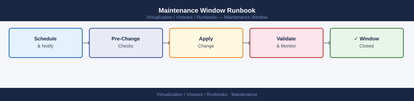

---
tags:
  - operations
---
# Maintenance Window Runbook

Maintenance Window Runbook reference covering Before Maintenance, During Maintenance, After Maintenance.

*Applies to: vSphere 7.x / 8.x*

## Before you begin

- **Access:** Admin credentials on all affected systems
- **Timing:** safe to run during business hours unless a step is marked ⚠ (causes interruption)
- **Dependencies:** no active upgrades or migrations on the same infrastructure
- **Logging:** capture command output — paste into the change record on completion

---

## Before Maintenance

- Review change ticket
- Confirm maintenance window
- Notify stakeholders
- Confirm backups
- Confirm current health
- Confirm rollback plan
- Capture versions
- Confirm access
- Confirm vendor support if needed

## During Maintenance

- Start maintenance window
- Place host in maintenance mode if required
- Perform approved work
- Monitor cluster and workload health
- Capture screenshots or logs
- Escalate if unexpected issues occur

## After Maintenance

- Validate cluster health
- Confirm VMs are running
- Confirm datastores are accessible
- Confirm monitoring is clean
- Confirm backups still work
- Update ticket with results
- Send completion notice

---

## Verify

- Confirm the operation completed without errors in the log or management UI
- Verify the expected state change is visible (service running, object created, config applied)
- Document the outcome in the change record

## See also

- [VMware Backup Failure Runbook](backup-failure.md)
- [VMware Certificate Renewal Runbook](certificate-renewal-planning.md)
- [vCenter Certificate Rotation Runbook](certificate-rotation.md)
- [Virtualization Runbooks](index.md)
