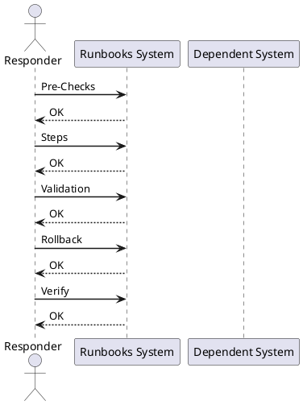

---
tags:
  - operations
---
# Virtualization Network Validation

Virtualization Network Validation reference covering Overview, Pre-Checks, Steps, Validation, Rollback and 1 more sections.

*Applies to: vSphere 7.x / 8.x*

## Before you begin

- **Access:** Admin credentials on all affected systems
- **Timing:** safe to run during business hours unless a step is marked ⚠ (causes interruption)
- **Dependencies:** no active upgrades or migrations on the same infrastructure
- **Logging:** capture command output — paste into the change record on completion

---

## Overview

Use this after network changes, VLAN changes, host work, NSX changes, or VM connectivity issues.

## Pre-Checks

- Confirm affected VLANs or segments.
- Confirm port groups or NSX segments.
- Confirm uplink status.
- Confirm recent switch or firewall changes.
- Confirm affected VM scope.

## Steps

1. Check VM network assignment.
2. Check port group or segment configuration.
3. Check host uplinks.
4. Check VLAN or overlay configuration.
5. Check gateway reachability.
6. Check NSX edge and routing if used.
7. Test from affected and unaffected VMs.

## Validation

- VM connectivity works.
- Uplinks are healthy.
- VLAN or segment config is correct.
- Routing is working.
- No new network alarms.

## Rollback

- Stop the change if impact increases.
- Return settings to the last known good state where possible.
- Reconnect affected systems if disconnected.
- Escalate with logs, timestamps, screenshots, and task IDs.

## Notes

Keep this page updated with local commands, screenshots, system names, and known environment quirks.

---

## Verify

- All vSS/vDS port groups show expected uplink connectivity in vCenter
- VMkernel adapters (management, vMotion, vSAN) ping their gateway successfully
- VM network traffic is flowing — no packet loss from a test VM
- vSAN storage traffic is healthy — no resync objects related to network issues

## See also

- [VMware Backup Failure Runbook](backup-failure.md)
- [VMware Certificate Renewal Runbook](certificate-renewal-planning.md)
- [vCenter Certificate Rotation Runbook](certificate-rotation.md)
- [Virtualization Runbooks](index.md)
