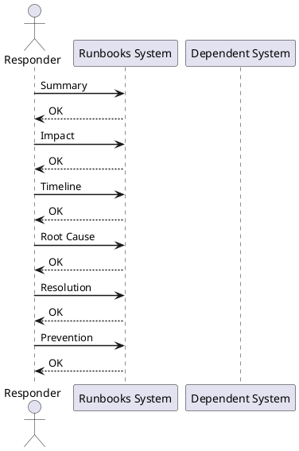

# RCA Template

RCA Template reference covering Summary, Impact, Timeline, Root Cause, Resolution and 2 more sections.

*Applies to: vSphere 7.x / 8.x*

## Before you begin

- **Access:** Admin credentials on all affected systems
- **Timing:** safe to run during business hours unless a step is marked ⚠ (causes interruption)
- **Dependencies:** no active upgrades or migrations on the same infrastructure
- **Logging:** capture command output — paste into the change record on completion

---

## Summary

Brief description of what happened.

## Impact

Systems, users, applications, or services affected.

## Timeline

| Time | Event |
|---|---|
| HH:MM | Issue detected |
| HH:MM | Investigation started |
| HH:MM | Cause identified |
| HH:MM | Fix applied |
| HH:MM | Service restored |

## Root Cause

Explain the actual cause of the issue.

## Resolution

Explain what was done to fix it.

## Prevention

List steps to reduce the chance of the issue happening again.

## Evidence

Attach logs, screenshots, events, support case numbers, and validation results.

---

## Verify

- Confirm the operation completed without errors in the log or management UI
- Verify the expected state change is visible (service running, object created, config applied)
- Document the outcome in the change record

## See also

- [VMware Backup Failure Runbook](backup-failure.md)
- [VMware Certificate Renewal Runbook](certificate-renewal-planning.md)
- [vCenter Certificate Rotation Runbook](certificate-rotation.md)
- [Virtualization Runbooks](index.md)
