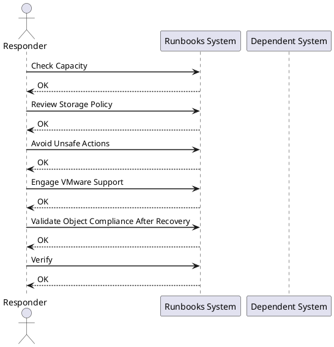

---
tags:
  - operations
---
# vSAN Degraded Object Runbook

vSAN Degraded Object Runbook reference covering Confirm vSAN Health State, Identify Affected Objects, Check Failed Disks, Check Host Availability, Check Resync Status and 5 more sections.

*Applies to: vSphere 7.x / 8.x*

Active resync is expected after a host returns from maintenance — wait for it to complete before taking further action.

## Before you begin

- **Access:** Admin credentials on all affected systems
- **Timing:** safe to run during business hours unless a step is marked ⚠ (causes interruption)
- **Dependencies:** no active upgrades or migrations on the same infrastructure
- **Logging:** capture command output — paste into the change record on completion

---

## Check Capacity

- Confirm vSAN usable capacity is within safe limits
- If capacity is the cause of non-compliance, expansion may be needed

## Review Storage Policy

- Confirm the storage policy assigned to affected objects is achievable with current cluster state
- If FTT=1 and only one host or disk is available, the policy cannot be met

## Avoid Unsafe Actions

- Do not take additional hosts into maintenance mode while objects are degraded
- Do not delete VMs or disks without VMware support guidance

## Engage VMware Support

- Collect a vSAN support bundle if objects remain degraded after the expected recovery period
- Open a VMware support case and provide the bundle, timeline, and Skyline Health screenshots

## Validate Object Compliance After Recovery

- Return to Virtual Objects view and confirm all objects are Healthy
- Run Skyline Health and confirm no remaining failures

---

## Verify

- Confirm the operation completed without errors in the log or management UI
- Verify the expected state change is visible (service running, object created, config applied)
- Document the outcome in the change record

## See also

- [VMware Backup Failure Runbook](backup-failure.md)
- [VMware Certificate Renewal Runbook](certificate-renewal-planning.md)
- [vCenter Certificate Rotation Runbook](certificate-rotation.md)
- [Virtualization Runbooks](index.md)
