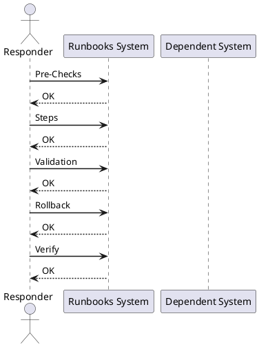

---
tags:
  - operations
description: "Virtualization Storage Path Validation reference covering Overview, Pre-Checks, Steps, Validation, Rollback and 1 more sections."
---
# Virtualization Storage Path Validation

Virtualization Storage Path Validation reference covering Overview, Pre-Checks, Steps, Validation, Rollback and 1 more sections.

*Applies to: vSphere 7.x / 8.x*

## Before you begin

- **Access:** Admin credentials on all affected systems
- **Timing:** safe to run during business hours unless a step is marked ⚠ (causes interruption)
- **Dependencies:** no active upgrades or migrations on the same infrastructure
- **Logging:** capture command output — paste into the change record on completion

---

## Overview

Use this after SAN changes, storage maintenance, host work, or datastore alerts.

## Pre-Checks

- Confirm affected hosts and datastores.
- Confirm storage array status.
- Confirm SAN zoning or masking changes.
- Confirm no active datastore outage.
- Confirm maintenance window if changes are planned.

## Steps

1. Check datastore visibility.
2. Check host storage adapters.
3. Check path count and path state.
4. Check multipathing policy.
5. Review storage latency.
6. Confirm VMs can access datastores.
7. Compare against expected path design.

## Validation

- Expected paths are visible.
- No dead paths remain unless expected.
- Datastores are mounted.
- Latency is normal.
- No new storage alarms.

## Rollback

- Stop the change if impact increases.
- Return settings to the last known good state where possible.
- Reconnect affected systems if disconnected.
- Escalate with logs, timestamps, screenshots, and task IDs.

## Notes

Keep this page updated with local commands, screenshots, system names, and known environment quirks.

---

## Verify

- All ESXi hosts show 4+ active paths per LUN (`esxcli storage nmp path list`)
- No APD (All Paths Down) or PDL (Permanent Device Loss) conditions in vCenter events
- Datastore is accessible and VMs are reading/writing without latency spikes
- Multipathing policy matches the storage vendor's recommendation (RR for most arrays)

## See also

- [VMware Backup Failure Runbook](backup-failure.md)
- [VMware Certificate Renewal Runbook](certificate-renewal-planning.md)
- [vCenter Certificate Rotation Runbook](certificate-rotation.md)
- [Virtualization Runbooks](index.md)
