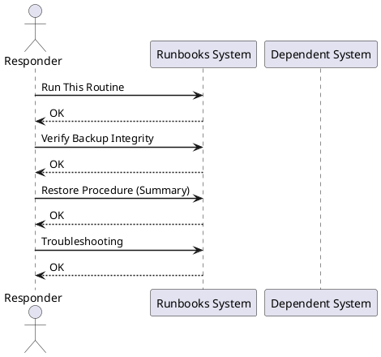

---
tags:
  - operations
  - vcenter
  - vmware
  - vsphere-8
---
# vCenter File-Based Backup Runbook

<div class="kb-summary">

| Field | Value |
|---|---|
| Risk | Low — read-only operation on the VCSA |
| Approval | No formal change required for scheduled backups; ad-hoc backup before major changes is best practice |
| Estimated time | 15–45 minutes depending on VCSA size |
| Impact | No service interruption; vCenter remains fully operational during backup |

*Applies to: vSphere 7.x / 8.x*
</div>



## Before you begin

- **Access:** Admin credentials on all affected systems
- **Timing:** safe to run during business hours unless a step is marked ⚠ (causes interruption)
- **Dependencies:** no active upgrades or migrations on the same infrastructure
- **Logging:** capture command output — paste into the change record on completion

---

!!! warning "vCenter downtime"
    Restoring vCenter from backup replaces the running instance. The environment will be unmanaged for the duration of the restore (typically 20–60 minutes).

## Run This Routine

### Ad-hoc backup via VAMI

1. **Open VAMI** — navigate to `https://<vcenter-fqdn>:5480` and log in as `root`.

2. **Navigate to backup** — left menu → **Backup** → **Backup Now**.

3. **Configure backup target**:
   - Protocol: `SFTP` (recommended) or `NFS`
   - Server: backup server FQDN or IP
   - Directory path: `/backups/vcenter/`
   - Username and password for the SFTP target
   - Backup password (encryption token): set a strong passphrase and record it in the password vault — required for any future restore

4. **Enable data options** — select "Include statistics, events, and tasks" for a full backup.

5. **Start backup** — click **Start**. Progress appears in the VAMI.

6. **Verify backup file** — on the SFTP target, confirm a new directory like `sn-vcenter01-<timestamp>/` was created and contains `.bak` files.

### Ad-hoc backup via API

```bash
# Trigger backup via REST API
VCENTER="vcenter.example.local"
TOKEN=$(curl -sk -X POST -u "administrator@vsphere.local:<password>" \
  "https://$VCENTER/rest/com/vmware/cis/session" | jq -r '.value')

curl -sk -X POST \
  -H "vmware-api-session-id: $TOKEN" \
  -H "Content-Type: application/json" \
  "https://$VCENTER/rest/appliance/recovery/backup/job" \
  -d '{
    "piece": {
      "location_type": "SFTP",
      "location": "sftp://backup-server.example.local/backups/vcenter/",
      "location_user": "vcbackup",
      "location_password": "<sftp-password>",
      "parts": ["seat","common"],
      "comment": "pre-change backup",
      "password": "<backup-encryption-password>"
    }
  }' | jq .
```


```text title="Expected output"
{
  "value": "backup-job-20250214-084532"
}
{
  "value": {
    "id": "backup-job-20250214-084532",
    "state": "RUNNING",
    "progress": 0,
    "detail": null,
    "start_time": "2025-02-14T08:45:32.123Z",
    "end_time": null,
    "messages": [],
    "description": "vCenter Server backup job"
  }
}
```

!!! warning "Common errors"
    **`curl: (60) SSL certificate problem: self signed certificate`** — Add `-k` flag to curl command to skip SSL verification (already present; if error persists, verify certificate chain on vCenter).
    **`jq: parse error: Invalid JSON text at line 1`** — Ensure jq is installed (`yum install jq`) and that the API response is valid JSON by testing the curl command without piping to jq first.
    **`{"value":{"messages":[{"default_message":"Authentication failed"}]}}`** — Verify the vCenter administrator password is correct and the user account is not locked; reset credentials in vCenter if needed.
### Scheduled backup via VAMI

1. VAMI → Backup → **Schedule**.
2. Enable the schedule.
3. Set frequency: **Daily**, retention count: **3** (keeps last 3 backups; older are auto-deleted).
4. Configure the SFTP target (same fields as ad-hoc above).
5. Save — confirm the next scheduled run time is shown.

---

## Verify Backup Integrity

After each backup, confirm:

```bash
# List backup files on SFTP target
ls -lh /backups/vcenter/sn-*/

# Check the manifest file — lists all backup components and sizes
cat /backups/vcenter/sn-<timestamp>/manifest.json
```


```text title="Expected output"
total 2.3G
drwxr-xr-x 4 backup backup 4.0K 2024-01-15 14:32 /backups/vcenter/sn-20240115-143200/
drwxr-xr-x 4 backup backup 4.0K 2024-01-14 09:18 /backups/vcenter/sn-20240114-091800/
drwxr-xr-x 4 backup backup 4.0K 2024-01-13 22:45 /backups/vcenter/sn-20240113-224500/
-rw-r--r-- 1 backup backup 1.2G 2024-01-15 14:35 sn-20240115-143200.tar.gz
-rw-r--r-- 1 backup backup 1.1G 2024-01-14 09:20 sn-20240114-091800.tar.gz

{
  "backup_id": "sn-20240115-143200",
  "timestamp": "2024-01-15T14:32:00Z",
  "vcenter_version": "7.0.3",
  "components": [
    {"name": "database", "size_bytes": 856932864, "status": "completed"},
    {"name": "config", "size_bytes": 45678912, "status": "completed"},
    {"name": "ssl_certs", "size_bytes": 2097152, "status": "completed"},
    {"name": "logs", "size_bytes": 312458240, "status": "completed"}
  ],
  "total_size_bytes": 1217167168,
  "checksum": "sha256:a7f3e9c2b1d4f8e6a9c3b2e1f4d7a9c2"
}
```

!!! warning "Common errors"
    **`ls: cannot access '/backups/vcenter/sn-*/': No such file or directory`** — Verify the backup mount point is mounted with `mount | grep backups` and check the SFTP target path is correct.
    **`cat: /backups/vcenter/sn-<timestamp>/manifest.json: No such file or directory`** — Replace `<timestamp>` with an actual backup directory name from the `ls` output (e.g., `sn-20240115-143200`).
A valid backup contains:
- `manifest.json` — metadata and component list
- `*.bak` — encrypted backup data files
- Total size typically 1–10 GB depending on VCSA configuration and history

---

## Restore Procedure (Summary)

Full restore requires a complete re-deploy — do not attempt during normal operations without a DR plan:

```text
1. Mount the VCSA installer ISO
2. Run the VCSA installer → Stage 1: Deploy new VCSA appliance
   (deploy to same ESXi host; use same FQDN as original)
3. Stage 2: restore from backup
   — Choose "Restore" mode
   — Enter SFTP backup location and backup encryption password
   — Wait for restore to complete (30–90 minutes)
4. After restore: DNS must resolve the VCSA FQDN to the new appliance IP
5. Verify all hosts reconnect and inventory is intact
```

---

## Troubleshooting

| Symptom | Cause | Fix |
|---|---|---|
| Backup fails with "SFTP connection refused" | SFTP target unreachable from VCSA management network | Verify firewall rule: VCSA mgmt IP → backup server TCP 22; test with `nc -vz backup-server 22` from VCSA shell |
| Backup fails with "Insufficient disk space" | Target directory full | Clean up old backup directories; ensure 20+ GB free on SFTP target |
| Backup job shows "Running" but no progress | VCSA services under load | Check VAMI → Monitor → CPU/memory; wait 15 min before cancelling |
| Cannot find backup encryption password | Password not recorded at setup | Without the password the backup cannot be restored; re-establish a fresh scheduled backup with a recorded password |

---

## See also

- [vCenter — Operations](../../../products/vcenter/operations/)
- [Scenarios — vCenter Down](../../../topics/scenarios/vcenter-down/)
- [VMware Morning Health Check](../../morning-health-check/)
