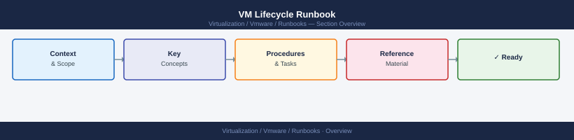

---
tags:
  - operations
---
# VM Lifecycle Runbook

VM Lifecycle Runbook reference covering Overview, Pre-Checks, Steps, Validation, Rollback and 1 more sections.

*Applies to: vSphere 7.x / 8.x*

## Before you begin

- **Access:** Admin credentials on all affected systems
- **Timing:** safe to run during business hours unless a step is marked ⚠ (causes interruption)
- **Dependencies:** no active upgrades or migrations on the same infrastructure
- **Logging:** capture command output — paste into the change record on completion

---

## Overview

Use this for VM build, change, ownership, review, retirement, and cleanup.

## Pre-Checks

- Confirm VM owner.
- Confirm business purpose.
- Confirm sizing.
- Confirm backup policy.
- Confirm monitoring.
- Confirm network and security requirements.
- Confirm naming standard.

## Steps

1. Validate request details.
2. Build or update VM.
3. Apply naming and tagging standards.
4. Confirm backup and monitoring.
5. Validate access and connectivity.
6. Record owner and lifecycle notes.
7. Review unused VMs regularly.
8. Decommission cleanly when approved.

## Validation

- VM has owner.
- VM follows naming standard.
- Backup is assigned.
- Monitoring is active.
- Tags or inventory notes are current.

## Rollback

- Stop the change if impact increases.
- Return settings to the last known good state where possible.
- Reconnect affected systems if disconnected.
- Escalate with logs, timestamps, screenshots, and task IDs.

## Notes

Keep this page updated with local commands, screenshots, system names, and known environment quirks.

---

## Verify

- New VM: powered on, OS boots, guest OS tools show running, IP is assigned
- Decommissioned VM: removed from inventory and no orphaned VMDK files remain on datastores
- Migrated VM: running on target host/datastore with no configuration changes
- Template updated: version suffix updated, old template snapshot removed

## See also

- [VMware Backup Failure Runbook](backup-failure.md)
- [VMware Certificate Renewal Runbook](certificate-renewal-planning.md)
- [vCenter Certificate Rotation Runbook](certificate-rotation.md)
- [Virtualization Runbooks](index.md)
