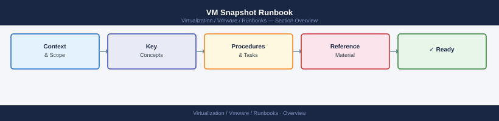

---
tags:
  - operations
  - vmware
---
# VM Snapshot Runbook


<div class="kb-summary">
| Field | Value | |---|---| | Risk | Low (taking) / Medium (removing) | | Approval | No formal change required to take; revert requires change ticket | | Estimated time | 2–5 minutes to create; 10–30 minutes to remove (consolidation) | | Impact | None during creation (brief I/O s

*Applies to: vSphere 7.x / 8.x*
</div>



| Field | Value |
|---|---|
| Risk | Low (taking) / Medium (removing) |
| Approval | No formal change required to take; revert requires change ticket |
| Estimated time | 2–5 minutes to create; 10–30 minutes to remove (consolidation) |
| Impact | None during creation (brief I/O stun < 1s); performance degraded while snapshot exists |

!!! warning
    Snapshots are **not backups**. Delta disks grow continuously and degrade performance. Remove within **24–72 hours** — never leave snapshots over a weekend.

## Before you begin

- **Access:** Admin credentials on all affected systems
- **Timing:** safe to run during business hours unless a step is marked ⚠ (causes interruption)
- **Dependencies:** no active upgrades or migrations on the same infrastructure
- **Logging:** capture command output — paste into the change record on completion

---

## Process Flow


## Step 2 — Create Snapshot

**PowerCLI — crash-consistent:**
```powershell
New-Snapshot -VM <vmname> `
    -Name "pre-change-$(Get-Date -Format yyyyMMdd-HHmm)" `
    -Description "Before <change description>"
```

**PowerCLI — app-consistent (quiesced, requires VMware Tools):**
```powershell
New-Snapshot -VM <vmname> `
    -Name "pre-change-$(Get-Date -Format yyyyMMdd-HHmm)" `
    -Quiesce -Memory:$false
```

**ESXi CLI:**
```bash
# Args: VMID, name, description, memory (0=no), quiesce (0=no)
vim-cmd vmsvc/snapshot.create <VMID> "pre-change" "Before change" 0 0
```

## Step 3 — Revert to Snapshot (if change fails)

```powershell
$snap = Get-VM <vmname> | Get-Snapshot -Name "pre-change*"
Set-VM <vmname> -Snapshot $snap -Confirm:$false
```

Then validate the application has rolled back correctly before proceeding.

## Step 4 — Remove Snapshot (after successful change)

Remove as soon as the change is validated — do not leave it to "clean up later".

```powershell
Get-VM <vmname> | Get-Snapshot | Remove-Snapshot -Confirm:$false

# Confirm no consolidation needed
(Get-VM <vmname>).Extensiondata.Runtime.ConsolidationNeeded
# Must return: False
```

**If consolidation is needed:**
```powershell
(Get-VM <vmname>).Extensiondata.ConsolidateVMDisks_Task()
# Monitor in vSphere Client → Tasks
```

## Common Issues

| Issue | Check | Action |
|---|---|---|
| Snapshot creation fails | Datastore space | Free space; relocate VM or use different datastore |
| Quiesce fails | VMware Tools not running | Use crash-consistent snapshot; fix Tools after |
| Old snapshot found | Previous cleanup missed | Remove immediately; check for consolidation needed |
| ConsolidationNeeded = True after removal | Consolidation didn't run | Trigger manually via PowerCLI or vSphere Client |
| VM performance degraded | Snapshot chain too deep or too old | Remove snapshot immediately; consolidate |

## Checklist

- [ ] No existing snapshots on VM
- [ ] Datastore ≥ 20% free
- [ ] Snapshot created and ID/name recorded
- [ ] Change performed
- [ ] Application validated (or revert taken)
- [ ] Snapshot removed within change window
- [ ] `ConsolidationNeeded` confirmed False

---

## Verify

- **Alarms:** vSphere Client → Home → Alarms — no new critical alarms after the operation
- **Events:** monitor the vCenter Events view for the affected object for 5 minutes
- **Health check:** run the morning health-check sequence for the affected product tier

## See also

- [VMware Backup Failure Runbook](backup-failure.md)
- [VMware Certificate Renewal Runbook](certificate-renewal-planning.md)
- [vCenter Certificate Rotation Runbook](certificate-rotation.md)
- [Virtualization Runbooks](index.md)
