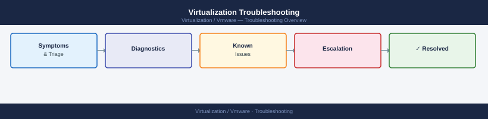

---
tags:
  - operations
  - troubleshooting
search:
  boost: 1.5
---
# Virtualization Troubleshooting


<div class="kb-summary">
Virtualization troubleshooting: VM power-on failures, network port-group misconfiguration, storage access loss, HA admission control issues, and escalation workflows.

*Applies to: vSphere 7.x / 8.x*
</div>



## Troubleshooting Flow

Start by defining the scope, then work down through the stack.

1. **Define scope** — one VM, one host, one cluster, or full vCenter outage?
2. **Check vCenter health** — can you log in? Are services running? Any critical alarms?
3. **Check host health** — are all hosts connected? Any in warning or not responding?
4. **Check storage and vSAN** — are datastores accessible? Is vSAN Skyline Health green?
5. **Check network** — are VM and management networks reachable? Any vMotion failures?
6. **Review recent tasks and events** — what changed in the last 24 hours?
7. **Check logs** — hostd, vpxa, vmkernel, vCenter events, Aria for Logs
8. **Escalate** — open a Dell or VMware support case if the root cause is unclear

<div class="kb-grid kb-grid-7">

<a class="kb-card" href="vm-performance-issue/">
  <strong>VM Performance Issue</strong>
  <span>First-pass workflow for CPU, memory, storage, and network symptoms.</span>
</a>

<a class="kb-card" href="host-disconnected/">
  <strong>Host Disconnected</strong>
  <span>Workflow for disconnected or not responding ESXi hosts.</span>
</a>

<a class="kb-card" href="datastore-inaccessible/">
  <strong>Datastore Inaccessible</strong>
  <span>Troubleshooting VMFS, NFS, vSAN, and storage visibility issues.</span>
</a>

<a class="kb-card" href="network-connectivity-issue/">
  <strong>Network Connectivity Issue</strong>
  <span>VM, host, VLAN, distributed switch, and NSX connectivity checks.</span>
</a>

<a class="kb-card" href="certificate-issue/">
  <strong>Certificate Issue</strong>
  <span>vCenter, NSX, VxRail, and Aria certificate symptoms and workflow.</span>
</a>

<a class="kb-card" href="login-access-issue/">
  <strong>Login or Access Issue</strong>
  <span>SSO, LDAP, AD, permissions, MFA, and local account checks.</span>
</a>

<a class="kb-card" href="known-issues/">
  <strong>Known Issues</strong>
  <span>Known issues and workarounds.</span>
</a>
</div>

## Symptom Index

| Symptom | Component | First steps |
|---|---|---|
| Host disconnected in vCenter | ESXi | Check host DCUI; ping host IP; `vim-cmd hostsvc/hostsummary` |
| VMs powered off unexpectedly | ESXi / HA | Check HA event log; check host hardware faults |
| vSAN health red | vSAN | vCenter → vSAN → Skyline Health; `esxcli vsan health cluster` |
| vSAN disk offline | vSAN | Check disk group health; check disk hardware errors |
| Horizon connection failure | Horizon | Check Connection Server health; check Composer; test blast/pcoip ports |
| Tanzu cluster not ready | Tanzu | `kubectl get nodes`; check Supervisor cluster VMs |
| VxRail upgrade stuck | VxRail | VxRail Manager → Upgrade History; check bundle download |
| SRM recovery plan failed | SRM | Check SRM event log; verify VRMS connectivity |

## ESXi Host Diagnostics

```bash
# From ESXi SSH:
esxcli system stats uptime        # uptime in seconds
esxcli hardware ipmi sel list     # IPMI hardware events
vim-cmd vmsvc/getallvms           # list all VMs and states
esxcli storage core path list | grep -v Active   # check for dead paths
esxcli network ip connection list | grep ESTABLISHED  # active connections
```

**Expected output:** `storage core path list | grep -v Active` returns no output (all paths active). `hardware ipmi sel list` returns no critical hardware events. IPMI critical events require hardware replacement ticket.

## vSAN Health Check

```bash
# Via ESXi SSH:
esxcli vsan health cluster list
esxcli vsan debug disk list
esxcli vsan cluster get    # cluster UUID and node count

# Via DCLI / RVC (legacy):
rvc user@vcenter -c "vsan.health.health_summary /<dc>/computers/<cluster>"
```

**Expected output:** `vsan health cluster list` shows all checks as `green`. `vsan cluster get` confirms node count matches expected cluster size. Any `yellow` or `red` check requires investigation before any scheduled maintenance.

## Horizon Connection Diagnosis

```text
1. Check Connection Server health: https://cs01.corp.local/broker/xml
2. Check event log in Horizon Admin console
3. Verify pool composition (desktops powered on)
4. Test blast: nc -zv <connection-server> 8443
5. Test PCoIP: nc -zv <connection-server> 4172/udp
6. Check Horizon Composer service (if instant clone pool)
```

## Tanzu / Kubernetes Troubleshooting

```bash
kubectl get nodes -o wide                          # node health
kubectl get pods -A | grep -v Running | grep -v Completed   # problem pods
kubectl describe pod <pod> -n <ns>                 # pod events
kubectl logs <pod> -n <ns> --previous             # previous container logs
kubectl get events -n <ns> --sort-by=.lastTimestamp | tail -20
```

## VxRail Troubleshooting

```bash
# Collect support bundle
/usr/lib/vmware-marvin/marvind.py collect_support_bundle

# VxRail Manager service status
systemctl status vmware-marvin

# Check VxRail log
tail -100 /var/log/vmware/vmware-vxrail-manager.log
```
