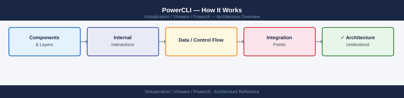

---
tags:
  - architecture
  - powercli
  - vmware
---
# PowerCLI — How It Works

<div class="kb-summary">
PowerCLI wraps the vSphere Web Services API (SOAP/REST) in PowerShell cmdlets. Each Connect-VIServer call creates a persistent session object; all subsequent cmdlets in the session operate against that server's API without re-authenticating.

*Applies to: PowerCLI 13.x*
</div>



<!-- diagram:powercli-architecture -->

## Module Structure

PowerCLI ships as a set of independent PowerShell modules. Each module covers one VMware product family:

| Module | Product | Key Cmdlets |
|---|---|---|
| `VMware.VimAutomation.Core` | vCenter + ESXi | Get-VM, Start-VM, Move-VM, Get-VMHost |
| `VMware.VimAutomation.Vds` | vSphere Distributed Switch | Get-VDSwitch, New-VDPortgroup |
| `VMware.VimAutomation.Storage` | vSAN + VMFS | Get-VsanDisk, Get-Datastore |
| `VMware.VimAutomation.Nsxt` | NSX-T | Get-NsxtSegment, Get-NsxtTransportNode |
| `VMware.VimAutomation.Srm` | Site Recovery Manager | Get-SrmRecoveryPlan, Start-SrmRecovery |
| `VMware.VimAutomation.Hcx` | HCX | Get-HcxServiceMesh, Get-HcxMigration |
| `VMware.VimAutomation.Horizon` | Horizon | Get-HVPool, Get-HVDesktopMachine |
| `VMware.CloudServices` | vCD / Cloud Director | Get-Org, Get-VApp |

```powershell
# List all installed PowerCLI modules
Get-Module -ListAvailable | Where-Object { $_.Name -like 'VMware*' } | Select-Object Name, Version | Sort-Object Name
```

## Connection Model

```text
PowerShell session
       │
       │  Connect-VIServer -Server vcenter.example.com -Credential $cred
       ▼
  $global:DefaultVIServer (session object)
       │
       │  HTTPS + vSphere SOAP API (port 443)
       ▼
  vCenter Server
       │  delegates API calls to ESXi hosts as needed
       ▼
  ESXi Host (hostd, vpxa)
```

Key behaviors:
- `Connect-VIServer` stores the session in `$global:DefaultVIServer`
- All subsequent cmdlets use this session implicitly
- Multiple simultaneous connections supported: `$global:DefaultVIServers` (array)
- Sessions persist for the PowerShell session lifetime (or until `Disconnect-VIServer`)

## Session Handling

```powershell
# Connect to a single vCenter
Connect-VIServer -Server vcenter.example.com -Credential (Get-Credential)

# Connect to multiple vCenters simultaneously
$servers = @('vc1.example.com', 'vc2.example.com')
$servers | ForEach-Object { Connect-VIServer -Server $_ -Credential $cred }

# Check active connections
$global:DefaultVIServers | Select-Object Name, User, IsConnected, Version

# Disconnect cleanly (important in scripts to release API sessions)
Disconnect-VIServer -Confirm:$false
# Or disconnect all:
Disconnect-VIServer * -Confirm:$false
```

## API Binding — View vs. VI Objects

PowerCLI cmdlets return two types of objects:

| Type | Example | Notes |
|---|---|---|
| VI Object | `Get-VM` returns `VirtualMachineImpl` | High-level; property-access; auto-refreshes |
| View Object | `Get-View` returns raw Managed Object | Low-level; full API access; static snapshot |

```powershell
# VI object — easy property access
$vm = Get-VM -Name "web01"
$vm.PowerState          # Running
$vm.NumCpu              # 4

# View object — access properties not exposed by VI cmdlets
$view = Get-View -VIObject $vm
$view.Config.ExtraConfig    # Advanced VM settings array
$view.Guest.IpAddress       # Guest OS IP (if VMware Tools running)
```

Use VI objects for most work; use View objects when you need raw API properties not surfaced by the standard cmdlets.

## Credential Handling

```powershell
# Method 1: Interactive prompt (scripts run by a human)
$cred = Get-Credential

# Method 2: Stored credential file (non-interactive scripts)
# Save credentials to encrypted file (only readable by same user on same machine):
Get-Credential | Export-Clixml -Path C:\SecureStore\vcenter-cred.xml
# Load at script start:
$cred = Import-Clixml -Path C:\SecureStore\vcenter-cred.xml

# Method 3: PowerCLI credential store (per-server saved creds)
New-VICredentialStoreItem -Host vcenter.example.com -User svc-powercli@vsphere.local -Password 'Secr3t!'
# Now Connect-VIServer will use stored creds automatically:
Connect-VIServer -Server vcenter.example.com

# Method 4: Environment variables (CI/CD pipelines)
$cred = New-Object System.Management.Automation.PSCredential(
    $env:VCENTER_USER,
    (ConvertTo-SecureString $env:VCENTER_PASS -AsPlainText -Force)
)
```

## See also

- [PowerCLI — Deploy](../deploy/)
- [PowerCLI — Integrations](integrations/)
