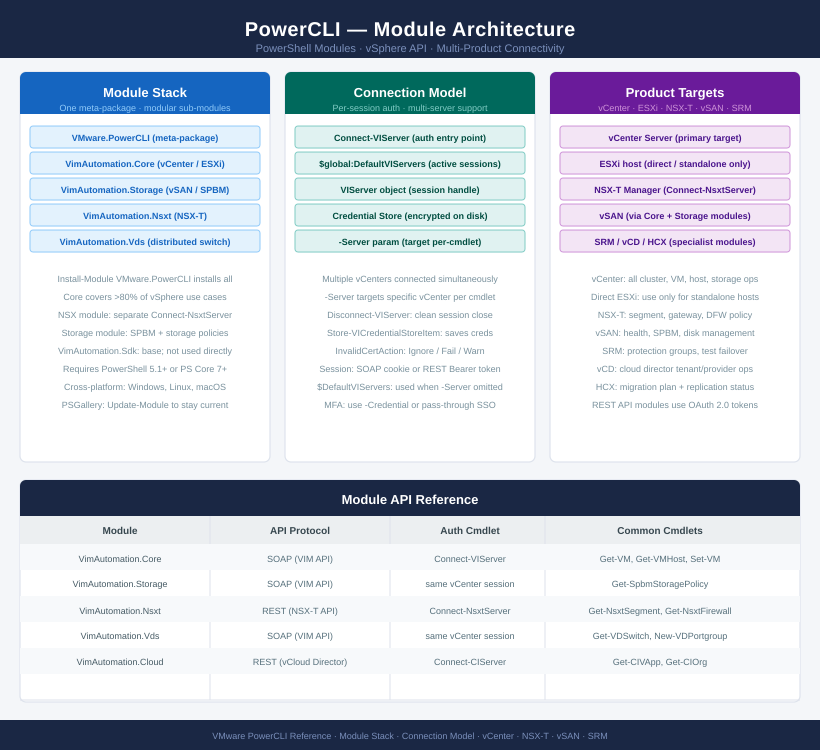

---
tags:
  - architecture
  - powercli
  - vmware
---
# PowerCLI — Architecture

PowerCLI module architecture, vSphere API connectivity model, credential management, and integration with vCenter, ESXi, NSX, and vSAN.

*Applies to: PowerCLI 13.x*

<a class="kb-card" href="how-it-works/">
  <strong>How It Works</strong>
  Module structure, connection model, session handling, and vSphere API binding.
</a>

<a class="kb-card" href="integrations/">
  <strong>Integrations</strong>
  Multi-product support: NSX, vSAN, vCD, HCX, Site Recovery Manager, and vROps.
</a>

