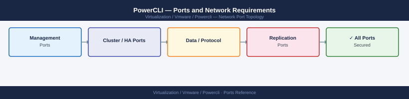

---
tags:
  - powercli
  - powershell
  - automation
  - networking
  - firewall
  - ports
  - vsphere
---
# PowerCLI — Ports and Network Requirements

<div class="kb-summary">
Firewall port reference for VMware PowerCLI. PowerCLI is a scripting client with no listening ports. The relevant firewall rules are the outbound API connections made from the host running PowerCLI to vSphere infrastructure.

*Applies to: PowerCLI 13.x+*
</div>


## Before you begin

- PowerCLI has no listening ports — it is a PowerShell module that connects outbound to VMware APIs
- Open the ports below from whichever machine runs `Connect-VIServer` / `Connect-NSXTServer` to the target infrastructure
- PowerCLI runs from admin workstations, jump hosts, or CI/CD runners

## PowerCLI to vSphere Infrastructure

| Port | Protocol | Destination | Purpose |
|---|---|---|---|
| 443 | TCP | vCenter Server | `Connect-VIServer` — primary vSphere API; all VM, host, cluster, storage operations |
| 443 | TCP | ESXi host (direct connection) | `Connect-VIServer -Server <esxi-host>` — direct host operations without vCenter |
| 443 | TCP | NSX Manager | `Connect-NSXTServer` — NSX API for network objects |
| 443 | TCP | Horizon Connection Server | Horizon PowerCLI module |
| 443 | TCP | vSAN Witness Appliance | vSAN stretched cluster operations |

## Common Scenarios

| Scenario | Source | Destination | Port |
|---|---|---|---|
| Connect to vCenter | Admin workstation / runner | vCenter FQDN | 443 |
| Connect to ESXi directly | Admin workstation | ESXi management IP | 443 |
| NSX operations | Admin workstation | NSX Manager VIP | 443 |
| Retrieve vSAN health | Admin workstation | vCenter FQDN | 443 |
| Export VM inventory | CI/CD pipeline | vCenter FQDN | 443 |

## Firewall Zone Summary

| From | To | Port | Notes |
|---|---|---|---|
| PowerCLI host | vCenter | 443 | Required for all standard operations |
| PowerCLI host | ESXi hosts | 443 | Only if using direct host connections |
| PowerCLI host | NSX Manager | 443 | NSX module operations |

## Verify

```powershell
# Test vCenter connectivity before connecting
Test-NetConnection -ComputerName <vcenter-fqdn> -Port 443

# Connect to vCenter
Connect-VIServer -Server <vcenter-fqdn> -Credential (Get-Credential)

# Verify connected
$global:DefaultVIServer
```

## See also

- [PowerCLI — Architecture](../how-it-works/)
- [vCenter — Ports](../../vcenter/architecture/ports.md)
- [NSX — Ports](../../nsx/architecture/ports.md)
- [Ansible — Ports](../../../../automation/ansible/architecture/ports.md)
