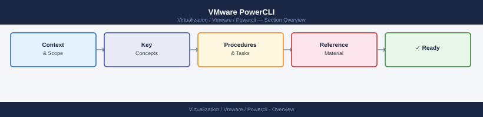

---
tags:
  - powercli
  - vmware
---
# VMware PowerCLI

PowerCLI is VMware's official PowerShell module suite for automating and managing vSphere, NSX, vSAN, vCD, and other VMware products. It provides 900+ cmdlets covering the full vSphere API, enabling scripted VM operations, host configuration, storage management, and reporting at scale.

*Applies to: PowerCLI 13.x*

<!-- diagram:powercli -->

<a class="kb-card" href="architecture/">
  <strong>Architecture</strong>
  How PowerCLI connects to vCenter/ESXi, module structure, credential handling, and integration points.
</a>

<a class="kb-card" href="deploy/">
  <strong>Deploy</strong>
  Installing PowerCLI, connecting to vCenter, service account setup, and multi-vCenter environments.
</a>

<a class="kb-card" href="operations/">
  <strong>Operations</strong>
  Cmdlet reference, scripts library, health checks, procedures, lifecycle, and automation patterns.
</a>

<a class="kb-card" href="security/">
  <strong>Security</strong>
  Service account least privilege, credential storage, certificate validation, and connection hardening.
</a>

<a class="kb-card" href="troubleshooting/">
  <strong>Troubleshooting</strong>
  Connection errors, cmdlet failures, certificate issues, and API permission errors.
</a>

