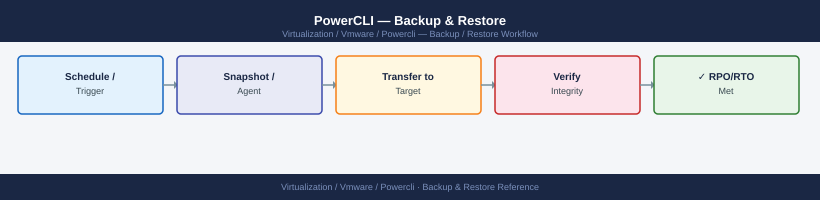

---
tags:
  - operations
  - powercli
  - vmware
---
# PowerCLI — Backup & Restore

<div class="kb-summary">
Exporting vSphere configurations using PowerCLI — VM inventory exports, storage policy snapshots, permissions and role exports, tag taxonomy backups, and module inventory for reproducible automation environments.

*Applies to: PowerCLI 13.x*
</div>


## Before you begin

- **Access:** vCenter read-only minimum; Administrator role for remediation steps
- **Timing:** safe to run during business hours unless a step is marked ⚠ (causes interruption)
- **Dependencies:** no active upgrades or migrations on the same infrastructure
- **Logging:** capture command output — paste into the change record on completion

---

## Run This Routine

Run this sequence weekly to capture a baseline configuration export of the vSphere environment.

```powershell
# Connect first
$vcenter = "vcenter.example.com"
Connect-VIServer -Server $vcenter -Credential (Get-Credential) -Force

$exportDir = "C:\vsphere-exports\$(Get-Date -Format 'yyyy-MM-dd')"
New-Item -ItemType Directory -Path $exportDir -Force | Out-Null

# 1. VM inventory
Get-VM | Select-Object Name, PowerState, NumCpu, MemoryGB,
    @{N='Host';E={$_.VMHost.Name}},
    @{N='Cluster';E={(Get-Cluster -VM $_).Name}},
    @{N='Datastore';E={(Get-Datastore -VM $_).Name}} |
    Export-Csv "$exportDir\vm-inventory.csv" -NoTypeInformation

# 2. Host inventory
Get-VMHost | Select-Object Name, ConnectionState, PowerState,
    NumCpu, CpuUsageMhz, MemoryTotalGB, MemoryUsageGB, Version |
    Export-Csv "$exportDir\host-inventory.csv" -NoTypeInformation

# 3. Storage policies
Get-SpbmStoragePolicy | Select-Object Name, Description, AnyOfRuleSets |
    Export-Csv "$exportDir\storage-policies.csv" -NoTypeInformation

# 4. Tags and categories
Get-TagCategory | Export-Csv "$exportDir\tag-categories.csv" -NoTypeInformation
Get-Tag | Select-Object Name, Description, @{N='Category';E={$_.Category.Name}} |
    Export-Csv "$exportDir\tags.csv" -NoTypeInformation

# 5. Permissions
Get-VIPermission | Select-Object Entity, Principal, Role, Propagate |
    Export-Csv "$exportDir\permissions.csv" -NoTypeInformation

Write-Host "Exports written to $exportDir"
Disconnect-VIServer -Server $vcenter -Confirm:$false
```

---

## Export VM Configuration

Capture full VM configuration including hardware specs, network, and storage layout.

```powershell
# Detailed VM configuration export
$vms = Get-VM
$vmDetails = foreach ($vm in $vms) {
    $nics = Get-NetworkAdapter -VM $vm
    $disks = Get-HardDisk -VM $vm
    $snapshots = Get-Snapshot -VM $vm

    [PSCustomObject]@{
        Name             = $vm.Name
        PowerState       = $vm.PowerState
        NumCPU           = $vm.NumCpu
        MemoryGB         = $vm.MemoryGB
        ProvisionedSpaceGB = [math]::Round($vm.ProvisionedSpaceGB, 2)
        UsedSpaceGB      = [math]::Round($vm.UsedSpaceGB, 2)
        Host             = $vm.VMHost.Name
        Cluster          = (Get-Cluster -VM $vm -ErrorAction SilentlyContinue).Name
        Datastore        = ($disks | Select-Object -First 1).FileName.Split(']')[0].TrimStart('[')
        NetworkAdapters  = ($nics.NetworkName -join ', ')
        DiskCount        = $disks.Count
        SnapshotCount    = $snapshots.Count
        VMXPath          = $vm.ExtensionData.Config.Files.VmPathName
        HardwareVersion  = $vm.HardwareVersion
        GuestOS          = $vm.Guest.OsFullName
        VMTools          = $vm.ExtensionData.Guest.ToolsStatus
        Notes            = $vm.Notes
    }
}

$vmDetails | Export-Csv "vm-details-$(Get-Date -Format 'yyyyMMdd').csv" -NoTypeInformation
Write-Host "Exported $($vmDetails.Count) VMs"
```

Export VM network and disk layout separately for change tracking:

```powershell
# Network adapter export — track VLAN assignments
$nicExport = Get-VM | Get-NetworkAdapter | Select-Object
    @{N='VM';E={$_.Parent.Name}},
    Name,
    NetworkName,
    Type,
    MacAddress,
    ConnectionState,
    @{N='Cluster';E={(Get-Cluster -VM $_.Parent -ErrorAction SilentlyContinue).Name}}

$nicExport | Export-Csv "vm-network-adapters.csv" -NoTypeInformation

# Disk export — track capacity and datastore placement
$diskExport = Get-VM | Get-HardDisk | Select-Object
    @{N='VM';E={$_.Parent.Name}},
    Name,
    @{N='CapacityGB';E={[math]::Round($_.CapacityGB, 2)}},
    DiskType,
    StorageFormat,
    FileName,
    @{N='Datastore';E={$_.FileName.Split(']')[0].TrimStart('[')}}

$diskExport | Export-Csv "vm-disks.csv" -NoTypeInformation
```

---

## Export Storage Policies

Back up SPBM storage policies so they can be recreated after a vCenter migration or rebuild.

```powershell
# Export storage policy details
$policies = Get-SpbmStoragePolicy
foreach ($policy in $policies) {
    $policyDetail = [PSCustomObject]@{
        Name        = $policy.Name
        Description = $policy.Description
        PolicyId    = $policy.Id
        AnyOfRules  = ($policy.AnyOfRuleSets | ConvertTo-Json -Depth 5)
    }
    Write-Host "Policy: $($policy.Name)"
}

# Export VMs and their assigned storage policies
$vmPolicies = foreach ($vm in Get-VM) {
    foreach ($disk in Get-HardDisk -VM $vm) {
        $compliance = Get-SpbmEntityConfiguration -HardDisk $disk -ErrorAction SilentlyContinue
        [PSCustomObject]@{
            VM          = $vm.Name
            Disk        = $disk.Name
            Policy      = $compliance.StoragePolicy.Name
            Compliance  = $compliance.ComplianceStatus
        }
    }
}

$vmPolicies | Export-Csv "vm-storage-policies.csv" -NoTypeInformation
Write-Host "Exported storage policy assignments for $($vmPolicies.Count) disks"
```

---

## Export Permissions and Roles

Capture the full RBAC permission model for audit and recovery purposes.

```powershell
# Export all custom roles (excludes built-in roles)
$customRoles = Get-VIRole | Where-Object { -not $_.IsSystem }
foreach ($role in $customRoles) {
    Write-Host "Role: $($role.Name) — $($role.PrivilegeList.Count) privileges"
}
$customRoles | Select-Object Name, Description, @{N='Privileges';E={$_.PrivilegeList -join ';'}} |
    Export-Csv "custom-roles.csv" -NoTypeInformation

# Export all permission assignments
$permissions = Get-VIPermission
$permExport = $permissions | Select-Object `
    @{N='Entity';E={$_.Entity.Name}},
    @{N='EntityType';E={$_.Entity.GetType().Name}},
    @{N='EntityPath';E={
        $obj = $_.Entity
        $path = $obj.Name
        while ($obj.Parent) { $obj = $obj.Parent; $path = "$($obj.Name)/$path" }
        $path
    }},
    Principal,
    Role,
    Propagate,
    IsGroup

$permExport | Export-Csv "permissions-full.csv" -NoTypeInformation
Write-Host "Exported $($permissions.Count) permission assignments"
```

---

## Export Tags and Categories

Tags and their category assignments are not included in vCenter backup by default — export them explicitly.

```powershell
# Export tag categories
$categories = Get-TagCategory
$categories | Select-Object Name, Description, Cardinality, EntityType |
    Export-Csv "tag-categories.csv" -NoTypeInformation

# Export all tags with their category
$tags = Get-Tag | Select-Object `
    Name,
    Description,
    @{N='Category';E={$_.Category.Name}},
    @{N='CategoryCardinality';E={$_.Category.Cardinality}}

$tags | Export-Csv "tags.csv" -NoTypeInformation

# Export tag assignments to VMs
$tagAssignments = foreach ($vm in Get-VM) {
    $vmTags = Get-TagAssignment -Entity $vm
    foreach ($assignment in $vmTags) {
        [PSCustomObject]@{
            VM       = $vm.Name
            Tag      = $assignment.Tag.Name
            Category = $assignment.Tag.Category.Name
        }
    }
}

$tagAssignments | Export-Csv "vm-tag-assignments.csv" -NoTypeInformation
Write-Host "Exported $($tagAssignments.Count) tag assignments across $((Get-VM).Count) VMs"
```

---

## Save Module Inventory

Capture the installed PowerCLI module versions so the environment can be reproduced on a new machine or after a rebuild.

```powershell
# Export all installed VMware modules
$vmwareModules = Get-Module -ListAvailable | Where-Object { $_.Name -like 'VMware*' }
$vmwareModules | Select-Object Name, Version, Description |
    Sort-Object Name |
    Format-Table -AutoSize

# Save to file for reproducibility
$vmwareModules | Select-Object Name, Version |
    Export-Csv "installed-powercli-modules.csv" -NoTypeInformation

# Generate an install script to recreate the same module versions on a new machine
$installScript = $vmwareModules | ForEach-Object {
    "Install-Module -Name $($_.Name) -RequiredVersion $($_.Version) -Force -AllowClobber"
}
$installScript | Out-File "reinstall-powercli-modules.ps1"
Write-Host "Reinstall script written to reinstall-powercli-modules.ps1"
```

---

## Restore from Exports

Use the CSV exports to validate or restore configuration after a vCenter incident.

```powershell
# Verify VM inventory against a saved baseline
$baseline = Import-Csv "vm-inventory.csv"
$current = Get-VM | Select-Object Name, PowerState, NumCpu, MemoryGB
$missing = $baseline | Where-Object { $_.Name -notin $current.Name }
$new = $current | Where-Object { $_.Name -notin $baseline.Name }

Write-Host "VMs in baseline but not current inventory: $($missing.Count)"
$missing | Format-Table Name, PowerState
Write-Host "VMs in current inventory but not in baseline: $($new.Count)"
$new | Format-Table Name, PowerState

# Restore tag assignments from CSV export
$tagData = Import-Csv "vm-tag-assignments.csv"
foreach ($row in $tagData) {
    $vm = Get-VM -Name $row.VM -ErrorAction SilentlyContinue
    $tag = Get-Tag -Name $row.Tag -Category $row.Category -ErrorAction SilentlyContinue
    if ($vm -and $tag) {
        New-TagAssignment -Entity $vm -Tag $tag -ErrorAction SilentlyContinue | Out-Null
        Write-Host "Restored tag '$($row.Tag)' on VM '$($row.VM)'"
    }
}

# Restore custom permissions from CSV export (manual review recommended)
$permData = Import-Csv "permissions-full.csv"
foreach ($perm in $permData) {
    Write-Host "Restore: $($perm.Principal) → $($perm.Role) on $($perm.EntityPath) (propagate=$($perm.Propagate))"
    # Uncomment to apply:
    # New-VIPermission -Entity (Get-VIObjectByVIView ...) -Principal $perm.Principal -Role $perm.Role -Propagate ($perm.Propagate -eq 'True')
}
```

---

## See also

- [PowerCLI — Procedures](procedures/)
- [PowerCLI — Common Issues](../troubleshooting/common-issues/)
- [PowerCLI — Health Checks](health-checks/)

## Verify

- **Alarms:** vSphere Client → Home → Alarms — no new critical alarms after the operation
- **Events:** monitor the vCenter Events view for the affected object for 5 minutes
- **Health check:** run the morning health-check sequence for the affected product tier
