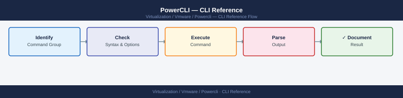

---
tags:
  - operations
  - powercli
  - vmware
---
# PowerCLI — CLI Reference

<div class="kb-summary">
Core PowerCLI cmdlets for VM management, host operations, cluster management, datastore/storage, vSAN, networking, snapshots, and tagging. All examples assume an active vCenter connection.

*Applies to: PowerCLI 13.x*
</div>



<!-- diagram:powercli-operations -->

```d2
direction: right

hub: "PowerCLI\nOperations" {shape: hexagon}
vm_management: "VM Management" {shape: rectangle}
host_operations: "Host Operations" {shape: rectangle}
cluster_management: "Cluster Management" {shape: rectangle}
datastore_and_storage: "Datastore and Storage" {shape: rectangle}
vsan_operations: "vSAN Operations" {shape: rectangle}
snapshots: "Snapshots" {shape: rectangle}

hub -> vm_management
hub -> host_operations
hub -> cluster_management
hub -> datastore_and_storage
hub -> vsan_operations
hub -> snapshots
```

## Before you begin

- **Access:** vCenter read-only minimum; Administrator role for remediation steps
- **Timing:** safe to run during business hours unless a step is marked ⚠ (causes interruption)
- **Dependencies:** no active upgrades or migrations on the same infrastructure
- **Logging:** capture command output — paste into the change record on completion

---

## VM Management

```powershell
# List all VMs
Get-VM | Select-Object Name, PowerState, NumCpu, MemoryGB, VMHost | Sort-Object Name

# Filter by power state
Get-VM | Where-Object { $_.PowerState -eq 'PoweredOff' }

# Get VMs on a specific host
Get-VMHost -Name esxi01.example.com | Get-VM | Select-Object Name, PowerState

# Get VMs in a cluster
Get-Cluster -Name "Production" | Get-VM | Select-Object Name, VMHost, PowerState

# Power operations
Start-VM -VM (Get-VM -Name "web01")
Stop-VM -VM (Get-VM -Name "web01") -Confirm:$false
Restart-VM -VM (Get-VM -Name "web01") -Confirm:$false
Suspend-VM -VM (Get-VM -Name "web01") -Confirm:$false

# VM configuration
Set-VM -VM (Get-VM -Name "web01") -NumCpu 4 -MemoryGB 8 -Confirm:$false

# vMotion (live migration)
Move-VM -VM (Get-VM -Name "web01") -Destination (Get-VMHost -Name esxi02.example.com) -Confirm:$false
# Move to different datastore
Move-VM -VM (Get-VM -Name "web01") -Datastore (Get-Datastore -Name "vSAN-DS") -Confirm:$false
```

## Host Operations

```powershell
# List all hosts
Get-VMHost | Select-Object Name, ConnectionState, PowerState, Version, Parent | Sort-Object Name

# Host in a cluster
Get-Cluster -Name "Production" | Get-VMHost | Select-Object Name, CpuUsageMhz, MemoryUsageGB

# Host network adapters
Get-VMHost -Name esxi01.example.com | Get-VMHostNetworkAdapter | Select-Object Name, IP, SubnetMask, Mac

# Host services
Get-VMHost -Name esxi01.example.com | Get-VMHostService | Select-Object Key, Label, Running, Policy

# Enter/exit maintenance mode
Set-VMHost -VMHost (Get-VMHost -Name esxi01.example.com) -State Maintenance -Confirm:$false
Set-VMHost -VMHost (Get-VMHost -Name esxi01.example.com) -State Connected -Confirm:$false

# Host advanced settings
Get-VMHost -Name esxi01.example.com | Get-AdvancedSetting -Name "UserVars.SuppressShellWarning"
Get-VMHost -Name esxi01.example.com | Get-AdvancedSetting -Name "Net.TcpipHeapSize" | Set-AdvancedSetting -Value 32 -Confirm:$false
```

## Cluster Management

```powershell
# List clusters
Get-Cluster | Select-Object Name, HAEnabled, DrsEnabled, DrsAutomationLevel, VsanEnabled | Format-Table -AutoSize

# HA configuration
Set-Cluster -Cluster (Get-Cluster -Name "Production") -HAEnabled $true -HAAdmissionControlEnabled $true -Confirm:$false

# DRS configuration
Set-Cluster -Cluster (Get-Cluster -Name "Production") -DrsEnabled $true -DrsAutomationLevel FullyAutomated -Confirm:$false

# Check DRS migration recommendations
Get-DrsRecommendation -Cluster (Get-Cluster -Name "Production") | Select-Object Reason, Target, Priority

# Apply all DRS recommendations
Get-DrsRecommendation -Cluster (Get-Cluster -Name "Production") | Apply-DrsRecommendation
```

## Datastore and Storage

```powershell
# List datastores
Get-Datastore | Select-Object Name, Type, CapacityGB, FreeSpaceGB, @{N="UsedPct";E={[math]::Round((1-$_.FreeSpaceGB/$_.CapacityGB)*100,1)}} | Sort-Object UsedPct -Descending

# Datastores below 20% free
Get-Datastore | Where-Object { ($_.FreeSpaceGB / $_.CapacityGB) -lt 0.20 }

# Datastore files (browse)
$ds = Get-Datastore -Name "vSAN-DS"
$browser = Get-View -Id $ds.ExtensionData.Browser
$spec = New-Object VMware.Vim.HostDatastoreBrowserSearchSpec

# Find VM with largest VMDK
Get-VM | ForEach-Object {
    Get-HardDisk -VM $_ | Select-Object @{N="VM";E={$_.Parent.Name}}, Name, CapacityGB
} | Sort-Object CapacityGB -Descending | Select-Object -First 20
```

## vSAN Operations

```powershell
# vSAN cluster health
Get-VsanClusterHealthSummary -Cluster (Get-Cluster -Name "vSAN-Cluster") | Select-Object OverallHealth

# Disk groups
Get-VsanDiskGroup -VMHost (Get-VMHost -Location (Get-Cluster -Name "vSAN-Cluster")) | Select-Object VMHost, @{N="CacheDisk";E={$_.ExtensionData.SsdUuid}}, @{N="CapacityDisks";E={$_.ExtensionData.NonSsd.Count}}

# vSAN disk health
Get-VsanDisk -VMHost (Get-VMHost -Location (Get-Cluster -Name "vSAN-Cluster")) | Select-Object CanonicalName, State, IsFlash | Format-Table -AutoSize

# vSAN objects
Get-VsanObject -Cluster (Get-Cluster -Name "vSAN-Cluster") | Where-Object { $_.HealthState -ne 'healthy' }
```

## Snapshots

```powershell
# Find all VMs with snapshots
Get-VM | Get-Snapshot | Select-Object VM, Name, Created, SizeMB, @{N="AgeDays";E={(Get-Date) - $_.Created | Select-Object -Expand TotalDays}} | Sort-Object AgeDays -Descending

# Find old snapshots (>7 days)
Get-VM | Get-Snapshot | Where-Object { $_.Created -lt (Get-Date).AddDays(-7) }

# Create snapshot
New-Snapshot -VM (Get-VM -Name "web01") -Name "pre-patch-$(Get-Date -Format 'yyyyMMdd')" -Memory:$false -Quiesce:$false -Confirm:$false

# Remove a specific snapshot
Get-VM -Name "web01" | Get-Snapshot -Name "pre-patch-20260607" | Remove-Snapshot -RemoveChildren -Confirm:$false

# Remove all snapshots for a VM
Get-VM -Name "web01" | Get-Snapshot | Remove-Snapshot -RemoveChildren -Confirm:$false
```

## Tags and Custom Attributes

```powershell
# List all tag categories
Get-TagCategory | Select-Object Name, Description, Cardinality

# Create a tag
New-TagCategory -Name "Environment" -Cardinality Single -EntityType VirtualMachine
New-Tag -Name "Production" -Category (Get-TagCategory -Name "Environment")

# Assign a tag
Get-VM -Name "web01" | New-TagAssignment -Tag (Get-Tag -Name "Production")

# Find VMs with a tag
Get-VM | Where-Object { (Get-TagAssignment -Entity $_).Tag.Name -eq "Production" }

# Custom attributes
$vm = Get-VM -Name "web01"
$attr = Get-CustomAttribute -Name "Owner"
Set-Annotation -Entity $vm -CustomAttribute $attr -Value "john.doe@example.com"
```

---

## See also

- [PowerCLI — Procedures](procedures/)
- [PowerCLI — Scripts](scripts/)
- [PowerCLI — Health Checks](health-checks/)

## Verify

- **Alarms:** vSphere Client → Home → Alarms — no new critical alarms after the operation
- **Events:** monitor the vCenter Events view for the affected object for 5 minutes
- **Health check:** run the morning health-check sequence for the affected product tier
