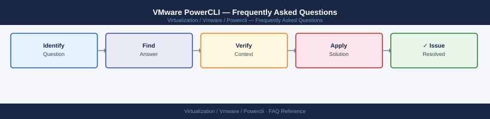

---
tags:
  - powercli
  - faq
  - operations
---
# VMware PowerCLI — Frequently Asked Questions

*Applies to: VMware PowerCLI 13.x*

Common questions about VMware PowerCLI operations, configuration, and troubleshooting. For step-by-step procedures, see the <a href="index.md">Operations</a> section.

## General

**Q: What PowerCLI version is recommended?**
A: PowerCLI 13.x is the current recommendation. Check: `Get-Module VMware.PowerCLI -ListAvailable | Select Version`. Update: `Update-Module VMware.PowerCLI`.

**Q: How do I check the current VMware PowerCLI version?**
A: `Get-Module VMware.PowerCLI -ListAvailable | Select Version`

## Configuration

**Q: What is the default certificate handling and when should it change?**
A: PowerCLI warns on self-signed certificates by default. Set `Set-PowerCLIConfiguration -InvalidCertificateAction Ignore` for lab environments only. In production, use valid certificates on vCenter and set to `Warn` or `Fail`.

**Q: How do I enable PowerCLI to manage multiple vCenters simultaneously?**
A: Connect to multiple vCenters: `Connect-VIServer -Server vc1,vc2`. Use `$global:DefaultVIServers` to see all connections. Target specific servers: `Get-VM -Server vc1`. Disconnect individually: `Disconnect-VIServer -Server vc1`.

## Operations

**Q: How do I use PowerCLI to automate ESXi patch remediation?**
A: Use `Install-VMHostPatch` or the newer vLCM API via `Invoke-VsanCommand`. For staged remediation: `Get-VMHost | where State -eq 'Connected' | ForEach { Set-VMHost $_ -State Maintenance; Install-VMHostPatch ...; Set-VMHost $_ -State Connected }`.

**Q: What is the correct procedure to bulk-add VMs to a folder using PowerCLI?**
A: `$folder = Get-Folder 'Production'; Get-VM | where Name -match 'prod-' | Move-VM -Destination $folder`. Verify with `Get-VM -Location $folder`. Use `-WhatIf` parameter first to preview changes before execution.

## Troubleshooting

**Q: PowerCLI shows 'Server certificate validation error'. What does it mean?**
A: The vCenter certificate is not trusted by the PowerCLI client. Either set `Set-PowerCLIConfiguration -InvalidCertificateAction Ignore` (lab only) or import the vCenter CA certificate into the Windows certificate store.

**Q: Large PowerCLI scripts run slowly against big vCenter inventories — where do I start?**
A: Use `Get-View` instead of `Get-VM` for bulk queries — it uses direct API calls without object wrapping. Filter server-side: `Get-View -ViewType VirtualMachine -Filter @{Name='prod-*'}`. Avoid `Get-VM | where` which retrieves all VMs first.

## Backup and Recovery

**Q: How do I back up PowerCLI scripts and modules?**
A: Store all PowerCLI scripts in Git. Pin module versions in a `requirements.psd1`. For DSC-based automation, version-control the configuration files. Use a private PowerShell repository (Azure Artifacts, Nexus) for internal modules.

**Q: Can I recover a deleted VM configuration using PowerCLI?**
A: If the VM was removed from inventory (not deleted from disk), re-register: `New-VM -VMFilePath '[datastore] vm/vm.vmx' -ResourcePool <pool>`. If deleted from disk, restore from backup using your backup tool's PowerShell cmdlets.

## See Also

- [VMware PowerCLI Operations](index.md)
- [VMware PowerCLI Troubleshooting](../troubleshooting/index.md)
