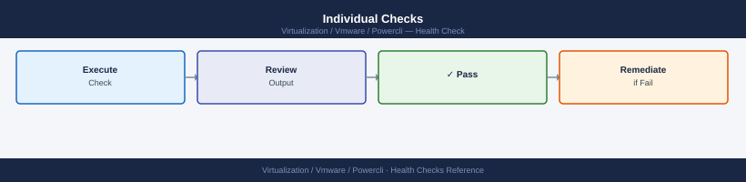

---
tags:
  - operations
  - powercli
  - vmware
---
# PowerCLI — Health Checks

<div class="kb-summary">
PowerCLI health check routines for vSphere platform health: host connection states, VM power states, snapshot inventory, datastore capacity, cluster HA status, and vSAN health — all runnable as a single daily check script.

*Applies to: PowerCLI 13.x*
</div>

## Before you begin

- **Access:** vCenter read-only minimum; Administrator role for remediation steps
- **Timing:** safe to run during business hours unless a step is marked ⚠ (causes interruption)
- **Dependencies:** no active upgrades or migrations on the same infrastructure
- **Logging:** capture command output — paste into the change record on completion

---

## Run This Routine

```powershell
#!/usr/bin/env pwsh
# vsphere-health-check.ps1
# Usage: .\vsphere-health-check.ps1 -vCenter vcenter.example.com -Cluster Production

param(
    [Parameter(Mandatory)] [string] $vCenter,
    [string] $Cluster = "*",
    [System.Management.Automation.PSCredential] $Credential
)

Set-PowerCLIConfiguration -InvalidCertificateAction Ignore -Confirm:$false | Out-Null

if ($Credential) {
    Connect-VIServer -Server $vCenter -Credential $Credential
} else {
    Connect-VIServer -Server $vCenter
}

$PASS = 0; $WARN = 0; $FAIL = 0

function Check($label, $value, $warnThreshold, $failThreshold, $unit="") {
    if ($value -ge $failThreshold) {
        Write-Host "FAIL  $label`: $value$unit" -ForegroundColor Red; $script:FAIL++
    } elseif ($value -ge $warnThreshold) {
        Write-Host "WARN  $label`: $value$unit" -ForegroundColor Yellow; $script:WARN++
    } else {
        Write-Host "PASS  $label`: $value$unit" -ForegroundColor Green; $script:PASS++
    }
}

Write-Host "`n=== vSphere Health Check: $vCenter ===" -ForegroundColor Cyan
Write-Host "Cluster filter: $Cluster`n"

# 1. Disconnected hosts
$disconnected = Get-VMHost -Location (Get-Cluster -Name $Cluster) | Where-Object { $_.ConnectionState -ne 'Connected' }
Check "Disconnected hosts" $disconnected.Count 1 1
if ($disconnected) { $disconnected | ForEach-Object { Write-Host "       → $($_.Name): $($_.ConnectionState)" -ForegroundColor Red } }

# 2. Hosts in maintenance
$maintenance = Get-VMHost -Location (Get-Cluster -Name $Cluster) | Where-Object { $_.ConnectionState -eq 'Maintenance' }
if ($maintenance.Count -gt 0) {
    Write-Host "NOTE  $($maintenance.Count) host(s) in maintenance: $(($maintenance.Name) -join ', ')" -ForegroundColor Cyan
}

# 3. VMs with consolidation needed
$consolidate = Get-VM -Location (Get-Cluster -Name $Cluster) | Where-Object { $_.ExtensionData.Runtime.ConsolidationNeeded }
Check "VMs needing consolidation" $consolidate.Count 1 3
if ($consolidate) { $consolidate | ForEach-Object { Write-Host "       → $($_.Name)" -ForegroundColor Yellow } }

# 4. Old snapshots (>7 days)
$oldSnaps = Get-VM -Location (Get-Cluster -Name $Cluster) | Get-Snapshot | Where-Object { $_.Created -lt (Get-Date).AddDays(-7) }
Check "Snapshots older than 7 days" $oldSnaps.Count 1 5
if ($oldSnaps) { $oldSnaps | Select-Object @{N="VM";E={$_.VM.Name}}, Name, Created | Format-Table -AutoSize }

# 5. Datastores > 80% full
$fullDS = Get-Datastore -RelatedObject (Get-Cluster -Name $Cluster) | Where-Object {
    ($_.CapacityGB -gt 0) -and ((($_.CapacityGB - $_.FreeSpaceGB) / $_.CapacityGB) -gt 0.80)
}
Check "Datastores > 80% used" $fullDS.Count 1 3
if ($fullDS) {
    $fullDS | Select-Object Name, CapacityGB, FreeSpaceGB, @{N="UsedPct";E={[math]::Round((1-$_.FreeSpaceGB/$_.CapacityGB)*100,1)}} | Format-Table -AutoSize
}

# 6. HA admission control
$clusters = Get-Cluster -Name $Cluster
foreach ($c in $clusters) {
    if (-not $c.HAEnabled) {
        Write-Host "WARN  HA disabled on cluster: $($c.Name)" -ForegroundColor Yellow; $WARN++
    } else {
        Write-Host "PASS  HA enabled: $($c.Name)" -ForegroundColor Green; $PASS++
    }
}

# 7. vSAN health (if applicable)
$vsanClusters = $clusters | Where-Object { $_.VsanEnabled }
foreach ($vc in $vsanClusters) {
    $health = (Get-VsanClusterHealthSummary -Cluster $vc).OverallHealth
    if ($health -eq 'green') {
        Write-Host "PASS  vSAN health [$($vc.Name)]: $health" -ForegroundColor Green; $PASS++
    } elseif ($health -eq 'yellow') {
        Write-Host "WARN  vSAN health [$($vc.Name)]: $health" -ForegroundColor Yellow; $WARN++
    } else {
        Write-Host "FAIL  vSAN health [$($vc.Name)]: $health" -ForegroundColor Red; $FAIL++
    }
}

Write-Host "`n=== Summary ===" -ForegroundColor Cyan
Write-Host "PASS: $PASS  |  WARN: $WARN  |  FAIL: $FAIL"

Disconnect-VIServer -Confirm:$false
if ($FAIL -gt 0) { exit 1 } elseif ($WARN -gt 0) { exit 2 } else { exit 0 }
```

## Individual Checks



```powershell
# Host hardware health (via CIM)
Get-VMHost | ForEach-Object {
    $esxcli = Get-EsxCli -VMHost $_ -V2
    $status = $esxcli.hardware.platform.get.Invoke().VendorName
    Write-Host "$($_.Name): $status"
}

# Alarm states
Get-AlarmAction | Get-Alarm | Where-Object { $_.TriggeredAlarms } | Select-Object Name, EntityType

# CPU/Memory utilization per host
Get-VMHost | Select-Object Name,
    @{N="CPU%";E={[math]::Round($_.CpuUsageMhz/$_.CpuTotalMhz*100,1)}},
    @{N="Mem%";E={[math]::Round($_.MemoryUsageGB/$_.MemoryTotalGB*100,1)}} |
    Sort-Object "CPU%" -Descending | Format-Table -AutoSize

# VMs with tools not running
Get-VM | Where-Object { $_.PowerState -eq 'PoweredOn' } |
    Where-Object { $_.ExtensionData.Guest.ToolsStatus -ne 'toolsOk' } |
    Select-Object Name, @{N="ToolsStatus";E={$_.ExtensionData.Guest.ToolsStatus}}
```

---

## See also

- [PowerCLI — Common Issues](../../troubleshooting/common-issues/)
- [PowerCLI — Procedures](../procedures/)
- [PowerCLI — CLI Reference](../cli-reference/)

## Verify

- **Alarms:** vSphere Client → Home → Alarms — no new critical alarms after the operation
- **Events:** monitor the vCenter Events view for the affected object for 5 minutes
- **Health check:** run the morning health-check sequence for the affected product tier
