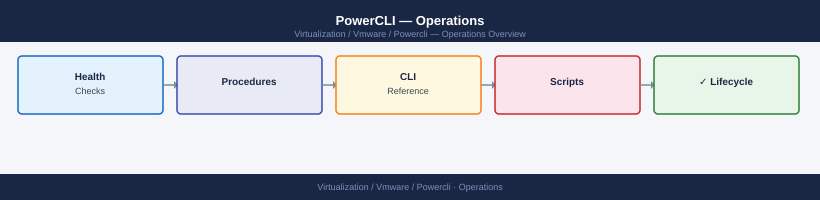

---
tags:
  - operations
  - powercli
  - vmware
---
# PowerCLI — Operations

PowerCLI operational reference: cmdlet library, automation scripts, health check routines, operational procedures, and lifecycle management.

*Applies to: PowerCLI 13.x*

<a class="kb-card" href="cli-reference/">
  <strong>CLI Reference</strong>
  Cmdlets for VMs, hosts, clusters, storage, networking, vSAN, and snapshots.
</a>

<a class="kb-card" href="scripts/">
  <strong>Scripts</strong>
  Production-ready scripts: VM inventory, host health, snapshot audit, vSAN reporting, and storage reports.
</a>

<a class="kb-card" href="health-checks/">
  <strong>Health Checks</strong>
  Daily and weekly platform health routine covering hosts, VMs, storage, and cluster state.
</a>

<a class="kb-card" href="procedures/">
  <strong>Procedures</strong>
  Common operational tasks: bulk VM operations, host maintenance, snapshot cleanup, and tag management.
</a>

<a class="kb-card" href="install-upgrade/">
  <strong>Lifecycle</strong>
  PowerCLI version upgrades, module management, and compatibility with vCenter versions.
</a>

<a class="kb-card" href="backup-restore/">
  <strong>Backup & Restore</strong>
  VM inventory exports, storage policy snapshots, permissions exports, tag backups, and module inventory.
</a>

