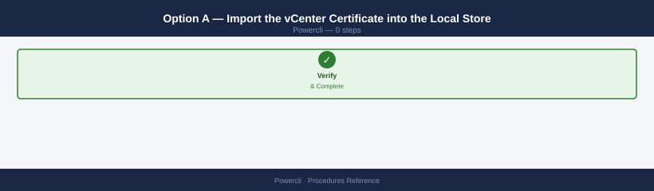
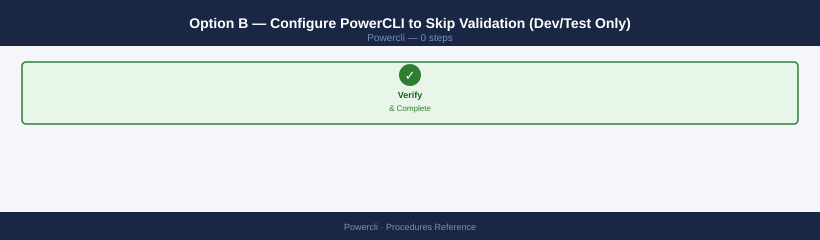
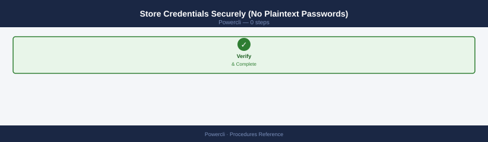

---
tags:
  - operations
  - powercli
  - vmware
---
# PowerCLI — Procedures

<div class="kb-summary">
Common operational procedures using PowerCLI: VM lifecycle, bulk operations, storage migration, network management, vSAN, reporting, permissions, cluster configuration, host profiles, and scheduled task automation.

*Applies to: PowerCLI 13.x*
</div>


## Before you begin

- **Access:** vCenter read-only minimum; Administrator role for remediation steps
- **Timing:** safe to run during business hours unless a step is marked ⚠ (causes interruption)
- **Dependencies:** no active upgrades or migrations on the same infrastructure
- **Logging:** capture command output — paste into the change record on completion

---

## Put Host in Maintenance Mode

```powershell
$hostName = "esxi01.corp.local"
$vmhost   = Get-VMHost -Name $hostName

# Confirm VMs that will be vMotioned off
$runningVMs = Get-VM -VMHost $vmhost | Where-Object { $_.PowerState -eq 'PoweredOn' }
Write-Host "$($runningVMs.Count) powered-on VMs will be evacuated from $hostName"

# Enter maintenance mode — -Evacuate triggers DRS to vMotion all VMs off
Set-VMHost -VMHost $vmhost -State Maintenance -Evacuate:$true -Confirm:$false

# Poll until confirmed
do {
    Start-Sleep 10
    $state = (Get-VMHost -Name $hostName).ConnectionState
    Write-Host "State: $state"
} until ($state -eq 'Maintenance')
Write-Host "$hostName is in Maintenance mode — safe to proceed"

# After work is complete — exit maintenance mode
Set-VMHost -VMHost (Get-VMHost -Name $hostName) -State Connected -Confirm:$false
```

**Verify:** `Get-VMHost -Name $hostName | Select-Object Name, ConnectionState, PowerState`

---

## Bulk Snapshot Cleanup

```powershell
$cluster = "Production"
$daysOld = 14
$cutoff  = (Get-Date).AddDays(-$daysOld)

$snaps = Get-VM -Location (Get-Cluster -Name $cluster) |
         Get-Snapshot |
         Where-Object { $_.Created -lt $cutoff }

Write-Host "Found $($snaps.Count) snapshots older than $daysOld days:"
$snaps | Select-Object @{N="VM";E={$_.VM.Name}}, Name, Created, @{N="SizeGB";E={[Math]::Round($_.SizeGB,1)}} |
    Sort-Object VM | Format-Table -AutoSize

# Remove per VM with confirmation
$snaps | Group-Object { $_.VM.Name } | ForEach-Object {
    $vmName  = $_.Name
    $vmSnaps = $_.Group
    $ans = Read-Host "Remove $($vmSnaps.Count) snapshot(s) for $vmName? (y/n)"
    if ($ans -eq 'y') {
        $vmSnaps | Remove-Snapshot -RemoveChildren:$false -Confirm:$false
        Write-Host "  Removed snapshots for $vmName" -ForegroundColor Green
    }
}
```

---

## VM Clone from Template

```powershell
$template  = Get-Template -Name "Win2022-Base"
$custSpec  = Get-OSCustomizationSpec -Name "Windows-Domain-Join"
$cluster   = Get-Cluster -Name "Production"
$datastore = Get-Datastore -Name "vSAN-Production"
$folder    = Get-Folder -Name "Production-VMs"
$vmNames   = @("web01", "web02", "app01")

foreach ($name in $vmNames) {
    $vmhost = Get-VMHost -Location $cluster | Where-Object { $_.ConnectionState -eq 'Connected' } | Get-Random
    Write-Host "Cloning $name on $($vmhost.Name)..."
    New-VM -Name $name -Template $template -VMHost $vmhost `
           -Datastore $datastore -Location $folder `
           -OSCustomizationSpec $custSpec -Confirm:$false
}

# Wait for customization, then power on
Start-Sleep 90
$vmNames | ForEach-Object { Start-VM -VM (Get-VM -Name $_) -Confirm:$false }
Write-Host "All VMs cloned and started"
```

---

## Create a VM from Scratch

```powershell
$vmhost    = Get-VMHost -Name "esxi01.corp.local"
$datastore = Get-Datastore -Name "vSAN-Production"
$network   = Get-VDPortgroup -Name "VLAN-100-Servers"

$vm = New-VM -Name "linux-app01" `
             -VMHost $vmhost `
             -Datastore $datastore `
             -NumCpu 4 `
             -MemoryGB 8 `
             -DiskGB 80 `
             -DiskStorageFormat Thin `
             -NetworkName $network.Name `
             -GuestId "ubuntu64Guest" `
             -Confirm:$false

# Attach ISO for OS install
$cdDrive = New-CDDrive -VM $vm -IsoPath "[vSAN-Production] ISOs/ubuntu-22.04.iso" -StartConnected:$true -Confirm:$false

# Set boot order to CD first
$spec = New-Object VMware.Vim.VirtualMachineConfigSpec
$bootOrder = New-Object VMware.Vim.VirtualMachineBootOptionsBootableDevice
# (boot order requires vim API — simplest: set via vSphere Client after creation)

Start-VM -VM $vm -Confirm:$false
Write-Host "VM $($vm.Name) created and started"
```

---

## Resize VM Hardware (CPU and Memory)

```powershell
# ⚠ VM must be powered off for CPU/memory changes (unless hot-add is enabled)
$vm = Get-VM -Name "app01"

if ($vm.PowerState -eq 'PoweredOn') {
    Write-Host "Shutting down $($vm.Name) gracefully..."
    Shutdown-VMGuest -VM $vm -Confirm:$false
    do { Start-Sleep 5 } until ((Get-VM -Name $vm.Name).PowerState -eq 'PoweredOff')
}

# Resize
Set-VM -VM $vm -NumCpu 8 -MemoryGB 32 -Confirm:$false

# Verify
$updated = Get-VM -Name $vm.Name
Write-Host "Updated: $($updated.Name) — CPU: $($updated.NumCpu), RAM: $($updated.MemoryGB)GB"

Start-VM -VM $vm -Confirm:$false
```

---

## Bulk VM Power Operations

```powershell
# Graceful shutdown of all VMs in a folder
$folder  = Get-Folder -Name "Pre-Maintenance"
$powered = Get-VM -Location $folder | Where-Object { $_.PowerState -eq 'PoweredOn' }
Write-Host "Shutting down $($powered.Count) VMs..."

$powered | ForEach-Object { Shutdown-VMGuest -VM $_ -Confirm:$false }

# Wait for all to power off
do {
    Start-Sleep 15
    $still_on = Get-VM -Location $folder | Where-Object { $_.PowerState -eq 'PoweredOn' }
    Write-Host "Still running: $($still_on.Count)"
} until ($still_on.Count -eq 0)

# Ordered power-on (stagger by 5 seconds)
Get-VM -Location $folder | Where-Object { $_.PowerState -eq 'PoweredOff' } |
    Sort-Object Name | ForEach-Object {
        Start-VM -VM $_ -Confirm:$false
        Start-Sleep 5
    }
```

---

## Storage vMotion (Datastore Migration)

```powershell
$sourceDS = Get-Datastore -Name "OldDatastore"
$targetDS = Get-Datastore -Name "vSAN-Production"

$vms = Get-VM | Where-Object { ($_ | Get-Datastore) -contains $sourceDS }
Write-Host "Migrating $($vms.Count) VMs from $($sourceDS.Name) to $($targetDS.Name)"

$vms | ForEach-Object {
    Write-Host "  Moving $($_.Name)..."
    Move-VM -VM $_ -Datastore $targetDS -DiskStorageFormat Thin -Confirm:$false
}

# Monitor running tasks
Get-Task | Where-Object { $_.State -eq 'Running' -and $_.Name -like '*Relocate*' } |
    Select-Object DescriptionId, PercentComplete, State | Format-Table
```

---

## Network — Bulk Portgroup Migration

```powershell
# Move all VMs on a source portgroup to a destination portgroup
$sourcePG = Get-VDPortgroup -Name "VLAN-50-Legacy"
$targetPG = Get-VDPortgroup -Name "VLAN-100-Production"

$vms = Get-VM | Get-NetworkAdapter | Where-Object { $_.NetworkName -eq $sourcePG.Name }
Write-Host "Migrating $($vms.Count) NICs to $($targetPG.Name)"

$vms | ForEach-Object {
    Set-NetworkAdapter -NetworkAdapter $_ -Portgroup $targetPG -Confirm:$false
    Write-Host "  Moved $($_.Parent.Name) NIC to $($targetPG.Name)"
}
```

---

## Network — Get VM IP and MAC Inventory

```powershell
# Export all VM NICs to CSV (useful for auditing and IPAM reconciliation)
$results = Get-VM | ForEach-Object {
    $vm = $_
    Get-NetworkAdapter -VM $vm | ForEach-Object {
        [PSCustomObject]@{
            VM         = $vm.Name
            Cluster    = $vm.VMHost.Parent.Name
            NIC        = $_.Name
            Network    = $_.NetworkName
            MACAddress = $_.MacAddress
            IP         = ($vm.Guest.IPAddress -join "; ")
            PowerState = $vm.PowerState
        }
    }
}
$results | Export-Csv -Path "vm-nic-inventory.csv" -NoTypeInformation -Encoding UTF8
Write-Host "Exported $($results.Count) NIC entries to vm-nic-inventory.csv"
```

---

## Bulk Tag Assignment

```powershell
$category = Get-TagCategory -Name "Environment"
$prodTag  = Get-Tag -Name "Production"  -Category $category
$devTag   = Get-Tag -Name "Development" -Category $category

Get-VM | Where-Object { !(Get-TagAssignment -Entity $_ | Where-Object { $_.Tag.Category.Name -eq "Environment" }) } |
    ForEach-Object {
        $tag = switch -Wildcard ($_.Name) {
            "prod-*" { $prodTag }
            "dev-*"  { $devTag  }
            default  { $null    }
        }
        if ($tag) {
            New-TagAssignment -Tag $tag -Entity $_
            Write-Host "Tagged $($_.Name) → $($tag.Name)"
        }
    }
```

---

## VM Inventory Report (CSV Export)

```powershell
$vms = Get-VM | ForEach-Object {
    [PSCustomObject]@{
        Name        = $_.Name
        PowerState  = $_.PowerState
        NumCPU      = $_.NumCpu
        MemoryGB    = $_.MemoryGB
        Host        = $_.VMHost.Name
        Cluster     = $_.VMHost.Parent.Name
        Datastore   = ($_ | Get-Datastore | Select-Object -First 1 -ExpandProperty Name)
        OSVersion   = $_.Guest.OSFullName
        ToolsStatus = $_.ExtensionData.Guest.ToolsRunningStatus
        IPAddresses = ($_.Guest.IPAddress -join "; ")
        Tags        = ((Get-TagAssignment -Entity $_ | Select-Object -ExpandProperty Tag) -join "; ")
    }
}
$vms | Export-Csv -Path "vm-inventory-$(Get-Date -Format yyyyMMdd).csv" -NoTypeInformation -Encoding UTF8
Write-Host "Exported $($vms.Count) VMs to CSV"
```

---

## Snapshot Inventory Report

```powershell
# Find all snapshots with age and size — useful for weekly snapshot audit
$report = Get-VM | Get-Snapshot | ForEach-Object {
    [PSCustomObject]@{
        VM          = $_.VM.Name
        Snapshot    = $_.Name
        Description = $_.Description
        Created     = $_.Created
        AgeDays     = [Math]::Round(((Get-Date) - $_.Created).TotalDays, 1)
        SizeGB      = [Math]::Round($_.SizeGB, 2)
    }
}
$report | Sort-Object AgeDays -Descending |
    Export-Csv -Path "snapshot-report-$(Get-Date -Format yyyyMMdd).csv" -NoTypeInformation -Encoding UTF8
$report | Where-Object { $_.AgeDays -gt 7 } | Format-Table -AutoSize
```

---

## Permissions — Manage Roles and Assignments

```powershell
# List all permissions on a specific object (vCenter, cluster, or datacenter)
$cluster = Get-Cluster -Name "Production"
Get-VIPermission -Entity $cluster | Select-Object Principal, Role, Propagate | Format-Table

# Grant a role to an AD group on a cluster
$role   = Get-VIRole -Name "VirtualMachineAdmin"
$entity = Get-Cluster -Name "Production"
New-VIPermission -Entity $entity -Principal "CORP\vSphere-Admins" -Role $role -Propagate:$true -Confirm:$false

!!! warning "Removing permissions is immediate and logged"
    `Remove-VIPermission` takes effect immediately — the affected user or group loses access the moment the command runs. Verify the target principal and entity before running. Export current permissions first: `Get-VIPermission | Export-Csv permissions-backup.csv`.

# Remove a permission
Get-VIPermission -Entity $entity | Where-Object { $_.Principal -like "*old-group*" } |
    Remove-VIPermission -Confirm:$false

# Create a custom role with specific privileges
New-VIRole -Name "VM-Readonly-Ops" -Privilege (
    Get-VIPrivilege | Where-Object {
        $_.Id -in @(
            "System.Read",
            "VirtualMachine.Config.AddNewDisk",
            "VirtualMachine.Interact.PowerOn",
            "VirtualMachine.Interact.PowerOff"
        )
    }
)
```

---

## Cluster — DRS and HA Configuration

```powershell
$cluster = Get-Cluster -Name "Production"

# View current DRS settings
$cluster | Select-Object Name, DrsEnabled, DrsAutomationLevel, DrsTargetBalance

# Change DRS mode (Disabled / Manual / PartiallyAutomated / FullyAutomated)
Set-Cluster -Cluster $cluster -DrsAutomationLevel FullyAutomated -Confirm:$false

# View DRS recommendations (Manual/PartiallyAutomated mode only)
Get-DrsRecommendation -Cluster $cluster | Format-Table

# Apply all pending DRS recommendations
Get-DrsRecommendation -Cluster $cluster | Apply-DrsRecommendation -Confirm:$false

# Change HA settings
Set-Cluster -Cluster $cluster `
    -HAEnabled:$true `
    -HAAdmissionControlEnabled:$true `
    -HAFailoverLevel 1 `
    -Confirm:$false
```

---

## vSAN — Health and Disk Group Operations

```powershell
# Check vSAN cluster health summary
Get-VsanClusterHealthSummary -Cluster (Get-Cluster -Name "Production") |
    Select-Object OverallHealthState, OverallHealthDescription

# List all vSAN disk groups
Get-VsanDiskGroup | ForEach-Object {
    [PSCustomObject]@{
        VMHost    = $_.VMHost.Name
        Cache     = $_.ExtensionData.CacheDisk.CanonicalName
        Capacity  = ($_.ExtensionData.NonSsdDisks | ForEach-Object { $_.CanonicalName }) -join ", "
    }
} | Format-Table -AutoSize

!!! danger "Evacuates all vSAN data from disk group — ensure FTT compliance"
    `Remove-VsanDiskGroup` with `-DataMigrationMode Full` migrates all vSAN objects from the disk group to other nodes before removal. If the cluster cannot absorb the data (insufficient free space or FTT already reduced), the operation fails mid-way and may leave objects degraded. Check cluster health and capacity before running.

# Remove a disk group (for disk replacement)
# ⚠ Ensure FTT compliance allows the loss before proceeding
$diskGroup = Get-VsanDiskGroup -VMHost (Get-VMHost "esxi01.corp.local") | Select-Object -First 1
Remove-VsanDiskGroup -VsanDiskGroup $diskGroup -DataMigrationMode Full -Confirm:$false

# Get vSAN object health
Get-VsanView -Id "VsanObjectSystem-vsan-cluster-object-system" |
    ForEach-Object { $_.QueryVsanObjectUuidsByFilter("", 0, 0, "UNHEALTHY") }
```

---

## Host Profile — Apply and Check Compliance

```powershell
# Extract a host profile from a reference host
$refHost   = Get-VMHost -Name "esxi-ref.corp.local"
$profile   = New-VMHostProfile -Name "Production-Standard" -ReferenceHost $refHost -Confirm:$false

# Check compliance of all hosts in a cluster
$cluster = Get-Cluster -Name "Production"
$results = Get-VMHost -Location $cluster | ForEach-Object {
    $comp = Test-VMHostProfileCompliance -VMHost $_
    [PSCustomObject]@{
        Host   = $_.Name
        Status = if ($comp.ComplianceStatus -eq "Compliant") { "✅ Compliant" } else { "❌ $($comp.ComplianceStatus)" }
        Issues = $comp.IncomplianceElementList.Count
    }
}
$results | Format-Table -AutoSize

# Apply profile to a host (puts host in maintenance mode first)
$host = Get-VMHost -Name "esxi02.corp.local"
Set-VMHost -VMHost $host -State Maintenance -Evacuate:$true -Confirm:$false
Apply-VMHostProfile -VMHost $host -Profile $profile -Confirm:$false
Set-VMHost -VMHost $host -State Connected -Confirm:$false
```

---

## Alarm — Trigger and Acknowledge Management

```powershell
# List all triggered alarms across all VMs in a cluster
$cluster = Get-Cluster -Name "Production"
$alarms  = Get-VM -Location $cluster | Get-AlarmAction |
    Where-Object { $_.ExtensionData.TriggeredAlarmState.Count -gt 0 }
$alarms | Format-Table

# Acknowledge triggered alarms on a specific entity
$vm = Get-VM -Name "app01"
$triggered = $vm.ExtensionData.TriggeredAlarmState
$triggered | ForEach-Object {
    $vm.ExtensionData.AcknowledgeAlarm($_.Alarm, $vm.Id)
}
Write-Host "Acknowledged $($triggered.Count) alarms on $($vm.Name)"

# Create a simple alarm on a VM (CPU ready > 5%)
$alarmSpec = New-Object VMware.Vim.AlarmSpec
$alarmSpec.Name = "CPU Ready Warning"
$alarmSpec.Expression = New-Object VMware.Vim.OrAlarmExpression
# (full alarm creation requires Vim API — simpler to create via vSphere Client)
```

---

## Bulk VM Annotation (Notes/Custom Attributes)

```powershell
# Set a custom attribute on all VMs — useful for CMDB tagging
$attr = Get-CustomAttribute -Name "CostCenter" -TargetType VirtualMachine
Get-VM -Location (Get-Cluster "Production") | ForEach-Object {
    Set-Annotation -Entity $_ -CustomAttribute $attr -Value "CC-1234" -Confirm:$false
}

# Export custom attribute values to CSV
Get-VM | ForEach-Object {
    $vm = $_
    [PSCustomObject]@{
        VM          = $vm.Name
        CostCenter  = (Get-Annotation -Entity $vm -CustomAttribute "CostCenter").Value
        Owner       = (Get-Annotation -Entity $vm -CustomAttribute "Owner").Value
        Environment = (Get-Annotation -Entity $vm -CustomAttribute "Environment").Value
    }
} | Export-Csv "vm-annotations.csv" -NoTypeInformation -Encoding UTF8
```

---

## Multi-vCenter Session Management

```powershell
# Connect to multiple vCenters simultaneously
$vcenters   = @("vc01.corp.local", "vc02.dr.local")
$credential = Get-Credential -Message "Enter vCenter admin credentials"

foreach ($vc in $vcenters) {
    Connect-VIServer -Server $vc -Credential $credential -Force
}

# Run commands against a specific vCenter
$vc1Session = $global:DefaultVIServers | Where-Object { $_.Name -eq "vc01.corp.local" }
Get-VM -Server $vc1Session | Measure-Object | Select-Object Count

# Disconnect all
Disconnect-VIServer -Server * -Force -Confirm:$false
```

---

## Datastore Inventory and Capacity Report

Produces a per-datastore capacity summary across all vCenters in the session — useful for capacity planning, identifying near-full datastores, and verifying vSAN vs. VMFS balance.

```powershell
# Connect (assumes already connected via Connect-VIServer)
$report = Get-Datastore | Select-Object `
    Name,
    Type,
    @{N="CapacityGB"; E={[math]::Round($_.CapacityGB, 1)}},
    @{N="FreeGB";     E={[math]::Round($_.FreeSpaceGB, 1)}},
    @{N="UsedGB";     E={[math]::Round($_.CapacityGB - $_.FreeSpaceGB, 1)}},
    @{N="UsedPct";    E={[math]::Round((($_.CapacityGB - $_.FreeSpaceGB) / $_.CapacityGB) * 100, 1)}},
    @{N="vCenter";    E={$_.Uid.Split('@')[1].Split(':')[0]}} |
    Sort-Object UsedPct -Descending

# Display
$report | Format-Table -AutoSize

# Export to CSV
$report | Export-Csv -Path "C:\Reports\datastore-capacity-$(Get-Date -Format 'yyyyMMdd').csv" -NoTypeInformation
Write-Host "Report saved to C:\Reports\datastore-capacity-$(Get-Date -Format 'yyyyMMdd').csv"

# Flag datastores > 80% full
$critical = $report | Where-Object { $_.UsedPct -gt 80 }
if ($critical) {
    Write-Warning "DATASTORES OVER 80% CAPACITY:"
    $critical | Format-Table Name, UsedPct, FreeGB -AutoSize
}
```

Expected output: table of all datastores sorted by usage percentage, with a warning block for any over 80%.

---

## Connect to vCenter Securely (Certificate Validation)

Production scripts must validate the vCenter TLS certificate rather than using `-InvalidCertificate`. This prevents MITM exposure in scripts run in automated pipelines.

### Option A — Import the vCenter Certificate into the Local Store



```powershell
# Step 1: Retrieve the vCenter certificate
$vcFqdn = "vcenter.example.local"
$cert = [System.Net.ServicePointManager]::ServerCertificateValidationCallback = $null
$tcpClient = New-Object System.Net.Sockets.TcpClient($vcFqdn, 443)
$sslStream = New-Object System.Net.Security.SslStream($tcpClient.GetStream())
$sslStream.AuthenticateAsClient($vcFqdn)
$cert = $sslStream.RemoteCertificate
$sslStream.Close(); $tcpClient.Close()

# Step 2: Export the cert to a file
$certBytes = $cert.Export([System.Security.Cryptography.X509Certificates.X509ContentType]::Cert)
[System.IO.File]::WriteAllBytes("C:\certs\vcenter.cer", $certBytes)

# Step 3: Import into Trusted Root CA store (run as Administrator)
Import-Certificate -FilePath "C:\certs\vcenter.cer" -CertStoreLocation "Cert:\LocalMachine\Root"
```

After importing, connect normally — PowerCLI validates the cert against the trusted store:

```powershell
# No -InvalidCertificate flag — certificate is now trusted
Connect-VIServer -Server vcenter.example.local -Credential (Get-Credential)
```

### Option B — Configure PowerCLI to Skip Validation (Dev/Test Only)



```powershell
# ONLY for dev/test environments — never use in production scripts
Set-PowerCLIConfiguration -InvalidCertificateAction Ignore -Confirm:$false

# Revert to strict validation for production
Set-PowerCLIConfiguration -InvalidCertificateAction Fail -Confirm:$false
```

### Store Credentials Securely (No Plaintext Passwords)



```powershell
# Save credential to encrypted file (encrypted with current user's Windows DPAPI key)
$cred = Get-Credential -UserName "svc-powercli@vsphere.local" -Message "vCenter credential"
$cred | Export-Clixml -Path "C:\Scripts\.vc-cred.xml"

# Load in script
$cred = Import-Clixml -Path "C:\Scripts\.vc-cred.xml"
Connect-VIServer -Server vcenter.example.local -Credential $cred
```

Note: `Export-Clixml` encrypts with DPAPI — only the Windows user who saved it can decrypt it on the same machine.

---

## Query vCenter Events Log

The vCenter events log records every administrative action — VM power-on/off, configuration changes, authentication events, DRS migrations. Use these queries for auditing, troubleshooting, and change record validation.

```powershell
# --- Recent events for a specific VM ---
$vm = Get-VM "web-prod-01"
Get-VIEvent -Entity $vm -MaxSamples 50 |
    Select-Object CreatedTime, UserName, FullFormattedMessage |
    Sort-Object CreatedTime -Descending |
    Format-Table -AutoSize -Wrap

# --- Events on a host in the last 24 hours ---
$host = Get-VMHost "esxi-host-01.example.local"
$since = (Get-Date).AddHours(-24)
Get-VIEvent -Entity $host -Start $since -MaxSamples 500 |
    Select-Object CreatedTime, UserName, FullFormattedMessage |
    Sort-Object CreatedTime -Descending | Format-Table -AutoSize -Wrap

# --- All events by a specific user (audit trail) ---
Get-VIEvent -MaxSamples 1000 -Start (Get-Date).AddDays(-7) |
    Where-Object { $_.UserName -like "*administrator*" } |
    Select-Object CreatedTime, UserName, FullFormattedMessage |
    Sort-Object CreatedTime -Descending

# --- Events of a specific type: VM clones ---
Get-VIEvent -MaxSamples 1000 -Start (Get-Date).AddDays(-30) |
    Where-Object { $_.GetType().Name -eq "VmClonedEvent" } |
    Select-Object CreatedTime, UserName, @{N="VM"; E={$_.Vm.Name}}, FullFormattedMessage

# --- Export all events in the last 48 hours to CSV ---
Get-VIEvent -MaxSamples 5000 -Start (Get-Date).AddHours(-48) |
    Select-Object CreatedTime, UserName, FullFormattedMessage |
    Export-Csv -Path "C:\Reports\vc-events-$(Get-Date -Format 'yyyyMMdd').csv" -NoTypeInformation
Write-Host "Exported to C:\Reports\vc-events-$(Get-Date -Format 'yyyyMMdd').csv"
```

### Filter by Event Type


PowerCLI exposes typed event classes — use `Where-Object {$_.GetType().Name -eq "<type>"}` to narrow results:

| Event Type | Description |
|---|---|
| `VmPoweredOnEvent` | VM power-on |
| `VmPoweredOffEvent` | VM power-off |
| `VmMigratedEvent` | vMotion completed |
| `VmClonedEvent` | VM cloned |
| `VmRemovedEvent` | VM deleted from inventory |
| `UserLoginSessionEvent` | vCenter UI login |
| `DrsVmMigratedEvent` | DRS-initiated vMotion |
| `AlarmStatusChangedEvent` | vCenter alarm state change |

---

## See also

- [PowerCLI — Health Checks](health-checks/)
- [PowerCLI — CLI Reference](cli-reference/)
- [PowerCLI — Common Issues](../troubleshooting/common-issues/)

## Verify

- **Alarms:** vSphere Client → Home → Alarms — no new critical alarms after the operation
- **Events:** monitor the vCenter Events view for the affected object for 5 minutes
- **Transcript:** if `Start-Transcript` was used, attach the log file to the change record
