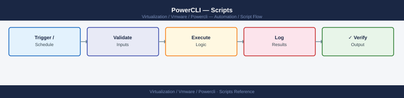

---
tags:
  - operations
  - powercli
  - vmware
---
# PowerCLI — Scripts

<div class="kb-summary">
Production-ready PowerCLI scripts for vSphere operations: VM inventory reports, snapshot audit, host capacity report, vSAN status, bulk tag assignment, and VM health reports. All scripts follow the standard header and error-handling pattern.

*Applies to: PowerCLI 13.x*
</div>



```d2
direction: right

hub: "PowerCLI\nOperations" {shape: hexagon}
vm_inventory_report: "VM Inventory Report" {shape: rectangle}
snapshot_audit_and_cleanup: "Snapshot Audit and Cleanup" {shape: rectangle}
host_capacity_report: "Host Capacity Report" {shape: rectangle}
vsan_capacity_and_health_report: "vSAN Capacity and Health Report" {shape: rectangle}
vmware_vm_health_report: "VMware VM Health Report" {shape: rectangle}
verify: "Verify" {shape: rectangle}

hub -> vm_inventory_report
hub -> snapshot_audit_and_cleanup
hub -> host_capacity_report
hub -> vsan_capacity_and_health_report
hub -> vmware_vm_health_report
hub -> verify
```

## Before you begin

- **Access:** vCenter read-only minimum; Administrator role for remediation steps
- **Timing:** safe to run during business hours unless a step is marked ⚠ (causes interruption)
- **Dependencies:** no active upgrades or migrations on the same infrastructure
- **Logging:** capture command output — paste into the change record on completion

---

## VM Inventory Report

Generate a comprehensive VM inventory including CPU, memory, OS, IP, tools status, snapshots, and hosting cluster.

```powershell
#!/usr/bin/env pwsh
# vm-inventory-report.ps1
# Usage: .\vm-inventory-report.ps1 -vCenter vcenter.example.com -OutputPath .\vm-inventory.csv

param(
    [Parameter(Mandatory)] [string] $vCenter,
    [string] $OutputPath = ".\vm-inventory-$(Get-Date -Format 'yyyyMMdd').csv",
    [System.Management.Automation.PSCredential] $Credential
)

Set-PowerCLIConfiguration -InvalidCertificateAction Ignore -Confirm:$false | Out-Null
if ($Credential) { Connect-VIServer -Server $vCenter -Credential $Credential }
else { Connect-VIServer -Server $vCenter }

Write-Host "Collecting VM inventory from $vCenter..." -ForegroundColor Cyan

$report = Get-VM | ForEach-Object {
    $vm = $_
    $snaps = Get-Snapshot -VM $vm -ErrorAction SilentlyContinue
    $tools = $vm.ExtensionData.Guest
    $cluster = (Get-Cluster -VM $vm -ErrorAction SilentlyContinue)?.Name
    $ds = ($vm | Get-Datastore | Select-Object -First 1)?.Name

    [PSCustomObject]@{
        Name           = $vm.Name
        PowerState     = $vm.PowerState
        vCPU           = $vm.NumCpu
        MemGB          = $vm.MemoryGB
        Cluster        = $cluster
        Host           = $vm.VMHost.Name
        Datastore      = $ds
        GuestOS        = $tools?.GuestFullName
        IPAddress      = ($tools?.Net | Where-Object { $_.IpAddress -match '^\d{1,3}\.\d{1,3}\.' })?.IpAddress[0]
        ToolsStatus    = $tools?.ToolsStatus
        ToolsVersion   = $tools?.ToolsVersionStatus2
        SnapshotCount  = $snaps.Count
        OldestSnapshot = if ($snaps) { ($snaps | Sort-Object Created | Select-Object -First 1).Created } else { $null }
        FolderPath     = $vm.Folder.Name
        Notes          = $vm.Notes
    }
}

$report | Export-Csv -Path $OutputPath -NoTypeInformation
$report | Format-Table Name, PowerState, vCPU, MemGB, Cluster, ToolsStatus -AutoSize
Write-Host "`n$($report.Count) VMs exported to: $OutputPath" -ForegroundColor Green
Disconnect-VIServer -Confirm:$false
```

## Snapshot Audit and Cleanup

Find snapshots older than a threshold and optionally remove them.

```powershell
#!/usr/bin/env pwsh
# snapshot-audit.ps1
# Usage: .\snapshot-audit.ps1 -vCenter vcenter.example.com [-DaysOld 7] [-Remove]

param(
    [Parameter(Mandatory)] [string] $vCenter,
    [int] $DaysOld = 7,
    [switch] $Remove,
    [System.Management.Automation.PSCredential] $Credential
)

Set-PowerCLIConfiguration -InvalidCertificateAction Ignore -Confirm:$false | Out-Null
if ($Credential) { Connect-VIServer -Server $vCenter -Credential $Credential }
else { Connect-VIServer -Server $vCenter }

$cutoff = (Get-Date).AddDays(-$DaysOld)
$oldSnaps = Get-VM | Get-Snapshot | Where-Object { $_.Created -lt $cutoff } | Sort-Object Created

Write-Host "`nSnapshots older than $DaysOld days ($($oldSnaps.Count) found):" -ForegroundColor Cyan

$oldSnaps | Select-Object @{N="VM";E={$_.VM.Name}}, Name, Created,
    @{N="AgeDays";E={[math]::Round(((Get-Date)-$_.Created).TotalDays,0)}},
    @{N="SizeGB";E={[math]::Round($_.SizeMB/1024,2)}} | Format-Table -AutoSize

if ($Remove -and $oldSnaps.Count -gt 0) {
    Write-Host "`nRemoving $($oldSnaps.Count) snapshots..." -ForegroundColor Yellow
    $oldSnaps | Remove-Snapshot -RemoveChildren -Confirm:$false
    Write-Host "Done." -ForegroundColor Green
} elseif ($Remove) {
    Write-Host "No snapshots to remove." -ForegroundColor Green
} else {
    Write-Host "`nRun with -Remove to delete these snapshots." -ForegroundColor Yellow
}

Disconnect-VIServer -Confirm:$false
```

## Host Capacity Report

```powershell
#!/usr/bin/env pwsh
# host-capacity-report.ps1
# Usage: .\host-capacity-report.ps1 -vCenter vcenter.example.com -OutputPath .\host-capacity.csv

param(
    [Parameter(Mandatory)] [string] $vCenter,
    [string] $OutputPath = ".\host-capacity-$(Get-Date -Format 'yyyyMMdd').csv",
    [System.Management.Automation.PSCredential] $Credential
)

Set-PowerCLIConfiguration -InvalidCertificateAction Ignore -Confirm:$false | Out-Null
if ($Credential) { Connect-VIServer -Server $vCenter -Credential $Credential }
else { Connect-VIServer -Server $vCenter }

$report = Get-VMHost | ForEach-Object {
    $h = $_
    $vms = Get-VM -VMHost $h
    [PSCustomObject]@{
        Host            = $h.Name
        Cluster         = (Get-Cluster -VMHost $h -ErrorAction SilentlyContinue)?.Name
        State           = $h.ConnectionState
        vCPU_Total      = $h.NumCpu
        CPU_Total_GHz   = [math]::Round($h.CpuTotalMhz/1000, 1)
        CPU_Used_GHz    = [math]::Round($h.CpuUsageMhz/1000, 1)
        CPU_Used_Pct    = [math]::Round($h.CpuUsageMhz/$h.CpuTotalMhz*100, 1)
        RAM_Total_GB    = [math]::Round($h.MemoryTotalGB, 0)
        RAM_Used_GB     = [math]::Round($h.MemoryUsageGB, 1)
        RAM_Used_Pct    = [math]::Round($h.MemoryUsageGB/$h.MemoryTotalGB*100, 1)
        VM_Count        = $vms.Count
        VM_Powered_On   = ($vms | Where-Object { $_.PowerState -eq 'PoweredOn' }).Count
        ESXi_Version    = $h.Version
        Build           = $h.Build
    }
}

$report | Export-Csv -Path $OutputPath -NoTypeInformation
$report | Sort-Object RAM_Used_Pct -Descending |
    Format-Table Host, Cluster, CPU_Used_Pct, RAM_Used_Pct, VM_Count, ESXi_Version -AutoSize
Write-Host "`nReport saved: $OutputPath" -ForegroundColor Green
Disconnect-VIServer -Confirm:$false
```

## vSAN Capacity and Health Report

```powershell
# vsan-report.ps1
param(
    [Parameter(Mandatory)] [string] $vCenter,
    [System.Management.Automation.PSCredential] $Credential
)

Set-PowerCLIConfiguration -InvalidCertificateAction Ignore -Confirm:$false | Out-Null
if ($Credential) { Connect-VIServer -Server $vCenter -Credential $Credential }
else { Connect-VIServer -Server $vCenter }

$vsanClusters = Get-Cluster | Where-Object { $_.VsanEnabled }

foreach ($cluster in $vsanClusters) {
    Write-Host "`n=== $($cluster.Name) ===" -ForegroundColor Cyan

    # Overall health
    $health = Get-VsanClusterHealthSummary -Cluster $cluster
    $color = if ($health.OverallHealth -eq 'green') { 'Green' } elseif ($health.OverallHealth -eq 'yellow') { 'Yellow' } else { 'Red' }
    Write-Host "Overall health: $($health.OverallHealth)" -ForegroundColor $color

    # Disk status
    $disks = Get-VsanDisk -VMHost (Get-VMHost -Location $cluster)
    $downDisks = $disks | Where-Object { $_.State -ne 'inUse' }
    if ($downDisks) {
        Write-Host "WARNING: $($downDisks.Count) disk(s) not in use:" -ForegroundColor Yellow
        $downDisks | Select-Object VMHost, CanonicalName, State | Format-Table -AutoSize
    }

    # Datastore capacity
    $ds = Get-Datastore -RelatedObject $cluster | Where-Object { $_.Type -eq 'vsan' }
    if ($ds) {
        $usedPct = [math]::Round((1 - $ds.FreeSpaceGB/$ds.CapacityGB)*100, 1)
        $capColor = if ($usedPct -gt 80) { 'Red' } elseif ($usedPct -gt 70) { 'Yellow' } else { 'Green' }
        Write-Host "vSAN datastore: $([math]::Round($ds.CapacityGB,0)) GB total, $([math]::Round($ds.FreeSpaceGB,0)) GB free ($usedPct% used)" -ForegroundColor $capColor
    }
}

Disconnect-VIServer -Confirm:$false
```

## VMware VM Health Report

Generate a per-VM health report from vCenter: power state, CPU, memory, snapshot count and age, and datastore.

```powershell
# vm-health-report.ps1
# Usage: .\vm-health-report.ps1 -vCenter <hostname> -OutputPath .\report.csv

param(
    [Parameter(Mandatory)] [string] $vCenter,
    [string] $OutputPath = ".\vm-health-$(Get-Date -Format 'yyyyMMdd').csv"
)

Connect-VIServer -Server $vCenter -Credential (Get-Credential) | Out-Null

$report = Get-VM | ForEach-Object {
    $vm = $_
    $snaps = Get-Snapshot -VM $vm
    $oldestSnap = if ($snaps) { ($snaps | Sort-Object Created | Select-Object -First 1).Created } else { $null }

    [PSCustomObject]@{
        Name         = $vm.Name
        Cluster      = (Get-Cluster -VM $vm).Name
        PowerState   = $vm.PowerState
        vCPU         = $vm.NumCpu
        MemGB        = $vm.MemoryGB
        Snapshots    = $snaps.Count
        OldestSnap   = $oldestSnap
        Datastore    = ($vm | Get-Datastore | Select-Object -First 1).Name
    }
}

$report | Export-Csv -Path $OutputPath -NoTypeInformation
$report | Format-Table -AutoSize
Write-Host "`nReport saved: $OutputPath" -ForegroundColor Green
Disconnect-VIServer -Confirm:$false
```

---

## See also

- [PowerCLI — CLI Reference](cli-reference/)
- [PowerCLI — Procedures](procedures/)

## Verify

- **Alarms:** vSphere Client → Home → Alarms — no new critical alarms after the operation
- **Events:** monitor the vCenter Events view for the affected object for 5 minutes
- **Health check:** run the morning health-check sequence for the affected product tier
