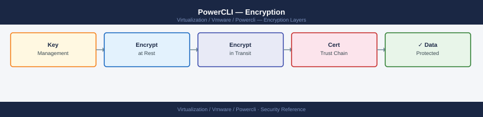

---
tags:
  - powercli
  - security
  - vmware
---
# PowerCLI — Encryption

<div class="kb-summary">
Managing vSphere encryption via PowerCLI — vSAN encryption enablement and key rotation, VM encryption (vSphere VMcrypt) configuration, KMS cluster management, encrypted credential file handling, and TLS connection security settings.

*Applies to: PowerCLI 13.x*
</div>


## Before you begin

- **Access:** vCenter Administrator role
- **Change management:** security changes require CAB approval in most environments
- **Rollback plan:** document current state before any security control change
- **Testing:** validate in a non-production environment first where possible

---

## vSAN Encryption via PowerCLI

Enable and manage vSAN data-at-rest encryption. Requires a configured KMS cluster in vCenter.

```powershell
Connect-VIServer -Server vcenter.example.com

# Check current vSAN encryption state
$cluster = Get-Cluster -Name "Production"
$vsanConfig = Get-VsanClusterConfiguration -Cluster $cluster
Write-Host "Encryption enabled: $($vsanConfig.EncryptionEnabled)"
Write-Host "KMS cluster: $($vsanConfig.KmsClusterId)"

# Enable vSAN encryption
# Prerequisite: KMS cluster must already be configured in vCenter
Set-VsanClusterConfiguration -Cluster $cluster -EncryptionEnabled $true

# Initiate key rotation (periodic or after key compromise)
Invoke-VsanKeyRotation -Cluster $cluster

# Verify encryption health after enabling
Get-VsanDiskGroup -VMHost (Get-VMHost -Location $cluster) |
    Select-Object @{N='Host';E={$_.VMHost.Name}}, MasterDisk,
    @{N='DiskCount';E={$_.ExtensionData.DiskMapping.NonSsd.Count}} |
    Format-Table -AutoSize
```

---

## VM Encryption (vSphere VMcrypt)

Encrypt individual VMs using vSphere storage policies backed by a KMS.

```powershell
# List encrypted VMs
$encryptedVMs = Get-VM | Where-Object {
    $_.ExtensionData.Config.KeyId -ne $null
}
$encryptedVMs | Select-Object Name, @{N='KeyId';E={$_.ExtensionData.Config.KeyId.KeyId}} |
    Format-Table -AutoSize

# Check VM encryption status
function Get-VMEncryptionStatus {
    param([string]$VMName)
    $vm = Get-VM -Name $VMName
    $keyId = $vm.ExtensionData.Config.KeyId
    if ($keyId) {
        Write-Host "$VMName is encrypted — KeyId: $($keyId.KeyId), Provider: $($keyId.ProviderId.Id)"
    } else {
        Write-Host "$VMName is NOT encrypted"
    }
}

Get-VMEncryptionStatus -VMName "app-server-01"

# Encrypt a VM using a VM Encryption storage policy
# Prerequisite: "VM Encryption Policy" storage policy must exist and reference KMS
$vm = Get-VM -Name "app-server-01"
$encPolicy = Get-SpbmStoragePolicy -Name "VM Encryption Policy"
Set-VM -VM $vm -StoragePolicy $encPolicy -Confirm:$false

# Decrypt a VM (switch to non-encrypted storage policy)
$noEncPolicy = Get-SpbmStoragePolicy -Name "vSAN Default Storage Policy"
Set-VM -VM $vm -StoragePolicy $noEncPolicy -Confirm:$false
```

---

## KMS Cluster Management

```powershell
# List configured KMS clusters
Get-KeyManagementServer | Select-Object Name, Address, Port, Type |
    Format-Table -AutoSize

# Add a new KMS cluster
New-KeyManagementServer -Name "prod-kms" -Address "kms.example.com" -Port 5696

# Test KMS connectivity
Test-VsanKeyManagementServer -Name "prod-kms"

# Set default KMS cluster (used by vSAN and VM encryption)
Set-VsanKeyManagementServer -Name "prod-kms" -IsDefault $true

# Check KMS status for a cluster
$cluster = Get-Cluster -Name "Production"
$vsanConfig = Get-VsanClusterConfiguration -Cluster $cluster
$vsanConfig | Select-Object Name, EncryptionEnabled, KmsClusterId | Format-List
```

---

## Encrypted Credential Files

Store vCenter credentials securely for use in scheduled or unattended scripts. The `Export-Clixml` method ties the encryption to the Windows user account — only that user on that machine can decrypt it.

```powershell
# Save encrypted credentials to disk (one-time setup)
$cred = Get-Credential -Message "Enter vCenter service account credentials"
$cred | Export-Clixml -Path "C:\scripts\creds\vcenter-svc.xml"
# File is encrypted with DPAPI — only readable by the same Windows user on the same machine

# Load and use saved credentials in a script
$cred = Import-Clixml -Path "C:\scripts\creds\vcenter-svc.xml"
Connect-VIServer -Server "vcenter.example.com" -Credential $cred

# Cross-machine credential option — encrypt with a specific key
$key = (1..32 | ForEach-Object { Get-Random -Maximum 256 })  # 256-bit key
$key | Out-File "C:\scripts\creds\vcenter.key"

$securePass = Read-Host -AsSecureString -Prompt "Password"
$encPass = ConvertFrom-SecureString -SecureString $securePass -Key $key
$encPass | Out-File "C:\scripts\creds\vcenter.pass"

# Usage on another machine (requires same key file)
$key = Get-Content "C:\scripts\creds\vcenter.key"
$securePass = Get-Content "C:\scripts\creds\vcenter.pass" |
    ConvertTo-SecureString -Key $key
$cred = New-Object PSCredential("svc-powercli@vsphere.local", $securePass)
Connect-VIServer -Server "vcenter.example.com" -Credential $cred
```

**Service account approach (recommended for production):**

```powershell
# Use a dedicated service account with a stored credential file
# The service account should have only the minimum required vSphere role
$cred = Import-Clixml "C:\scripts\creds\vcenter-automation.xml"
Connect-VIServer -Server "vcenter.example.com" -Credential $cred -Force

# Rotate the stored credential after password change
$newCred = Get-Credential -UserName "svc-powercli@vsphere.local" -Message "New password"
$newCred | Export-Clixml -Path "C:\scripts\creds\vcenter-automation.xml" -Force
Write-Host "Credential file updated"
```

---

## TLS and Certificate Settings

```powershell
# Check current PowerCLI TLS/certificate settings
Get-PowerCLIConfiguration | Select-Object Scope, InvalidCertificateAction, DefaultVIServerMode |
    Format-Table -AutoSize

# Production setting — require valid TLS certificates (recommended)
Set-PowerCLIConfiguration -InvalidCertificateAction Fail -Confirm:$false -Scope AllUsers

# Lab/dev only — ignore self-signed certificates (NEVER use in production)
Set-PowerCLIConfiguration -InvalidCertificateAction Ignore -Confirm:$false -Scope User

# Warn but allow invalid certificates (acceptable in controlled lab environments)
Set-PowerCLIConfiguration -InvalidCertificateAction Warn -Confirm:$false -Scope User

# Add vCenter's self-signed cert to the trusted store (preferred over Ignore)
# Export cert from vCenter UI → Administration → Certificates → Certificate Management
# Then import on the admin workstation:
Import-Certificate -FilePath "C:\certs\vcenter-ca.cer" `
    -CertStoreLocation "Cert:\LocalMachine\Root"

# Verify after import — connect should succeed without InvalidCertificateAction Ignore
Set-PowerCLIConfiguration -InvalidCertificateAction Fail -Confirm:$false
Connect-VIServer -Server "vcenter.example.com"
```

---

## Audit Encryption State

Run this periodically to report the encryption posture of the environment.

```powershell
Connect-VIServer -Server "vcenter.example.com"

# Report 1: vSAN encryption status per cluster
Write-Host "`n=== vSAN Encryption Status ==="
Get-Cluster | ForEach-Object {
    $cfg = Get-VsanClusterConfiguration -Cluster $_
    [PSCustomObject]@{
        Cluster   = $_.Name
        Encrypted = $cfg.EncryptionEnabled
        KMSCluster = $cfg.KmsClusterId
    }
} | Format-Table -AutoSize

# Report 2: VM encryption status
Write-Host "`n=== VM Encryption Status ==="
$allVMs = Get-VM
$encrypted = $allVMs | Where-Object { $_.ExtensionData.Config.KeyId -ne $null }
$unencrypted = $allVMs | Where-Object { $_.ExtensionData.Config.KeyId -eq $null }
Write-Host "Total VMs: $($allVMs.Count)"
Write-Host "Encrypted: $($encrypted.Count)"
Write-Host "Unencrypted: $($unencrypted.Count)"

$encrypted | Select-Object Name,
    @{N='KeyId';E={$_.ExtensionData.Config.KeyId.KeyId}},
    @{N='KMSProvider';E={$_.ExtensionData.Config.KeyId.ProviderId.Id}} |
    Format-Table -AutoSize

# Report 3: PowerCLI TLS configuration audit
Write-Host "`n=== PowerCLI TLS Configuration ==="
Get-PowerCLIConfiguration | Select-Object Scope, InvalidCertificateAction,
    DefaultVIServerMode, ParticipateInCeip | Format-Table -AutoSize

Disconnect-VIServer -Server * -Confirm:$false
```

## See also

- [PowerCLI — Hardening](../hardening/)
- [PowerCLI — Health Checks](../../operations/health-checks/)
