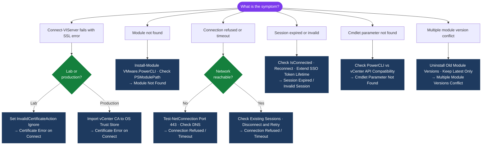

---
tags:
  - powercli
  - troubleshooting
  - vmware
search:
  boost: 1.5
---
# PowerCLI — Common Issues

<div class="kb-summary">
Solutions for the most frequent PowerCLI problems: certificate errors, connection failures, module conflicts, API incompatibility, session expiry, and cmdlet parameter mismatches.

*Applies to: PowerCLI 13.x*
</div>

```text
┌───────────────────────────────── PowerCLI — Common Issues and Fixes ──────────────────────────────────┐
│                                                                                                       │
│   Most PowerCLI issues occur at connect time, during module load, or when cmdlet parameters fail      │
│   Start diagnosis with: Get-Module VMware.* and the full error message                                │
│   Check vCenter version compatibility before upgrading PowerCLI in a multi-vCenter environment        │
│                                                                                                       │
│   Certificate error on Connect-VIServer                                                               │
│   Symptom: "The underlying connection was closed" or "SSL/TLS" error on connect                       │
│   Fix (lab): Set-PowerCLIConfiguration -InvalidCertificateAction Ignore -Confirm:$false               │
│   Fix (production): import the vCenter CA certificate into the OS trusted root store                  │
│                                                                                                       │
│   Module not found                                                                                    │
│   Symptom: "The term 'Connect-VIServer' is not recognized as the name of a cmdlet"                    │
│   Fix: Install-Module -Name VMware.PowerCLI -Scope CurrentUser; then Import-Module VMware.PowerCLI    │
│   Check PSModulePath includes the directory where the module was installed                            │
│                                                                                                       │
│   Session expired or disconnected                                                                     │
│   Symptom: cmdlets fail silently or return empty results after long idle period                       │
│   Fix: check ($global:DefaultVIServers).IsConnected; if $false, reconnect with Connect-VIServer       │
│   Prevention: add reconnect logic with try/catch around session-sensitive cmdlets in long scripts     │
│                                                                                                       │
│   Cmdlet parameter mismatch                                                                           │
│   Symptom: "A parameter cannot be found that matches parameter name 'ParameterName'"                  │
│   Cause: parameter exists in newer PowerCLI version but connecting to an older vCenter API            │
│   Fix: wrap in try/catch; use -Version parameter on Connect-VIServer to limit API negotiation         │
│                                                                                                       │
│   Key terms:                                                                                          │
│   PSModulePath = environment variable; add custom module paths with $env:PSModulePath += ";path"      │
│   API version  = vCenter exposes a versioned vSphere API; newer cmdlet params may not be available    │
│   IsConnected  = property on DefaultVIServer object; false when session has expired or timed out      │
└───────────────────────────────────────────────────────────────────────────────────────────────────────┘
```

## Diagnostic Flow



---

## Before you begin

- **Access:** SSH to vCenter Shell and ESXi hosts; vSphere Client read access
- **Gather first:** recent error message text, event timestamps, and affected object names
- **Scope:** confirm whether the issue affects a single object, host, cluster, or site
- **Escalation:** open a vendor support ticket before running any destructive step
- **Logging:** document each command and output — required if escalation is needed

---

## Certificate Error on Connect

**Symptom:** `Connect-VIServer` fails with `The underlying connection was closed` or `SSL/TLS` errors.

```powershell
# Quick fix for lab / self-signed certs
Set-PowerCLIConfiguration -InvalidCertificateAction Ignore -Confirm:$false
Connect-VIServer -Server vcenter.example.com

# Production: add vCenter CA to OS trust store, then use Fail policy
# Windows: Import CA cert into Trusted Root Certification Authorities
Import-Certificate -FilePath ".\vcenter-ca.cer" -CertStoreLocation Cert:\LocalMachine\Root
Set-PowerCLIConfiguration -InvalidCertificateAction Fail -Confirm:$false
```

## Module Not Found

**Symptom:** `The term 'Connect-VIServer' is not recognized` or `Import-Module: Module 'VMware.PowerCLI' was not found`.

```powershell
# Check if module is installed
Get-Module -Name VMware.* -ListAvailable

# Install from PSGallery
Install-Module -Name VMware.PowerCLI -Scope CurrentUser -AllowClobber

# If PSGallery is not trusted
Install-Module -Name VMware.PowerCLI -Scope CurrentUser -AllowClobber -Force

# Check PSModulePath
$env:PSModulePath -split [IO.Path]::PathSeparator
```

## Connection Refused / Timeout

**Symptom:** `Connect-VIServer` hangs or returns `Unable to connect to vCenter`.

```powershell
# Test network connectivity first
Test-NetConnection -ComputerName vcenter.example.com -Port 443

# Check DNS resolution
Resolve-DnsName vcenter.example.com

# Try with explicit port
Connect-VIServer -Server vcenter.example.com -Port 443

# Check if another session is blocking (single-server mode)
$global:DefaultVIServers
Disconnect-VIServer -Confirm:$false
```

## Session Expired / Invalid Session

**Symptom:** Cmdlets fail with `NotAuthenticated` or `An error occurred while sending the request`.

```powershell
# Check if still connected
$global:DefaultVIServer.IsConnected

# Reconnect
if (-not $global:DefaultVIServer.IsConnected) {
    Connect-VIServer -Server $vCenter -Credential $cred
}
```

Default SSO token lifetime is 8 hours. For long-running scripts, add periodic reconnect logic or increase token lifetime in vCenter SSO policy.

## Cmdlet Parameter Not Found

**Symptom:** `A parameter cannot be found that matches parameter name 'X'`.

```powershell
# Check PowerCLI version vs vCenter version compatibility
Get-Module -Name VMware.PowerCLI -ListAvailable | Select-Object Version
(Get-View ServiceInstance).Content.About | Select-Object Version, Build

# Get help for the cmdlet to see available parameters
Get-Help Set-VM -Full | Select-Object -Expand Parameters
```

New parameters (e.g., `-CryptoSpec` for VM encryption) are only available against vCenter versions that support the underlying API. Wrap in `try/catch` for multi-version environments.

## Multiple Module Versions Conflict

**Symptom:** `Assembly with same name is already loaded` or inconsistent cmdlet behavior.

```powershell
# List all installed versions
Get-Module -Name VMware.* -ListAvailable | Select-Object Name, Version | Sort-Object Name, Version

# Remove old versions
Get-Module -Name VMware.* -ListAvailable |
    Group-Object Name |
    ForEach-Object {
        $sorted = $_.Group | Sort-Object Version -Descending
        $sorted | Select-Object -Skip 1 | ForEach-Object {
            Uninstall-Module -Name $_.Name -RequiredVersion $_.Version -Force -ErrorAction SilentlyContinue
        }
    }
```

## Get-VM Returns Empty on Known VMs

**Symptom:** `Get-VM` returns nothing even though VMs exist.

```powershell
# Confirm connected to correct vCenter
$global:DefaultVIServers | Select-Object Name, IsConnected

# Specify -Server explicitly
Get-VM -Server vcenter.example.com

# Check permissions (service account may lack read on datacenter)
Get-VIPermission | Where-Object { $_.Principal -like "*$env:USERNAME*" }
```

## vSAN Cmdlets Unavailable

**Symptom:** `Get-VsanClusterHealthSummary : The term '...' is not recognized`.

```powershell
# Ensure vSAN module is installed
Get-Module -Name VMware.VimAutomation.Storage -ListAvailable

# Install if missing
Install-Module VMware.VimAutomation.Storage -Scope CurrentUser -Force

# Import explicitly
Import-Module VMware.VimAutomation.Storage
```

---

## Verify resolution

- **Alarms cleared:** Home → Alarms — the triggering alarm is no longer active
- **Event log:** confirm no new related error events in the last 5 minutes
- **Functional test:** perform the action that was failing (connect, vMotion, storage I/O) — confirm it succeeds
- **Monitor:** leave the vSphere Client open for 10 minutes and confirm the issue does not recur
